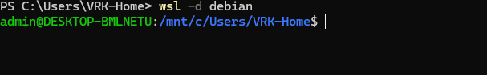

# WSL Setup on Windows

<details>
<summary>How to install Linux OS on Windows using WSL?</summary>

# TBD

</details>

---
---


<details>
<summary>How to Install & Uninstall other distros on existing WSL?</summary>

- Listdown all the available distros on WSL

````shell

    # open terminal
    wsl -l -o  # -l=list -o=online
````

### Install:


- Install Debian Distro


- Now check what all the distros installed on your WSL using `wsl -l`


- from GUI: if you go to file explorer you can see Linux displayed next to ``This PC`` if you click on it you can see what all the Linux distros you have installed on WSL


- from start Menu: if you click on start menu and search for Debian it will be visible


- How to open Debian?
  
- **GUI:** Go to Start Menu search for Debian and click on open


- **Terminal:** Go to Terminal use command `wsl -d debian`  
  


- to logout type exit

---

### Uninstall:

- Open Terminal and run `wsl --list --verbose` to find the exact distribution name. 
- Then, use ``wsl --unregister <DistributionName>`` to remove the Debian instance


- If you go to File Explorer Debian will be removed
  


- Windows-10 Users Finally, from GUI go to ``Settings > Apps > Apps & features``, find "Debian" in the list, and click Uninstall to remove the application.


</details>