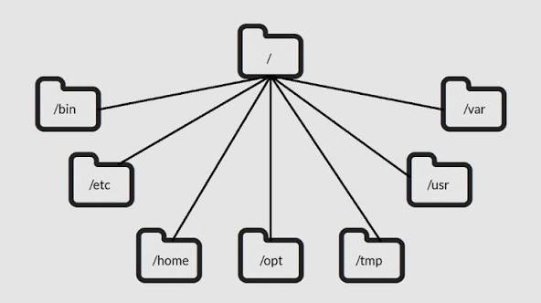
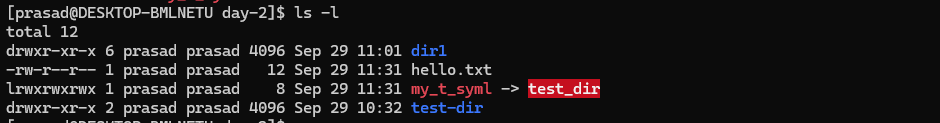

# Linux OS Directories


<details>
<summary>Linux OS Directory Structure</summary>



The Linux directory structure is a tree-like hierarchy defined by the Filesystem Hierarchy Standard (FHS). All files and directories start from the **root directory** `/`.

### Key system directories

*   **`/` (Root):** The top-level directory. Everything in the Linux filesystem starts here.
*   **`/bin`:** Contains essential user binaries (executable programs) required for basic system functions, such as `ls`, `cp`, and `mv`.
*   **`/sbin`:** Stores essential system administration binaries, like `ifconfig` and `fdisk`. These are typically used by the root user for system maintenance.
*   **`/etc`:** Holds host-specific system configuration files. These are generally static text files that control how the system and applications behave.
*   **`/boot`:** Contains files needed to start the system, including the Linux kernel and the GRUB boot loader.
*   **`/lib`:** Stores essential shared libraries and kernel modules required for the binaries in `/bin` and `/sbin`.
*   **`/dev`:** Contains device files that represent hardware, such as disk drives (`/dev/sda`) and terminals (`/dev/tty1`).
*   **`/proc`:** A virtual filesystem that provides information about running processes and kernel parameters.
*   **`/sys`:** Another virtual filesystem that exposes kernel data structures to user space, providing an interface for system hardware and device drivers.
*   **`/var`:** Contains variable data files that frequently change during normal system operation, such as log files (`/var/log`), caches, and mail spools.
*   **`/tmp`:** A temporary directory used by applications and users to store transient files. Its contents are often cleared at boot.
*   **`/run`:** A temporary filesystem that stores volatile runtime data, such as process IDs and sockets. This data is cleared on reboot.

### User and application directories

*   **`/home`:** Contains the personal directories for standard users. For a user named *bob*, their home directory is `/home/bob`, which stores their personal data and user-specific configurations.
*   **`/root`:** The home directory for the root user, separate from the `/home` directory.
*   **`/usr`:** A secondary hierarchy for user-space programs and data that are not essential for booting the system.
    *   **`/usr/bin`:** Stores non-essential user binaries and applications.
    *   **`/usr/sbin`:** Contains non-essential system administration binaries.
    *   **`/usr/lib`:** Stores libraries for the binaries in `/usr/bin` and `/usr/sbin`.
    *   **`/usr/local`:** The standard location for software that is locally compiled and not part of the distribution's base system.
*   **`/opt`:** Used to install optional or third-party software packages that are not part of the base operating system.
*   **`/srv`:** Contains data for services provided by the system, such as web server files or FTP data.

### Temporary and mounting directories

*   **`/mnt`:** Traditionally used by system administrators to temporarily mount filesystems, such as a Windows partition for file recovery.
*   **`/media`:** The standard mount point for removable media, such as USB drives and CD-ROMs, which are often mounted automatically.

*   **`/lost+found`:** A directory on each filesystem that stores files recovered after a file system check.


</details>

---

<details>
<summary>How to create/update/remove directories?</summary>

### Create

- `mkdir <dir_name>` to create an emtpy directory
- if you want to create multiple folders at once then use `mkdir -p <dir1/dir2/dir3>`  it will create multiple directories at once.


#### How to navigate b/w directories & what is absolute/relative paths 

- use change directory(`cd`) command to navigate b/w folders
- `cd <path_to_change>` 
- the path which is starting with `./` or `../` is the relative path
- Example:

````shell
    # goto prasad dir
    cd /home/prasad
    ls # list contents on current dir
    cd day-2
    cd ./dir1 # directory on the current folder
    cd ../test_dir # directory on the parent folder
    cd - # Change to the previous directory 
````

- ``rmdir <dir_name>`` to delete an empty dir.
- `rmdir -p <dir1/dir2/dir3>` to delete multiple non-empty dirs
- `rm -rf <dir>` Recursively removes directory. 


</details>


---
---

<details>
<summary>What is a Symbolic Link?</summary>

- A symbolic link, or "symlink," is a file that acts as a pointer or shortcut to another file or directory on the file system. 
- When you access the symbolic link, the operating system transparently redirects you to the original file or directory it points to. 
- A link can be used to create a shortcut.
  - Use for long file or directory names.
  - Use to indicate the current version of software.

### How to create symlink?

- To create a symbolic link, the ``ln`` command with the ``-s`` option is used.
-  Create a source file. 
````shell
    echo "This is the original file content." > original_file.txt
    ln -s original_file.txt symlink_to_file.txt
````

- ``ln``: The command for creating links.
- ``s``: The option to specify a symbolic (or soft) link.
- ``original_file.txt``: The path to the source (the original file).
- `symlink_to_file.txt`: The path and name of the link to be created. 
- You can use ``ls -l`` to see the new symbolic link.
- Now, ``symlink_to_file.txt`` acts as a shortcut to ``original_file.txt``. 
- Any changes made to ``original_file.txt`` will be reflected when accessing ``symlink_to_file.txt``, and vice-versa. 
</details>

---
---

<details>
<summary> How to read long listing output? </summary>



-  : 
- Permissions: `drwxr-xr-x`
- Number of links: ``6``
- Owner name: ``prasad``
- Group name:``prasad``
- Number of bytes in the fil:  ``4096``
- Last modification time: ``Sep 29 11:01``
- File name: `dir1`
</details>


