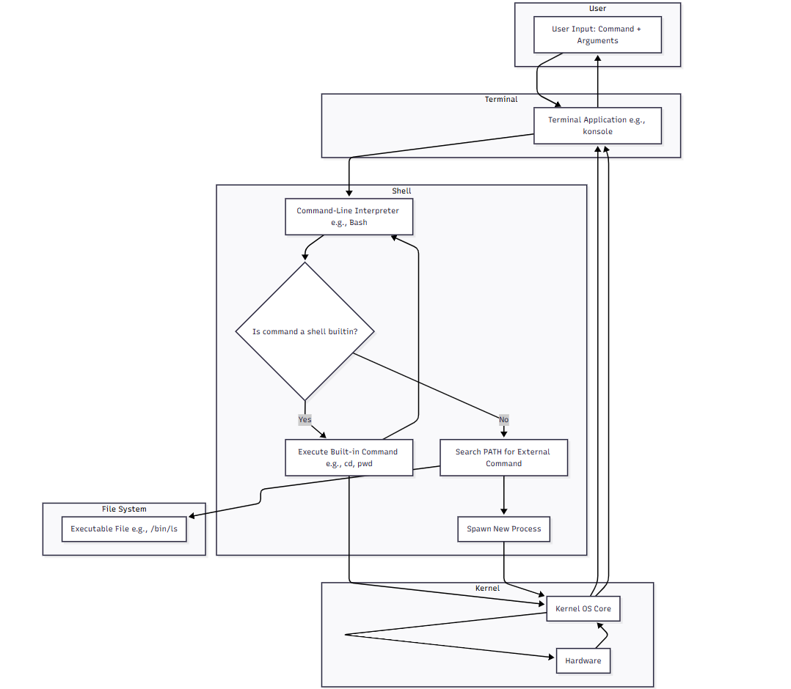

# Shell


- Most of the linux distros won't have GUI interface, **Shell** is the default interface to Linux.
- A shell is a program that acts as a **command-line interpreter (CLI)** and provides a text-based interface for a user to interact with the Linux operating system.
- It is the outer layer of the OS that sits between the user and the **kernel** 

- Server distributions do not include GUIs.
- Connect over Network.
- Desktop distributions have GUIs and CLIs.
  
# What is Shell in Linux?

A shell is a program that acts as a command-line interpreter (CLI) and provides a text-based interface for a user to interact with the Linux operating system. It is the outer layer of the OS that sits between the user and the **kernel**, which is the core component that manages hardware and system resources.

When you type a command into a terminal, the shell is the program that processes your command, figures out what you want to do, and then asks the kernel to carry out the task.

### How the shell works

1.  **User input**: You open a terminal application (e.g., `gnome-terminal`, `konsole`) and type a command, like `ls -l`, at the shell prompt (`$` or `#`).
2.  **Interpretation**: The shell interprets your command, breaking it down into a command (`ls`) and its options (`-l`).
3.  **Execution**: The shell either executes the command itself (if it's a built-in shell command) or finds the executable program on the system's file path (`/bin/ls`) and tells the kernel to run it.
4.  **Output**: The command's output is sent back to the shell, which displays it in the terminal window for you to see.

### Common Linux shells

Linux users can choose from several different shell programs, each with its own features and syntax.

*   **Bash (Bourne-Again Shell)**: The most widely used and default shell on most Linux distributions and macOS. It is a powerful and versatile shell that is a successor to the original Bourne shell (`sh`).
*   **Zsh (Z Shell)**: A modern shell that is highly customizable and offers advanced features like enhanced command completion, spelling correction, and a robust framework for themes and plugins.
*   **Fish (Friendly Interactive SHell)**: A user-friendly shell known for its "smart" features that work out of the box, such as syntax highlighting, auto-suggestions based on history, and a consistent command syntax.
*   **Sh (Bourne Shell)**: The original Unix shell. While less commonly used for interactive sessions today, it remains important for compatibility and for writing portable shell scripts.
*   **Dash (Debian Almquist Shell)**: A lightweight and fast shell used as the default `/bin/sh` on Debian-based systems for speed and reliability, especially for system initialization scripts.

### Shell vs. Terminal

The terms "shell" and "terminal" are often used interchangeably, but they are different components that work together.

*   **Shell**: The program that interprets commands and executes them. Bash, Zsh, and Fish are shells.
*   **Terminal**: The application or user interface that hosts the shell. It provides a text-based window where you can type commands and see the output. Examples include `gnome-terminal`, `konsole`, and `xterm`.

### Shell scripting

Beyond executing commands interactively, the shell is also a powerful scripting language. A shell script is a text file that contains a sequence of shell commands that are executed by the shell. Shell scripting is used to automate repetitive tasks, perform system administration, and chain together complex commands.

### How the shell works with built-in and external commands




### How to read the diagram

1.  **User Input:** The process starts when the user types a command and any arguments into a **Terminal Application**.
2.  **Shell Parsing:** The terminal sends this input to the **Shell**. The shell acts as a command-line interpreter and is responsible for parsing the input.
3.  **Command Type Check:** The shell determines if the command is a **built-in** command (like `cd` or `pwd`) or an **external** command (like `ls` or `grep`).
4.  **Execute Built-in Command:**
    *   **"Yes" Path:** If it's a built-in, the shell executes the command's internal code directly.
    *   **Output:** The result is sent back to the terminal for display.
5.  **Execute External Command:**
    *   **"No" Path:** If it's not a built-in, the shell searches for the executable file in the directories specified by the system's `$PATH` environment variable.
    *   **File System Interaction:** It finds the command's executable file (e.g., `/bin/ls`) in the **File System**.
    *   **Spawn New Process:** The shell then asks the **Kernel** to create a new process to run that external program.
6.  **Kernel and Hardware Interaction:**
    *   The kernel manages the new process and handles all interactions with the **Hardware** (e.g., accessing disk drives to list files for the `ls` command).
    *   The hardware performs the requested action and sends the result back to the kernel.
7.  **Displaying Output:**
    *   The kernel passes the output back to the **Terminal**.
    *   The terminal displays the final output to the user, completing the command execution cycle.


## FAQs

<details>
<summary>1. when I connect to server with ssh does it opens a shell? </summary>

- **Yes,** when you connect to a server using SSH without specifying a particular command to execute, it typically opens an interactive shell session on the remote server. 
- This allows you to interact with the server's command-line interface as if you were physically present at the server.
- The SSH server, upon successful authentication, will provide you with the default shell configured for your user account on that system (e.g., Bash, Zsh, Fish). Any commands you type into your local terminal are then sent through the encrypted SSH tunnel and executed within that shell on the remote server. 


</details>


<details>
<summary> 2. what is `~` operation on shell? </summary>

The Prompt: 
```shell
    [prasad@linuxsvr ~]$
    [root@linuxsvr:~]#

```
- if prompt ending with `$` means **non-root** user
- if prompt ending with `#` means **root** user
- **Tilde Expansion**

        ~prasad = /home/prasad
        ~test_user = /home/test_user
        ~root = /root
        ~ftp = /var/ftp
</details>

<details>
<summary> 2. what are the users? </summary>

- **root** user: root is the Superuser
- root access is typically restricted to system administrators.
- root access may be required to install, start or stop an application.
- **non-root** user: Normal accounts can only do a subset of the things ``root`` can do.
- Day to day activities will be performed using a normal account.
  
</details>

