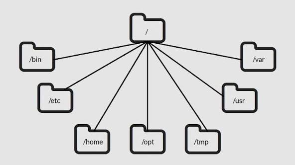

# Linux OS Directories

Linux OS Directory Structure

The Linux directory structure is a tree-like hierarchy defined by the Filesystem Hierarchy Standard (FHS). All files and directories start from the **root directory** `/`.

### Key system directories

*   **`/` (Root):** The top-level directory. Everything in the Linux filesystem starts here.
*   **`/bin`:** Contains essential user binaries (executable programs) required for basic system functions, such as `ls`, `cp`, and `mv`.
*   **`/sbin`:** Stores essential system administration binaries, like `ifconfig` and `fdisk`. These are typically used by the root user for system maintenance.
*   **`/etc`:** Holds host-specific system configuration files. These are generally static text files that control how the system and applications behave.
*   **`/boot`:** Contains files needed to start the system, including the Linux kernel and the GRUB boot loader.
*   **`/lib`:** Stores essential shared libraries and kernel modules required for the binaries in `/bin` and `/sbin`.
*   **`/dev`:** Contains device files that represent hardware, such as disk drives (`/dev/sda`) and terminals (`/dev/tty1`).
*   **`/proc`:** A virtual filesystem that provides information about running processes and kernel parameters.
*   **`/sys`:** Another virtual filesystem that exposes kernel data structures to user space, providing an interface for system hardware and device drivers.
*   **`/var`:** Contains variable data files that frequently change during normal system operation, such as log files (`/var/log`), caches, and mail spools.
*   **`/tmp`:** A temporary directory used by applications and users to store transient files. Its contents are often cleared at boot.
*   **`/run`:** A temporary filesystem that stores volatile runtime data, such as process IDs and sockets. This data is cleared on reboot.

### User and application directories

*   **`/home`:** Contains the personal directories for standard users. For a user named *bob*, their home directory is `/home/bob`, which stores their personal data and user-specific configurations.
*   **`/root`:** The home directory for the root user, separate from the `/home` directory.
*   **`/usr`:** A secondary hierarchy for user-space programs and data that are not essential for booting the system.
    *   **`/usr/bin`:** Stores non-essential user binaries and applications.
    *   **`/usr/sbin`:** Contains non-essential system administration binaries.
    *   **`/usr/lib`:** Stores libraries for the binaries in `/usr/bin` and `/usr/sbin`.
    *   **`/usr/local`:** The standard location for software that is locally compiled and not part of the distribution's base system.
*   **`/opt`:** Used to install optional or third-party software packages that are not part of the base operating system.
*   **`/srv`:** Contains data for services provided by the system, such as web server files or FTP data.

### Temporary and mounting directories

*   **`/mnt`:** Traditionally used by system administrators to temporarily mount filesystems, such as a Windows partition for file recovery.
*   **`/media`:** The standard mount point for removable media, such as USB drives and CD-ROMs, which are often mounted automatically.

*   **`/lost+found`:** A directory on each filesystem that stores files recovered after a file system check.

---

