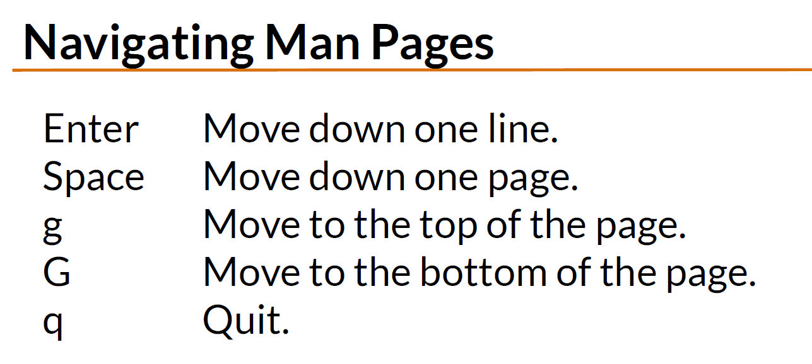
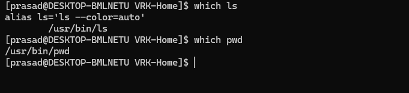

# Essential Linux Commands

Linux commands are the building blocks for interacting with the operating system. Below is a list of essential commands, their usages, and commonly used options in a tabular format.


<details>
<summary>File and Directory management commands </summary>

## File and Directory Management

| Command | Description                            | Common Options/Examples                                                   |
| ------- | -------------------------------------- | ------------------------------------------------------------------------- |
| `ls`    | Lists the contents of a directory.     | `-l` (long format), `-a` (show hidden files), `-h` (human-readable sizes) |
| `cd`    | Changes the current directory.         | `cd /home/user`                                                           |
| `pwd`   | Prints the current working directory.  |                                                                           |
| `mkdir` | Creates a new directory.               | `-p` (create parent directories as needed)                                |
| `rm`    | Removes files or directories.          | `-r` (recursive), `-f` (force removal)                                    |
| `cp`    | Copies files or directories.           | `-r` (recursive), `-i` (prompt before overwrite)                          |
| `mv`    | Moves or renames files or directories. | `-i` (prompt before overwrite)                                            |

## File Viewing and Editing

| Command | Description                               | Common Options/Examples  |
| ------- | ----------------------------------------- | ------------------------ |
| `cat`   | Concatenates and displays file contents.  |                          |
| `less`  | Views file contents one screen at a time. | `-N` (show line numbers) |
| `nano`  | Opens a simple text editor.               |                          |
| `vim`   | Opens the Vim text editor.                |                          |

## File Permissions and Ownership

| Command | Description               | Common Options/Examples                                      |
| ------- | ------------------------- | ------------------------------------------------------------ |
| `chmod` | Changes file permissions. | `+x` (add execute permission), `-r` (remove read permission) |
| `chown` | Changes file ownership.   | `user:group` (specify new owner and group)                   |


</details>

---
---

<details>

<summary>Process Management commands </summary>

## Process Management

| Command | Description                                   | Common Options/Examples     |
| ------- | --------------------------------------------- | --------------------------- |
| `ps`    | Displays information about running processes. | `-aux` (show all processes) |
| `top`   | Displays real-time system resource usage.     |                             |
| `kill`  | Terminates a process by its PID.              |                             |

</details>

---
---


<details>

<summary>Networking commands </summary>

## Networking

| Command | Description                           | Common Options/Examples                                  |
| ------- | ------------------------------------- | -------------------------------------------------------- |
| `ping`  | Tests network connectivity to a host. |                                                          |
| `curl`  | Transfers data from or to a server.   | `-O` (save file with same name), `-L` (follow redirects) |
| `wget`  | Downloads files from the web.         | `-c` (resume downloads)                                  |

</details>

---
---

<details>

<summary>Disk Usage commands </summary>

## Disk Usage

| Command | Description                      | Common Options/Examples               |
| ------- | -------------------------------- | ------------------------------------- |
| `df`    | Displays disk space usage.       | `-h` (human-readable format)          |
| `du`    | Displays directory or file size. | `-h` (human-readable), `-s` (summary) |

</details>

---
---

<details>

<summary>System Information commands </summary>

## System Information

| Command    | Description                           | Common Options/Examples |
| ---------- | ------------------------------------- | ----------------------- |
| `uname`    | Displays system information.          | `-a` (show all details) |
| `uptime`   | Displays system uptime.               |                         |
| `whoami`   | Displays the current user.            |                         |
| `hostname` | Displays or sets the system hostname. |                         |

</details>


---

<details>

<summary>Package Management (RHEL-based Systems) commands </summary>


## Package Management (RHEL-based Systems):

- ``dnf`` is replacement for ``yum``

| Command                 | Description                                          | Common Options/Examples                |
| ----------------------- | ---------------------------------------------------- | -------------------------------------- |
| `yum update`            | Updates all packages to the latest version.          | `yum update -y` (auto-confirm updates) |
| `yum install <package>` | Installs a specific package.                         | `yum install httpd`                    |
| `yum remove <package>`  | Removes a specific package.                          | `yum remove httpd`                     |
| `yum search <keyword>`  | Searches for a package by keyword.                   | `yum search nginx`                     |
| `yum list installed`    | Lists all installed packages.                        |                                        |
| `yum clean all`         | Cleans up cached data.                               |                                        |
| `dnf update`            | Updates all packages (modern replacement for `yum`). | `dnf update -y` (auto-confirm updates) |
| `dnf install <package>` | Installs a specific package.                         | `dnf install vim`                      |
| `dnf remove <package>`  | Removes a specific package.                          | `dnf remove vim`                       |
| `dnf search <keyword>`  | Searches for a package by keyword.                   | `dnf search git`                       |
| `dnf list installed`    | Lists all installed packages.                        |                                        |
| `dnf clean all`         | Cleans up cached data.                               |                                        |

</details>

---
---

## FAQs

<details>
<summary>How to learn new commands using man & help? </summary>


## Learning New Commands

Learning new Linux commands is essential for mastering the operating system. Here are some tips and examples to help you explore and understand commands on your own.

| Method               | Description                              | Example                                  |
| -------------------- | ---------------------------------------- | ---------------------------------------- |
| `man <command>`      | Opens the manual page for a command.     | `man ls` (shows the manual for `ls`)     |
| `<command> --help`   | Displays a summary of options and usage. | `ls --help` (lists options for `ls`)     |
| Online Documentation | Search for official or community guides. | Search "Linux ls command options" online |
| Experimentation      | Try the command with different options.  | `ls -l`, `ls -a`, `ls -lh`               |

### Using `man` Pages
The `man` command is used to access the manual pages for any Linux command. It provides detailed information about the command, its options, and usage.

#### Example: `ls` Command
1. Open the manual page for `ls`:
   ```bash
   man ls
   ```
2. Navigate using the arrow keys.
3. Press `q` to exit the manual.

#### How to navigage man pages?

### Using `--help`
Most Linux commands support the `--help` option, which provides a quick summary of the command's usage and options.

#### Example: `ls` Command
1. Run the following command:
   ```bash
   ls --help
   ```
2. Review the output to see available options, such as:
   - `-l`: Long listing format.
   - `-a`: Show hidden files.
   - `-h`: Human-readable file sizes.

By combining these methods, you can quickly learn and master new Linux commands.

</details>

---
---

<details>
<summary>How to navigage man pages? </summary>



</details>

---
---

<details>
<summary> How to check which linux distro ?</summary>

| Command               | Description                                                                              |
| --------------------- | ---------------------------------------------------------------------------------------- |
| `cat /etc/os-release` | This file provides detailed information about the operating system.                      |
| `lsb_release -a`      | The lsb_release command displays Linux Standard Base (LSB) information about the system. |
| `hostnamectl`         | This command provides information about the system's hostname and operating system.      |
 
</details>


---
---

<details>
<summary> How to check which command executable is using ?</summary>

- `which` cmd used to locate a command's binary in the path.
- it display full path to command
- `which ls`
  
  
</details>

---
---

