# LFCS Essential Commands


## 01. Read and Use System Documentation

### man

- All important commands in Linux have their own manuals or "man pages". 
- To access a command's manual enter `man <name_of_command>`

```shell
man ls
man mkdir
``` 
- General syntax of command in `SYNOPSIS`
- Detailed description of command, how it works, and so on, in `DESCRIPTION`.
- Detailed descriptions of command line options in `OPTIONS`.
- And some manual pages even have some `EXAMPLES` near the end of the manual.
- `printf` is a command. But `printf` is also a function that can be used by programmers.
- If two man commands has same name then use category number during the command

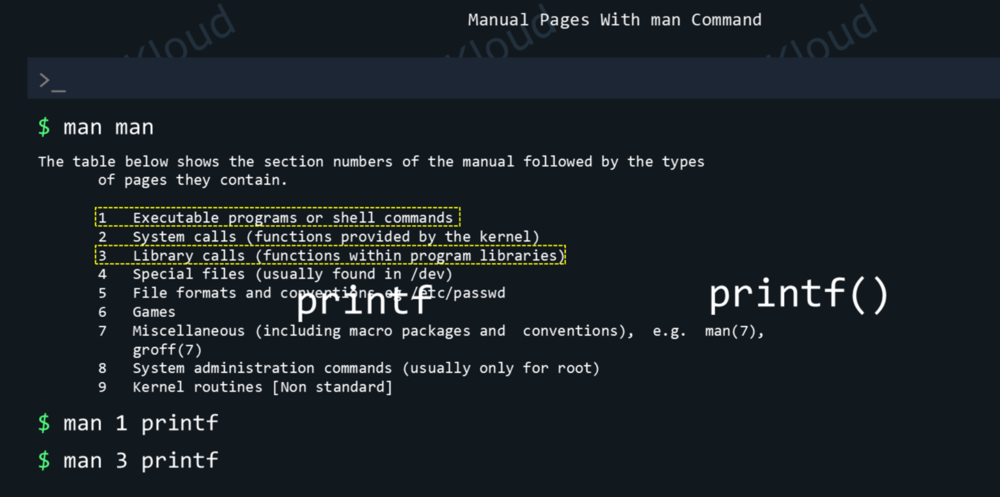


### help
- `--help` will usually show a condensed form of help, with very short explanations.
- Examples:
```shell
ls --help
mkdir --help
```

### apropos

- apropos is a command that lets you search through man pages. 
- It looks at the short descriptions of each man page and tries to see if it matches the text we entered.

- Imagine you forgot the name of the command that lets you create a new directory. How would you search for it?

- search for all man pages that have the word "director" in their short descriptions. 
- To run apropos for the first time run `sudo mandb` 

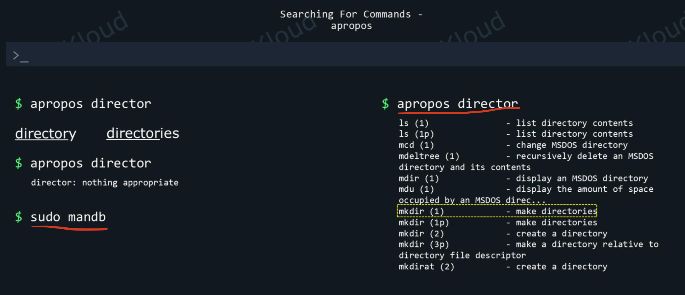

- Commands will be found in sections `1` and `8`. 
- We can tell apropos to only filter out results that lead to commands from these categories. 

```shell
apropos -s 1,8 director
```

### Auto-Complete:  <command_name> TAB/2TABs
- To auto-fill file/directory names use TAB if there is a conflict give 2TABs to list all the available options


---
---

# 02.Working with Files and Directories

## 2.1 Basic Commands

| Command | Description                            | Common Options/Examples                                                   |
| ------- | -------------------------------------- | ------------------------------------------------------------------------- |
| `ls`    | Lists the contents of a directory.     | `-l` (long format), `-a` (show hidden files), `-h` (human-readable sizes) |
| `cd`    | Changes the current directory.         | `cd /home/user`                                                           |
| `pwd`   | Prints the current working directory.  |                                                                           |
| `mkdir` | Creates a new directory.               | `-p` (create parent directories as needed)                                |
| `rm`    | Removes files or directories.          | `-r` (recursive), `-f` (force removal)                                    |
| `cp`    | Copies files or directories.           | `-r` (recursive), `-i` (prompt before overwrite)                          |
| `mv`    | Moves or renames files or directories. | `-i` (prompt before overwrite)                                            |

---

## 2.2 File Permissions

### 2.2.1 Owner & Groups Change
- lets look at Owners and Groups for files & directories

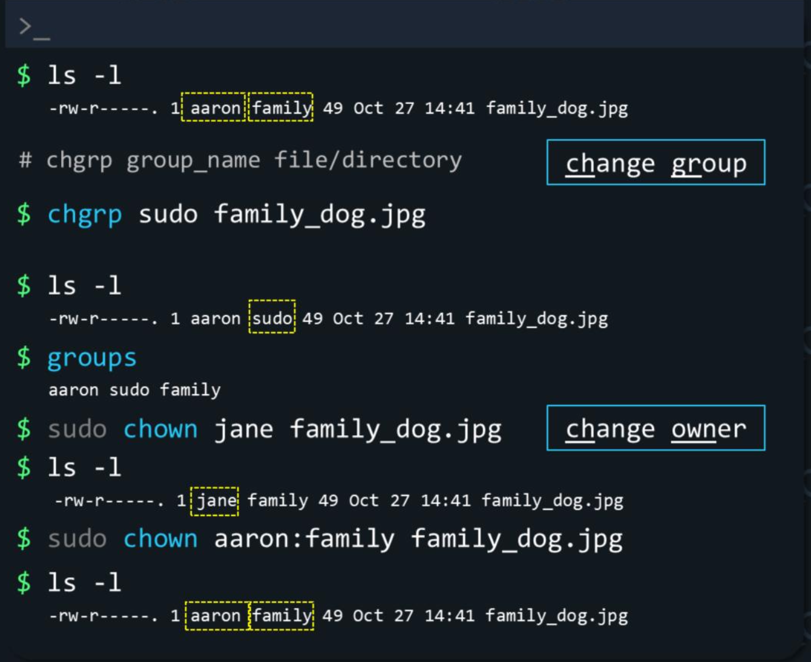

- In the above screenshot initially `owner: aaron group: family`
- __Only the owner of a file or directory can change permissions.except root user__
- The only exception is the root user (super user/administrator account), which can change permissions of any file or directory.
- To change the group of a file/directory, we use the `chgrp` command (change group).
```shell
chgrp group_name file/directory
chgrp sudo family_dog.jpg
```
- We can only change to groups that our user is part of. We can see to what groups our current user belongs with `groups` command
- This means we can change the group of our file to: aaron, sudo or family.
- Again, the root user is the exception, which can change the group of a file or directory to whatever group exists on the system.

- There's also a command to change the user owner of a file or directory: `chown` (change owner).

```shell
chown user file/directory
sudo chown jane family_dog.jpg
```
- __only the root user can change the user owner__, so we'd have to use the sudo command to temporarily get root privileges:

- We can change both user owner and group with a different syntax of chown:

```shell
chown user:group file/directory
sudo chown aaron:family family_dog.jpg
```
- last `ls –l` will show us that the owner is aaron again, and the group is family.

---

### 2.2.2 File & Directory Permissions

- `ls -l` command also shows us the permissions of all files and directories in our current directory
- First character on that line shows us what type of entry this is: a file, a special file, a directory and so on.

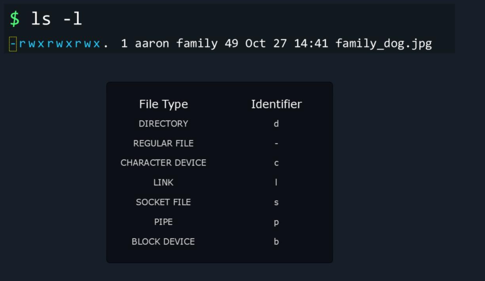

- The next 9 characters show us permissions:
- __First 3:__ permissions for the user that owns this file.
- __Next 3:__ permissions for the group of this file.
- __Last 3:__ permissions for other users (any user that is not aaron or not part of the family group).

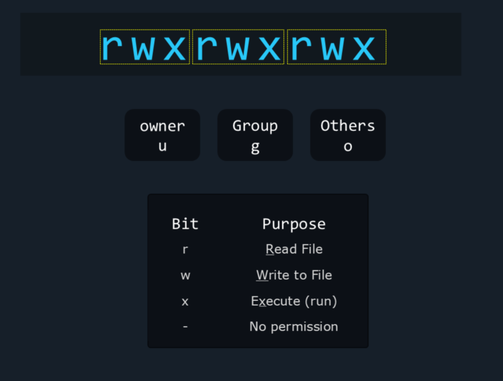

- Let's see what r, w and x mean in two different contexts, because they act in a certain way for files and have slightly different behavior for directories.

__For a file:__

- `-` means no permission they cannot read/write/execute it.
- `r` means the user, group, or other users can read the contents of this file. 
- `w` means the user, group, or other users can write to this file, modify its contents.
- `x` means the user, group, or other users can execute this file. Some files can be programs or shell scripts (instructions we can execute). 

__For directories:__

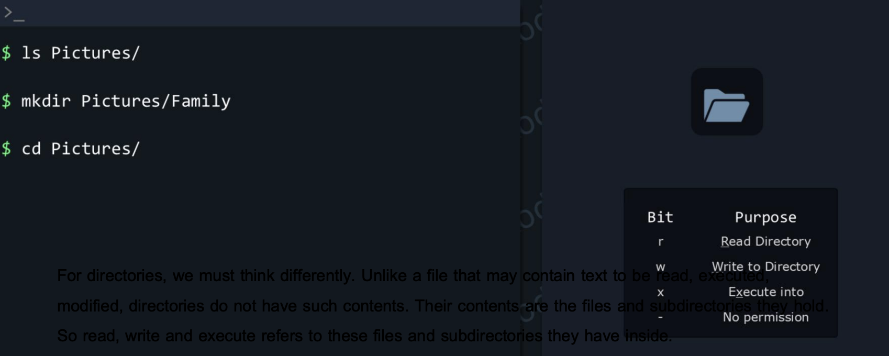

- Unlike a file that may contain text to be read, executed, modified, directories do not have such contents. 
- Their contents are the files and subdirectories they hold. So read, write and execute refers to these files and subdirectories they have inside.

- `r` means the user, group, or other users can read the contents of this directory. To run a command like `ls Pictures/` and view what files and subdirectories we have in this directory.

- `w` means the user, group, or other users can write to this directory. We need `w` to be able to create or delete entries in that directory (add/delete files or subdirectories), as when we use `mkdir`.

- `x` means we can "execute" into this directory. We need `x` to be able to do `cd Pictures/` and "enter" into the
Pictures/ directory.
- When directories are meant to be accessible, you'll normally find both the `r` and the `x` permissions enabled.

#### Evaluating Permissions:

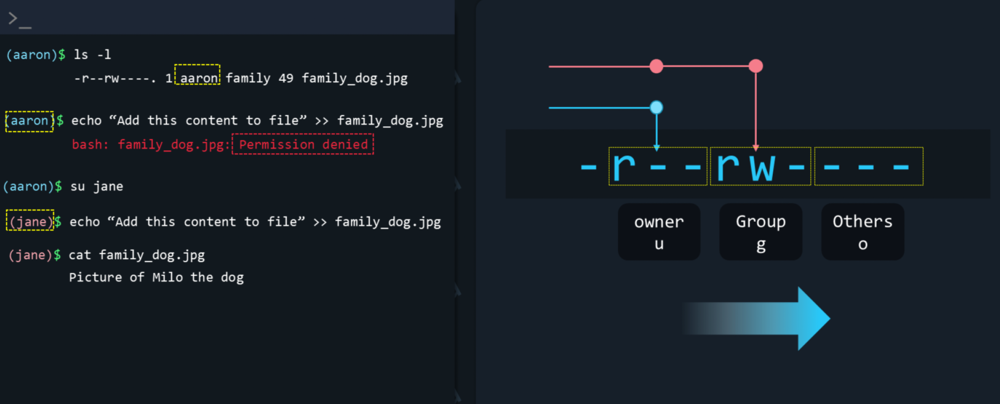


- Look at the permissions for the `family_dog.jpg` file. It’s set to read only for owner, read write for group and no permissions for others.
- We see the current owner of the file is aaron. And we know aaron is part of the family group.
- Can aaron write to this file considering the fact that the owner has read permissions only? 
- It might seem that he should be able to do that, as he is part of the family group, and that group has rw- (read/write) permissions.

- But if we try to add a line of text to this file, it fails.
- Why is that? Because __permissions are evaluated in a linear fashion, from left to right.__

#### how the operating system decides if you're allowed to do something?
- It goes through a logic like this:
- Who is trying to access this file? aaron
- Who owns this file?  aaron
- Ok, current user, aaron, is the owner. Owner permissions apply: `r--`. aaron can read the file but cannot write to it. Write permission denied!
- It does not evaluate the permissions of the group because it already matched you to the first set of permissions: the ones for the owner of the file.

- If you'd be logged in as a different user, for example jane, the logic would be like this:
- Who is trying to access this file?  jane
- Who owns this file? aaron
- Ok, owner permissions do not apply, moving on to group permissions
- Is jane in the family group? Yes. Ok, group permissions apply: jane has `rw-` permissions so she can read and write to file.
- If the user trying to access the file is not the owner and is also not in the "family" group, the last three permissions would apply, the permissions for other users.

#### Add Permissions

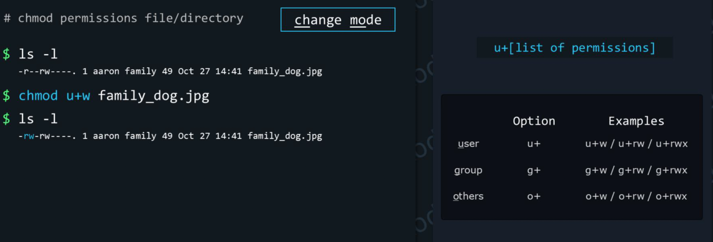

- To change permissions, we use the `chmod` command. 
- The basic syntax of the chmod command is:
```shell
chmod permissions file/directory
```

- In our case, we want to add the write permission for our user owner of the file:
```shell
chmod u+w family_dog.jpg
```

#### Remove Permissions

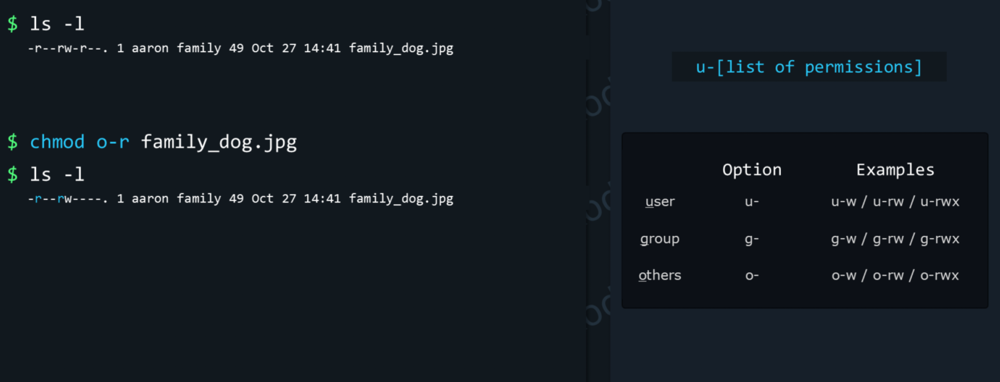

- At this point, we have the permission `r--` for other users. 
- How to remove `r` permissions for others? 
```shell
chmod o-r family_dog.jpg
```
- Now only aaron or the family group can read this file, no one else.

#### Setting Exact Permissions

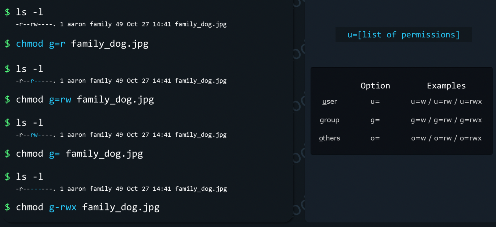

- With `+` and `-` we saw that we can add permissions on top of the preexisting ones or remove some of them from the preexisting ones.
- But, sometimes, we'll have a different requirement. We'll want to make sure that permissions are set exactly to certain values. We can do this with the `=` sign.
- Example: we want to make sure that the group can only read this file, but not write to it or execute it. We can run
```shell
chmod g=r family_dog.jpg
```
- We can see that, before, group permissions were `rw-`. We didn't tell chmod to actually remove the `w` permissions, but by saying `g=r`, we told it to make the group permissions exactly: `r--`. 
- This only affects the group permissions and not the user or other permissions.
- If we'd want to let the group read and write, but not execute, we'd use:
```shell
chmod g=rw family_dog.jpg
```

- We can see that whatever letter is missing, will make chmod disable permissions for that thing. No `x` here means no execute permission will be present on the file.
- Which leads us to the next thing. What if we omit all letters? No `r`, no `w`, no `x`. This would disable all permissions for the group:
```shell
#disable all permissions for the group
chmod g= family_dog.jpg
```
- This is like saying "make group permissions all empty". Another command that does the same thing is
```shell
chmod g-rwx family_dog.jpg
```
- It does the same thing, but following another logic - remove all these permissions for the group: r, w, and x.

#### chaining permissions

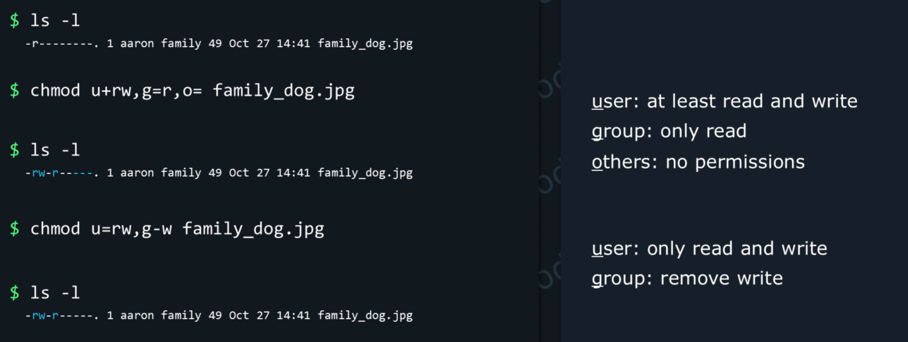

- We can group all these specifications in one single command by separating our permissions for the user, group and others, with a "," comma.

- For example, let's consider this scenario:
- We want the user to be able to read and write to the file; don't care if execute permission is on or off.
- We want the group to only be able to read (exactly this permission).
- And we want others to have no permissions at all.
```shell
chmod u+rw,g=r,o= family_dog.jpg
```
- Or, let's say:
- We want the user to only be able to read and write.
- But we want to remove the write permissions for the group and leave all other group permissions as they were.
- We don't care about permissions that apply to other users.
We would use:
```shell
chmod u=rw,g-w family_dog.jpg
```

#### Octal Permissions:

- `chmod` supports another way to set/modify permissions: through octal values.
- First, let's look at another command that shows us permissions:
```shell
stat family_dog.jpg
```

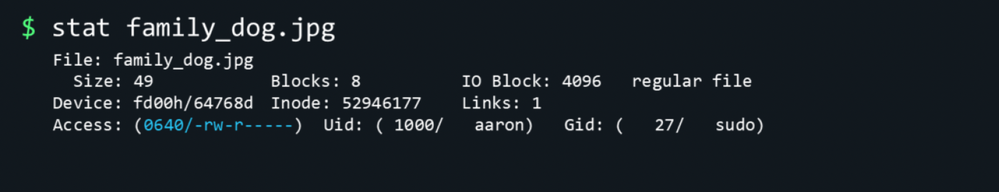

- Here's the list of permissions displayed by `stat`.
- We can see `rw-r-----` has an octal value of `640` (ignore the first 0, that's for special permissions like setuid, setgid and sticky bit). 
- If we break this down, `640` means the user/owner permissions are 6, the group permissions are 4 and the permissions for other users are 0. How are these calculated? 


- Let’s take a closer look at this permission. We have rw for user, r for group and none set for others. Each permission is represented in binary. If it’s set the binary is set to 1 or else its set to 0. In this case the first part has 110, the second part is 100 and the third part is 0. Converting this binary to decimal would give us 6 for the first part, 4 for the second part, and 0 for the third part. Here’s a quick binary table for your reference.
Let’s take another example. This time rwx r-x and r-x. So, the binary format would be 111, 101, 101. The decimal of which is 755.

In the last example it’s read write execute for all, so its 1 for all bits, and so the decimal value is 777.


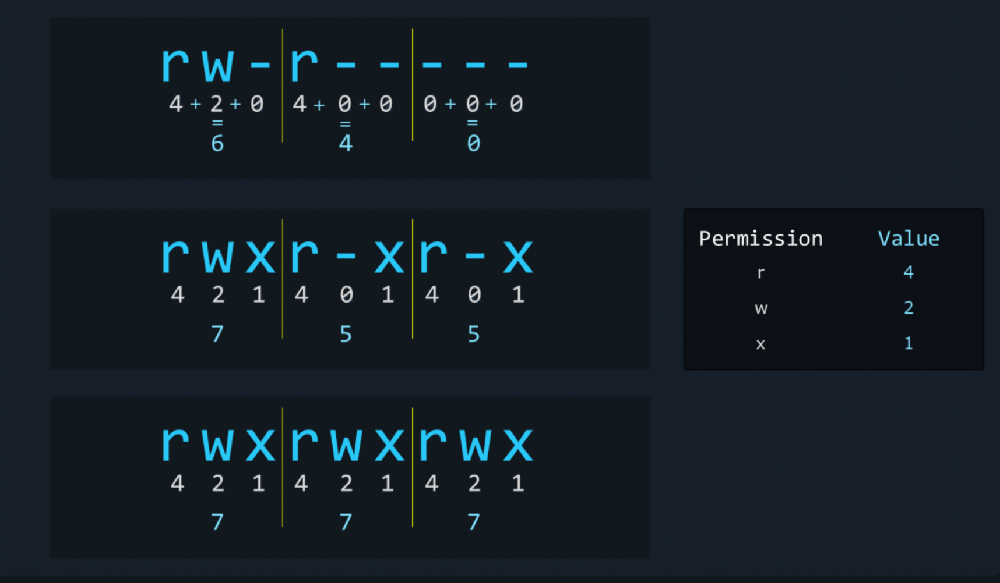

if you find binary difficult another approach would be to use the octal table. It’s much simpler. For each permission assign an octal value. For example 4 for read, 2 for write and 1 for execute. Then whichever permission is set, consider the respective value for that and for the permission bit not set consider 0. Once done, add up numbers within each group. 4 + 2 = 6 and 4 + 0 + 0 is 4 and the last group is 0.
Let’s look at using the same approach for the other examples as well. rwx r-x and r-x gives us 755
and rwxrwxrwx gives us 777.

and rwxrwxrwx gives us 777.


Once we identify the number we want to set to, we can use the same in chmod commands as well. Instead of specifying the permissions for each group, we could just provide a number like this.
chmod 640 family_dog.jpg
Well, that’s all for now, I will see you in the next one.


### Hard Links & Soft Links

- Inodes
- stat
- Hard Links

### Soft Links

- soft link is nothing but a software shortcut on the Windows Desktop. if you click on Chrome shortcut it will open `C:\Program Files (x86)\Google\Chrome\Application\chrome.exe` file
- Desktop shortcut is a soft link to the `.exe` file

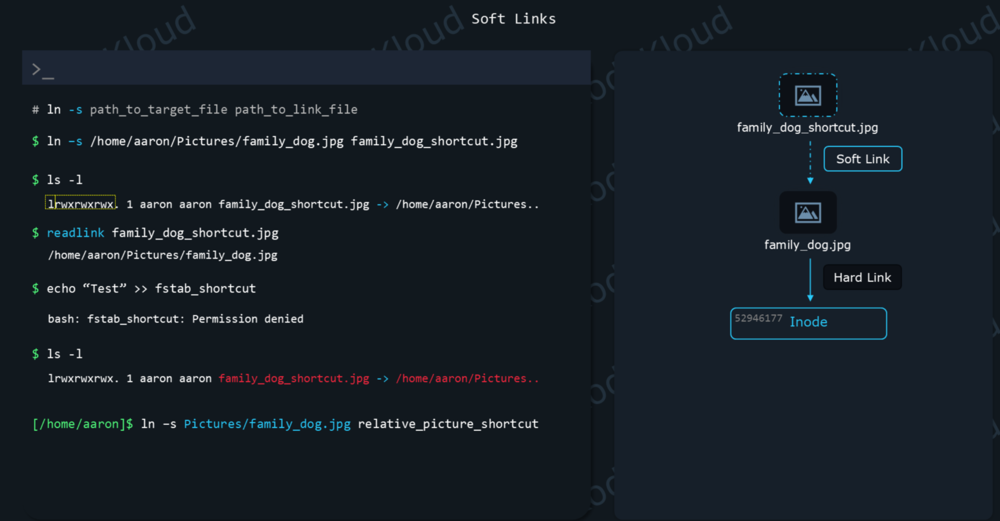

- Soft links in Linux are very similar to hard link.
- A hard link pointed to an `inode`. 
- A soft link is nothing more than a file that points to a path instead.
- It's almost like a text file, with a path to a file or directory inside.
- syntax:

```shell
ln -s path_to_target path_to_link_file
```

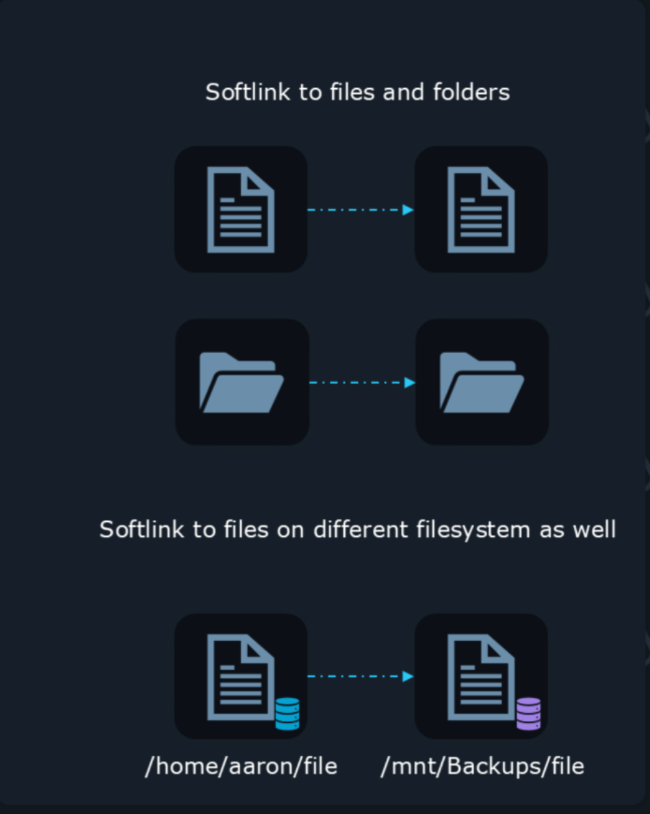

- Since soft links are nothing more than paths pointing to a file, you can also softlink to directories:
```shell 
ln -s Pictures/ shortcut_to_directory
```
- you can softlink to files/directories on a different filesystem.

#### How to read soft link?
- use `ls -l` long listing format to see the file type. if permissions section starts with `l` means it's a soft link
- It even displays the path that the soft link points to. If this path is long, `ls -l` might not show the entire path. 
- An alternative command to see the path stored in a soft link is:
```shell
readlink path_to_soft_link
```

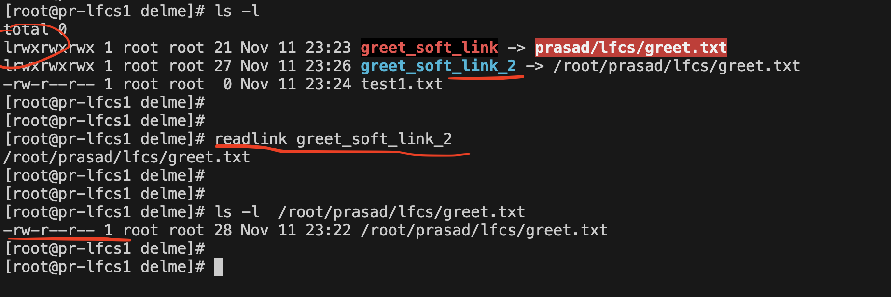


- You may also notice that all permission bits, rwx (read, write, execute) seem to be enabled for this file. That's because the permissions of the soft link do not matter, the permissions of the destination file applies.
- Broken links are displayed in RED color

</details>

---


<details>
<summary></summary>
</details>


## FAQs

<details>
<summary>find vs grep</summary>

### find vs grep:
---

# 🔍 1. `grep`

`grep` searches **inside file contents**.

Use `grep` when you want to find **text, patterns, or strings** within files.

### ✔ Examples

### 1. Search for a word inside files
```bash
grep "error" /var/log/syslog
````

Searches for the word `"error"` inside `/var/log/syslog`.

---

### **2. Search recursively in directories**

```bash
grep -r "timeout" /var/log/
```

Searches for `"timeout"` in all files under `/var/log`.

---

### 3. Show line numbers

```bash
grep -n "Failed" auth.log
```

---

### 4. Case-insensitive search

```bash
grep -i "warning" messages
```

---

### When to Use `grep`

* To search **text in files**
* To match **patterns** using regex
* To find **lines** containing certain words

---

# 📁 2. `find`

`find` searches for **files and directories** based on conditions such as name, type, size, permissions, date, etc.

### ✔ Examples

### **1. Find a file by name**

```bash
find /home -name "data.txt"
```

---

### **2. Find all directories**

```bash
find /etc -type d
```

---

### **3. Find files modified in the last 1 day**

```bash
find /var/log -mtime -1
```

---

### **4. Find files with specific permissions**

```bash
find /var/log -perm 644
```

---

### **5. Find files and execute a command**

```bash
find /tmp -name "*.log" -exec rm {} \;
```

---

### **When to Use `find`**

* To search **for files or directories**
* To filter using **permissions, size, type, owner**
* To **execute actions** on matched files (delete, copy, chmod, etc.)

---

# 🆚 Key Differences

| Feature                               | `grep`      | `find`                |
| ------------------------------------- | ----------- | --------------------- |
| Searches **inside files**             | ✔ Yes       | ✖ No                  |
| Searches **file names / directories** | ✖ No        | ✔ Yes                 |
| Supports **pattern matching**         | ✔ (regex)   | ✔ (file names)        |
| Can act on files found                | With pipes  | With `-exec`          |
| Primary use                           | Text search | File/directory search |

---

# 🧠 Summary

* Use **`grep`** when you want to search **text within files**.
* Use **`find`** when you want to search **for files or directories** on the filesystem.

These two commands are often used together for powerful searches.

Example:

```bash
find /var/log -type f -exec grep -i "failed" {} \;
```

This finds all files in `/var/log` and searches for `"failed"` inside each.

---


</details>