# LFCS Essential Commands


## 01. Read and Use System Documentation

### man

- All important commands in Linux have their own manuals or "man pages". 
- To access a command's manual enter `man <name_of_command>`

```shell
man ls
man mkdir
``` 
- General syntax of command in `SYNOPSIS`
- Detailed description of command, how it works, and so on, in `DESCRIPTION`.
- Detailed descriptions of command line options in `OPTIONS`.
- And some manual pages even have some `EXAMPLES` near the end of the manual.
- `printf` is a command. But `printf` is also a function that can be used by programmers.
- If two man commands has same name then use category number during the command


### help
- `--help` will usually show a condensed form of help, with very short explanations.
- Examples:
```shell
ls --help
mkdir --help
```

### apropos

- apropos is a command that lets you search through man pages. 
- It looks at the short descriptions of each man page and tries to see if it matches the text we entered.

- Imagine you forgot the name of the command that lets you create a new directory. How would you search for it?

- search for all man pages that have the word "director" in their short descriptions. 
- To run apropos for the first time run `sudo mandb` 


- Commands will be found in sections `1` and `8`. 
- We can tell apropos to only filter out results that lead to commands from these categories. 

```shell
apropos -s 1,8 director
```

### Auto-Complete:  <command_name> TAB/2TABs
- To auto-fill file/directory names use TAB if there is a conflict give 2TABs to list all the available options


---
---

# 02.Working with Files and Directories

## 2.1 Basic Commands

| Command | Description                            | Common Options/Examples                                                   |
| ------- | -------------------------------------- | ------------------------------------------------------------------------- |
| `ls`    | Lists the contents of a directory.     | `-l` (long format), `-a` (show hidden files), `-h` (human-readable sizes) |
| `cd`    | Changes the current directory.         | `cd /home/user`                                                           |
| `pwd`   | Prints the current working directory.  |                                                                           |
| `mkdir` | Creates a new directory.               | `-p` (create parent directories as needed)                                |
| `rm`    | Removes files or directories.          | `-r` (recursive), `-f` (force removal)                                    |
| `cp`    | Copies files or directories.           | `-r` (recursive), `-i` (prompt before overwrite)                          |
| `mv`    | Moves or renames files or directories. | `-i` (prompt before overwrite)                                            |

---

## 2.2 File Permissions

### 2.2.1 Owner & Groups Change
- lets look at Owners and Groups for files & directories


- In the above screenshot initially `owner: aaron group: family`
- __Only the owner of a file or directory can change permissions.except root user__
- The only exception is the root user (super user/administrator account), which can change permissions of any file or directory.
- To change the group of a file/directory, we use the `chgrp` command (change group).
```shell
chgrp group_name file/directory
chgrp sudo family_dog.jpg
```
- We can only change to groups that our user is part of. We can see to what groups our current user belongs with `groups` command
- This means we can change the group of our file to: aaron, sudo or family.
- Again, the root user is the exception, which can change the group of a file or directory to whatever group exists on the system.

- There's also a command to change the user owner of a file or directory: `chown` (change owner).

```shell
chown user file/directory
sudo chown jane family_dog.jpg
```
- __only the root user can change the user owner__, so we'd have to use the sudo command to temporarily get root privileges:

- We can change both user owner and group with a different syntax of chown:

```shell
chown user:group file/directory
sudo chown aaron:family family_dog.jpg
```
- last `ls –l` will show us that the owner is aaron again, and the group is family.

---

### 2.2.2 File & Directory Permissions

- `ls -l` command also shows us the permissions of all files and directories in our current directory
- First character on that line shows us what type of entry this is: a file, a special file, a directory and so on.


- The next 9 characters show us permissions:
- __First 3:__ permissions for the user that owns this file.
- __Next 3:__ permissions for the group of this file.
- __Last 3:__ permissions for other users (any user that is not aaron or not part of the family group).


- Let's see what r, w and x mean in two different contexts, because they act in a certain way for files and have slightly different behavior for directories.

__For a file:__

- `-` means no permission they cannot read/write/execute it.
- `r` means the user, group, or other users can read the contents of this file. 
- `w` means the user, group, or other users can write to this file, modify its contents.
- `x` means the user, group, or other users can execute this file. Some files can be programs or shell scripts (instructions we can execute). 

__For directories:__


- Unlike a file that may contain text to be read, executed, modified, directories do not have such contents. 
- Their contents are the files and subdirectories they hold. So read, write and execute refers to these files and subdirectories they have inside.

- `r` means the user, group, or other users can read the contents of this directory. To run a command like `ls Pictures/` and view what files and subdirectories we have in this directory.

- `w` means the user, group, or other users can write to this directory. We need `w` to be able to create or delete entries in that directory (add/delete files or subdirectories), as when we use `mkdir`.

- `x` means we can "execute" into this directory. We need `x` to be able to do `cd Pictures/` and "enter" into the
Pictures/ directory.
- When directories are meant to be accessible, you'll normally find both the `r` and the `x` permissions enabled.

- If user has `rw-` can user enter into the dir and execute commands?

#### Evaluating Permissions:


- Look at the permissions for the `family_dog.jpg` file. It’s set to read only for owner, read write for group and no permissions for others.
- We see the current owner of the file is aaron. And we know aaron is part of the family group.
- Can aaron write to this file considering the fact that the owner has read permissions only? 
- It might seem that he should be able to do that, as he is part of the family group, and that group has rw- (read/write) permissions.

- But if we try to add a line of text to this file, it fails.
- Why is that? Because __permissions are evaluated in a linear fashion, from left to right.__

#### how the operating system decides if you're allowed to do something?
- It goes through a logic like this:
- Who is trying to access this file? aaron
- Who owns this file?  aaron
- Ok, current user, aaron, is the owner. Owner permissions apply: `r--`. aaron can read the file but cannot write to it. Write permission denied!
- It does not evaluate the permissions of the group because it already matched you to the first set of permissions: the ones for the owner of the file.

- If you'd be logged in as a different user, for example jane, the logic would be like this:
- Who is trying to access this file?  jane
- Who owns this file? aaron
- Ok, owner permissions do not apply, moving on to group permissions
- Is jane in the family group? Yes. Ok, group permissions apply: jane has `rw-` permissions so she can read and write to file.
- If the user trying to access the file is not the owner and is also not in the "family" group, the last three permissions would apply, the permissions for other users.

#### Add Permissions


- To change permissions, we use the `chmod` command. 
- The basic syntax of the chmod command is:
```shell
chmod permissions file/directory
```

- In our case, we want to add the write permission for our user owner of the file:
```shell
chmod u+w family_dog.jpg
```

#### Remove Permissions


- At this point, we have the permission `r--` for other users. 
- How to remove `r` permissions for others? 
```shell
chmod o-r family_dog.jpg
```
- Now only aaron or the family group can read this file, no one else.

#### Setting Exact Permissions


- With `+` and `-` we saw that we can add permissions on top of the preexisting ones or remove some of them from the preexisting ones.
- But, sometimes, we'll have a different requirement. We'll want to make sure that permissions are set exactly to certain values. We can do this with the `=` sign.
- Example: we want to make sure that the group can only read this file, but not write to it or execute it. We can run
```shell
chmod g=r family_dog.jpg
```
- We can see that, before, group permissions were `rw-`. We didn't tell chmod to actually remove the `w` permissions, but by saying `g=r`, we told it to make the group permissions exactly: `r--`. 
- This only affects the group permissions and not the user or other permissions.
- If we'd want to let the group read and write, but not execute, we'd use:
```shell
chmod g=rw family_dog.jpg
```

- We can see that whatever letter is missing, will make chmod disable permissions for that thing. No `x` here means no execute permission will be present on the file.
- Which leads us to the next thing. What if we omit all letters? No `r`, no `w`, no `x`. This would disable all permissions for the group:
```shell
#disable all permissions for the group
chmod g= family_dog.jpg
```
- This is like saying "make group permissions all empty". Another command that does the same thing is
```shell
chmod g-rwx family_dog.jpg
```
- It does the same thing, but following another logic - remove all these permissions for the group: r, w, and x.

#### chaining permissions


- We can group all these specifications in one single command by separating our permissions for the user, group and others, with a "," comma.

- For example, let's consider this scenario:
- We want the user to be able to read and write to the file; don't care if execute permission is on or off.
- We want the group to only be able to read (exactly this permission).
- And we want others to have no permissions at all.
```shell
chmod u+rw,g=r,o= family_dog.jpg
```
- Or, let's say:
- We want the user to only be able to read and write.
- But we want to remove the write permissions for the group and leave all other group permissions as they were.
- We don't care about permissions that apply to other users.
We would use:
```shell
chmod u=rw,g-w family_dog.jpg
```

#### Octal Permissions:

- `chmod` supports another way to set/modify permissions: through octal values.
- First, let's look at another command that shows us permissions:
```shell
stat family_dog.jpg
```


- Here's the list of permissions displayed by `stat`.
- We can see `rw-r-----` has an octal value of `640` (ignore the first 0, that's for special permissions like setuid, setgid and sticky bit). 
- If we break this down, `640` means the user/owner permissions are 6, the group permissions are 4 and the permissions for other users are 0. How are these calculated? 


- Let’s take a closer look at this permission. We have `rw` for user, `r` for group and none set for others. 
- Each permission is represented in binary. If it’s set the binary is set to 1 or else its set to 0. 
- In this case the first part has `110`, the second part is `100` and the third part is `0`. 
- Converting this binary to decimal would give us `6` for the first part, `4` for the second part, and `0` for the third part. 
- Let’s take another example. This time `rwx r-x and r-x`. So, the binary format would be `111, 101, 101`. The decimal of which is `755`.

- In the last example it’s read write execute for all, so its 1 for all bits, and so the decimal value is 777.


- if you find binary difficult another approach would be to use the octal table. It’s much simpler. For each permission assign an octal value. 
- For example `4` for read, `2` for write and `1` for execute. 
- Then whichever permission is set, consider the respective value for that and for the permission bit not set consider 0. Once done, add up numbers within each group. `4 + 2 = 6` and 4 + 0 + 0 is 4 and the last group is 0.
- Examples:

        `rwxr-xr-x = 755
         rwxrwxrwx=777
        `

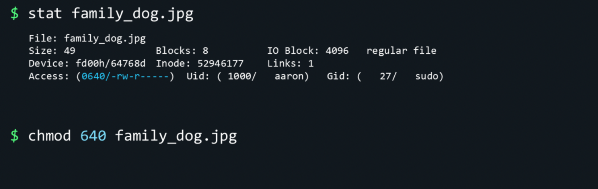

- Once we identify the number we want to set to, we can use the same in chmod commands as well. Instead of specifying the permissions for each group, we could just provide a number like this.

```shell
chmod 640 family_dog.jpg
# same as
chmod u=rw-,g=r family_dog.jpg
```

## 2.3 SUID, SGID, Stickt Bit:
This section explains the three special permission bits in Linux: setuid (SUID), setgid (SGID), and the sticky bit. These bits are stored in the "special" permission field (the left-most digit when using octal notation), and they alter how executables run or how files inside directories are handled.

- **Setuid (SUID, `u+s`)**: When set on an executable file, the process started from that executable runs with the file owner's user ID (effective UID) instead of the UID of the user who launched it. This is commonly used to allow normal users to perform specific tasks with elevated privileges (example: `/usr/bin/passwd`).

- **Setgid (SGID, `g+s`)**: When set on an executable file, the process runs with the file's group ID as its effective group. When set on a directory, new files and subdirectories created within inherit the directory's group (and, on some systems, get group-execute behavior), which is useful for collaborative directories.

- **Sticky bit (`o+t`)**: When set on a directory, the sticky bit prevents users from deleting or renaming files in that directory unless they are the file owner, the directory owner, or `root`. This is used on world-writable directories like `/tmp` to prevent users from removing each other's files.

How these appear in `ls -l`:

- Setuid: `-rwsr-xr-x` (note the `s` in the owner's execute position). If the owner's execute bit is not set, you may see `S` (uppercase) which means SUID is set but the owner execute bit is not.
- Setgid on an executable: `-rwxr-sr-x` (note the `s` in the group's execute position). On a directory you will see `d...s...` in the group position.
- Sticky bit on a directory: `drwxrwxrwt` (note the `t` at the end). If the execute bit for others is not set you'll see `T` (uppercase) instead.

Numeric (octal) notation for the special bits: they form the left-most octal digit.

- `4` = setuid
- `2` = setgid
- `1` = sticky

So `chmod 4755 file` sets setuid + `rwxr-xr-x`, `chmod 2755 dir` sets setgid + `rwxr-sr-x`, and `chmod 1777 /tmp` sets sticky + `rwxrwxrwt`.

Examples (commands you can run to try these out):

1) Demonstrate SUID with a small program

```
# Create a small C program that prints uid and euid
cat > suid_test.c <<'EOF'
#include <stdio.h>
#include <unistd.h>
int main() { printf("uid=%d euid=%d\n", getuid(), geteuid()); return 0; }
EOF

# Compile
gcc -o suid_test suid_test.c

# Make it owned by root and set the SUID bit (requires root privileges)
sudo chown root:root suid_test
sudo chmod 4755 suid_test   # or: sudo chmod u+s suid_test

# Now run as a regular user: note the effective UID becomes 0 (root)
./suid_test
# Expected output (when run by a non-root user):
# uid=1000 euid=0
```

Explanation: even though a normal user launched `suid_test`, the process's effective UID is the file owner's UID (root), so `geteuid()` returns `0`.

2) Demonstrate SGID on a directory (shared group collaboration)

```
# Create a shared directory and set its group
sudo groupadd sharedgrp  # if the group doesn't exist
mkdir -p /tmp/shareddir
sudo chown root:sharedgrp /tmp/shareddir

# Set SGID so files created inside inherit the group's gid
sudo chmod 2775 /tmp/shareddir   # or: sudo chmod g+s /tmp/shareddir

# Create a file as a regular user, then check its group
touch /tmp/shareddir/example_file
ls -l /tmp/shareddir/example_file
# You should see the file's group is 'sharedgrp' (inherited from the directory)
```

3) Demonstrate the sticky bit on a public directory (like `/tmp`)

```
# Create a public directory and set permissions like /tmp
mkdir -p /tmp/public
chmod 1777 /tmp/public    # or: chmod o+t /tmp/public; chmod 777 /tmp/public

# Now multiple users can create files, but one user cannot remove another user's file
touch /tmp/public/alice_file
# If another user tries to delete alice_file, it will fail unless that user is owner, dir owner, or root
ls -ld /tmp/public
# Expected permissions: drwxrwxrwt
```

Notes and security considerations:

- Use SUID sparingly. A SUID-root executable can be a major security risk if it contains bugs — attackers can exploit it to gain root. Only trusted, small programs should be SUID-root (e.g., `passwd`).
- SGID is useful for team directories to ensure files share the same group and collaborative permissions.
- The sticky bit is critical for world-writable directories so users cannot delete each other's files (this is why `/tmp` is `1777`).
- Watch for `s` vs `S` and `t` vs `T`: lowercase means special bit plus execute bit set; uppercase means special bit set but execute is not set for that scope.

Common `chmod` examples:

- `chmod u+s file`        # setuid
- `chmod g+s file_or_dir` # setgid
- `chmod o+t dir`         # sticky bit on directory
- `chmod 4755 file`       # numeric setuid example
- `chmod 2755 dir`        # numeric setgid example
- `chmod 1777 dir`        # numeric sticky example (like /tmp)

This concludes the SUID/SGID/Sticky-bit notes with examples. Use these commands in a safe test environment or VM, and avoid setting SUID on untrusted binaries.


---
---


## 3.Hard Links & Soft Links

- To understand hard links and soft links we first must learn some very basic things about filesystems.

### 3.1 How a file is stored in filesystem?

#### Inodes:
```shell
echo "Picture of Milo the dog" > Pictures/family_dog.jpg
stat Pictures/family_dog.jpg
```
- Filesystems like xfs, ext4, and others, keep track of data with the help of inodes. - An inode is a filesystem data structure that stores metadata about a file (or directory) — everything except the filename and the file’s actual data blocks.

- Our picture might have blocks of data scattered all over the disk, but the inode
remembers where all the pieces are stored. It also keeps track of metadata. What an inode stores

- __Owner / Group:__ UID and GID.
- __Permissions:__ Read/write/execute bits and special bits (SUID/SGID/sticky).
- __Timestamps:__ typically atime, mtime, ctime (and on some filesystems birth/creation time).
- __Link count:__ number of hard links pointing to the inode.
- __Size & block pointers:__ file size and pointers to the data blocks (or extents).
- __File type & flags:__ regular file, directory, device, special attributes.
- __Other:__ inode number, number of blocks used, filesystem-specific flags.

#### Key concepts

- __Filename vs inode:__ The directory entry maps a filename to an inode number. A file’s identity on disk is the inode; filenames are directory entries that reference it.
- __Hard links:__ Multiple filenames (dir entries) can reference the same inode. The inode’s link count increases for each hard link. Removing a filename decrements the link count; the data is freed only when link count reaches 0 and no process has the file open.
- __Symbolic links:__ A symlink is a separate file with its own inode that contains a path — it does not share the target’s inode.

- __Per-filesystem:__ Inodes exist per filesystem and inode numbers are unique only within that filesystem. Filesystems allocate a fixed number (or ratio) of inodes when created — you can run out of inodes even if there is free disk space.

```shell
ls -i file.txt        # prints inode number before filename
ls -li               # long listing including inode
stat file.txt        # detailed info including inode on Linux
#Find a file by inode:
find /path -inum 123456 -print
df -i               # shows used/available inodes per filesystem
```

### 3.2 Hard Links:

```shell
echo "Picture of Milo the dog" > Pictures/family_dog.jpg
stat Pictures/family_dog.jpg
```
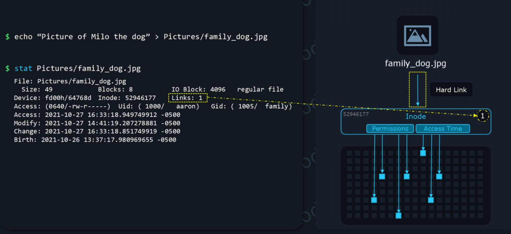

- When we create a file `family_dog.jpg` linux group all this file's data under inode 52946177. 
- Data blocks and inode created then hardlink created for "family_dog.jpg" to Inode 52946177.

#### why would we need more than one hard link for this data?

- If we want to share `family_dog.jpg` file with other users within the same system, Instead of copying `/home/aaron/Pictures/family_dog.jpg` to `/home/jane/Pictures/family_dog.jpg`, we could hardlink it to `/home/jane/Pictures/family_dog.jpg`.

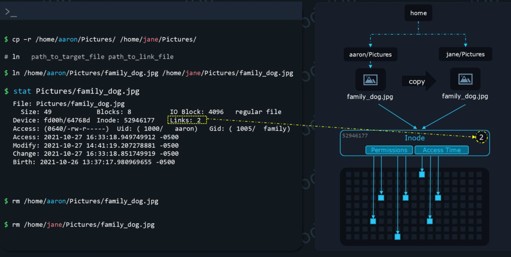

- `ln path_to_target_file path_to_link_file`

- The `target_file` is the file you want to link with. 
- The `link_file` is simply the name of this new hard link we create. Technically, the hard link created at the destination is a file like any other. 
- The only special thing about it is that instead of pointing to a new inode, it points to the same inode as the `target_file`.

- __Now our picture is only stored once, but the same data can be accessed at different locations, through different filenames.__

##### How delete happens with hard links?

- if aaron deletes the family_dog.jpg then it will decrease link_count to 1, so jane still can access the file.
- When there are 0 link_count, the data itself will disappear from the filesystem.
- The beauty of this approach is that people that share hard links can freely delete what they want, without having a negative impact on other users that still need that
information. 
- But once everyone deletes their hard links to that data, the data itself will be deleted. 
- Technically, the data blocks are not actually erased. They are just marked as unused, so the system can overwrite them with new data. 
- But from the user's perspective the data is gone. So, it is "intelligently removed" only when EVERYONE involved decides they don't need it anymore.

#### Limitations & Considerations:

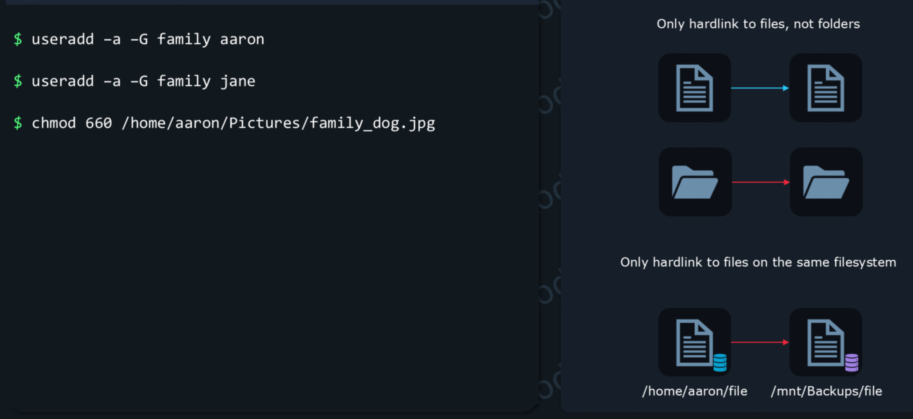

__Limitations of hard links:__

- You can only hard link to files, not directories.
- You can only hardl ink to files on the same filesystem. If you had an external drive mounted at /mnt/Backups, you would not be able to hard link a file from your SSD, at /home/aaron/file to some other file on /mnt/Backups since that's a different filesystem.
- __Consideration when you hardlink:__
- First, make sure that you have the proper permissions to create the link file at the destination. In our case, we need write permissions at: /home/jane/Pictures/.
- Second, when you hardlink a file, make sure that all users involved have the required permissions to access that file. 
- For Aaron and Jane, this might mean that we might have to add both their usernames to the same group, for example, "family". Then we'd use a command to let the group called "family" read and write to this file. 
- You only need to change permissions on one of the hardlinks. That's because you are actually changing permissions stored by the Inode. So, once you change permissions at
/home/aaron/Pictures/family_dog.jpg, /home/jane/Pictures/family_dog.jpg and all other hard links will show the same new sets of permissions.

### 3.3 Soft Links

- soft link is nothing but a software shortcut on the Windows Desktop. if you click on Chrome shortcut it will open `C:\Program Files (x86)\Google\Chrome\Application\chrome.exe` file
- Desktop shortcut is a soft link to the `.exe` file


- Soft links in Linux are very similar to hard link.
- A hard link pointed to an `inode`. 
- A soft link is nothing more than a file that points to a path instead.
- It's almost like a text file, with a path to a file or directory inside.
- syntax:

```shell
ln -s path_to_target path_to_link_file
```


- Since soft links are nothing more than paths pointing to a file, you can also softlink to directories:
```shell 
ln -s Pictures/ shortcut_to_directory
```
- you can softlink to files/directories on a different filesystem.

#### How to read soft link?
- use `ls -l` long listing format to see the file type. if permissions section starts with `l` means it's a soft link
- It even displays the path that the soft link points to. If this path is long, `ls -l` might not show the entire path. 
- An alternative command to see the path stored in a soft link is:
```shell
readlink path_to_soft_link
```


- You may also notice that all permission bits, rwx (read, write, execute) seem to be enabled for this file. That's because the permissions of the soft link do not matter, the permissions of the destination file applies.
- Broken links are displayed in RED color

---

## 4.Searching

### 4.1 search for files: find

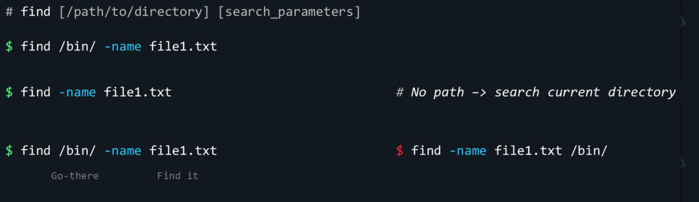

- For example to find a file named `file1.txt` in the directory `/bin` run the command.
```shell
# search inside current directory
find –name file1.txt 
# search inside /bin dir
find /bin/ –name file1.txt
# all files with prefix file
find /bin/ –name file*.txt 
#find all txt files
find /bin/ –name *.txt

```
- `–name` is the search parameter used to specify the name of the file you are looking for.
- You can sometimes skip specifying the path to the directory you want to search through. And when you do that it searches in the current directory.

- "First I have to go there, then I will find it".
- You have to enter your room, and only after you can search for your keys. This will remind you that you first have to specify the search location and then the search parameters.

#### Search Params:

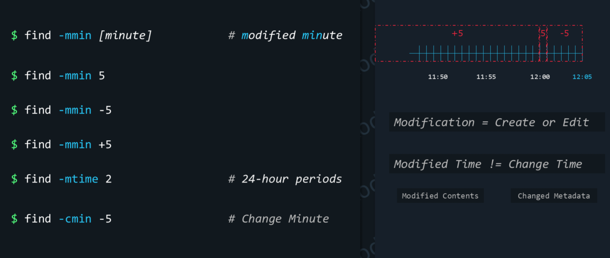

- let's make it easier to understand. First, let's imagine the time is `12:05`.With `-mmin 5`, we'd see files created at exactly `12:01`, and not `12:00` as we'd expect. That's because, when we backtrack from the current time, we step through `12:05, 12:04, 12:03, 12:02`, and end up at `12:01`, exactly five values.

- With `-mmin -5` we'd find files modified in the last 5 minutes. That means, files modified at `12:05, 12:04, 12:03, 12:02 and 12:01`. 12:00 not included, for the same reason as before. From 12:05 to 12:01 we have exactly five values. To 12:00, it would be six values, so we'd need to bump up -mmin to "-6" to also include that timestamp.

- With `-mmin +5`, we'd see files created from 12:00, to 11:59, 11:58 and beyond (in the past). You might notice there's a twist this time. We see 12:00 here instead of 12:01. 
- When you use a `+`, the count skips the current time. So it starts counting from 12:04 instead of 12:05. And we have five minutes from 12:04 to 12:00. 
- So another way to think about this "find –mmin +5" command is that it shows us any object that was created more than 5 minutes ago. And 12:01 is not more than 5 minutes ago, but rather exactly 5 minutes ago. So more than five minutes is 12:00 or earlier.

- Another similar option is `mtime`. But instead of working with minute units, it works with 24 hour units. `-mtime 0` matches what was modified in the last 24 hours. `-mtime 1` matches what was modified between 24 and 48 hours ago, and so on.

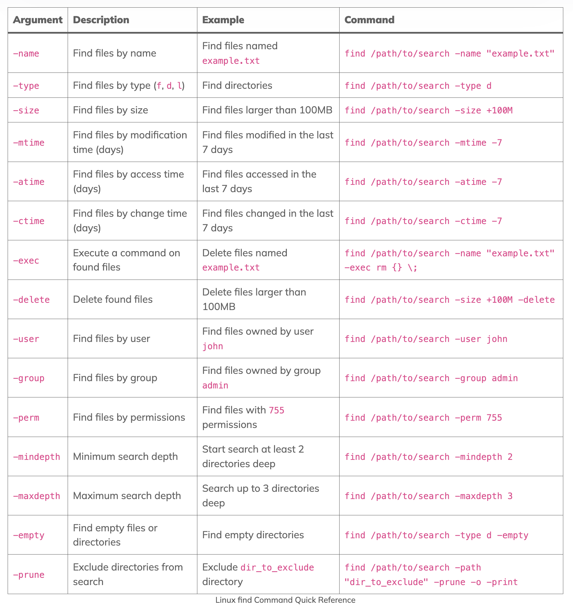
##### [source](https://serveracademy.com/blog/linux-find-command/)

#### Find by size:

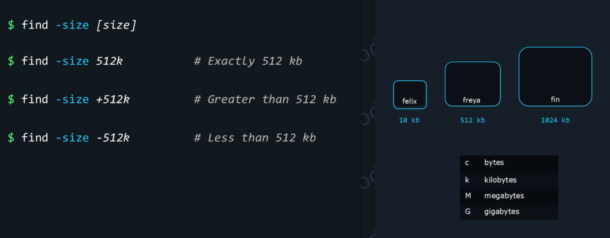

#### and, or, not operator expression

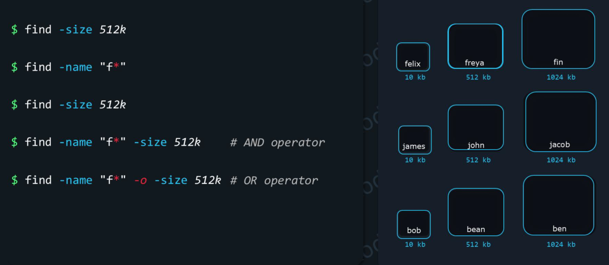

- we want to find all files that do not begin with the letter f. To exclude files beginning with the letter f from our results, we woulduse the “-not” option before the “-name” option.


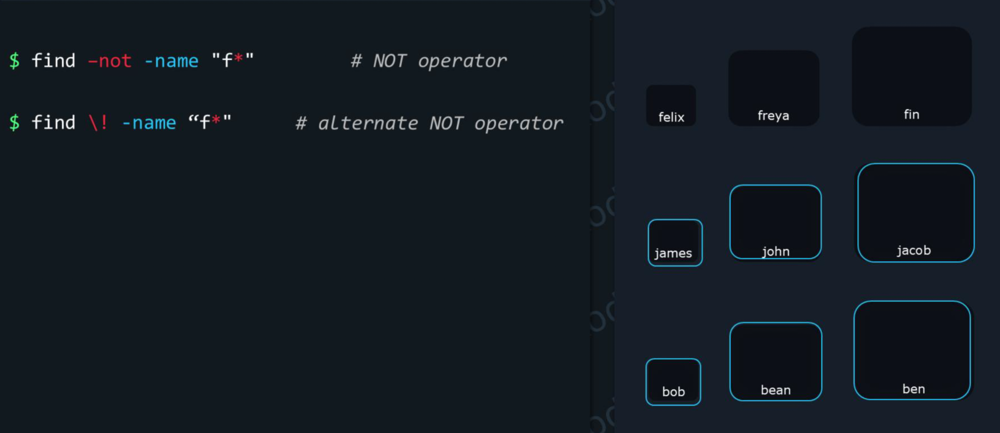

---

#### find by permissions

- We can also search for files (or directories) based on their permissions.
- We’ll use the “664” octal notation for our permissions. “664” means this set of permissions: user can read and write, group can read and write, others can read (u+rw,g+rw,o+r).


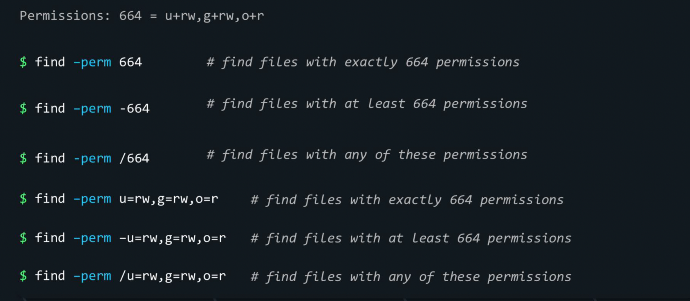


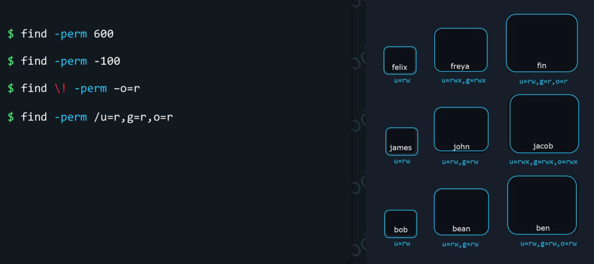

- We want to find files which only the owner can read and write, and no other permissions are set. To do that we would run `find –perm 600`. This would match the files, “felix,” “james,” and “bob.”

- To find files that the owner can execute, at least, but rest of permissions can be anything, we would run `find –perm -100`, which would match only “freya” and “jacob.”

- Now, imagine we want to make sure that nobody else can read these files, except users and groups that own them. In this case, we use the NOT operator. To look for files that others can NOT read, we would run `find \! –perm –o=r`, which matches “felix,” “james,” “bob,” “freya,” “john,” and “bean.”

- Finally, imagine we want to find files that can be read by either the user, or the group, or others 
-- does not matter who it is -- but at least one of them should be able to read. To do this, we would run `find –perm /u=r,g=r,o=r`. In this case, all our files match the condition. If no one can read it, it won't show up in the results.

<details>

<summary>why find is not working? </summary>

- The find command is designed to search recursively into subdirectories by default, starting from the specified path. If find is not searching inside subdirectories as expected, several factors could be at play: 
__1. Incorrect Path Specification:__

• Missing or Incorrect Starting Point: The find command requires a starting directory. If you want to search the current directory and its subdirectories, you must specify . (dot) as the starting point. For example: 

    find . -name "filename.txt"

To search from the root directory, use /. 
__2. Shell Globbing Interference:__ 

• Unquoted Wildcards: If you use wildcards (like *) in your -name or -iname arguments without quoting them, the shell might expand the wildcard before passing the argument to find. This means find receives a list of existing files in the current directory, not the wildcard pattern itself, leading to a non-recursive search. 
```shell
    # Incorrect (shell expands *.java)
    find . -name *.java 

    # Correct (quotes prevent shell expansion)
    find . -name "*.java" 
```

__3. Permissions Issues:__

• Insufficient Directory Permissions: find needs read (r) and execute (x) permissions on directories to traverse them and list their contents. If you lack these permissions for a particular subdirectory, find will not be able to enter it and search for files within. 

__4. Symbolic Link Handling:__ 

• Not Following Symbolic Links: By default, find does not follow symbolic links to directories. If the subdirectories you expect to be searched are actually symbolic links, find will skip them unless you explicitly tell it to follow them using the -L option. 

    find -L . -name "target_file.txt"

__5. Depth Restrictions:__ 

• maxdepth or mindepth Options: If you have used the -maxdepth or -mindepth options, you might be unintentionally limiting the search depth, preventing find from reaching certain subdirectories. Review your command for these options and adjust them as needed. 

By carefully checking these points, you can often identify and resolve why find might not be searching inside subdirectories as you intend. 

</details>


##### References:
1. https://serveracademy.com/blog/linux-find-command/


---
---


## 5. File Content Commands — grouped quick reference

Printable cheatsheet: [File Content Commands Cheatsheet](./file_content_cheatsheet.md)


## FAQs

<details>
<summary>find vs grep</summary>

### find vs grep:
---

# 🔍 1. `grep`

`grep` searches **inside file contents**.

Use `grep` when you want to find **text, patterns, or strings** within files.

### ✔ Examples

### 1. Search for a word inside files
```bash
grep "error" /var/log/syslog
````

Searches for the word `"error"` inside `/var/log/syslog`.

---

### **2. Search recursively in directories**

```bash
grep -r "timeout" /var/log/
```

Searches for `"timeout"` in all files under `/var/log`.

---

### 3. Show line numbers

```bash
grep -n "Failed" auth.log
```

---

### 4. Case-insensitive search

```bash
grep -i "warning" messages
```

---

### When to Use `grep`

* To search **text in files**
* To match **patterns** using regex
* To find **lines** containing certain words

---

# 📁 2. `find`

`find` searches for **files and directories** based on conditions such as name, type, size, permissions, date, etc.

### ✔ Examples

### **1. Find a file by name**

```bash
find /home -name "data.txt"
```

---

### **2. Find all directories**

```bash
find /etc -type d
```

---

### **3. Find files modified in the last 1 day**

```bash
find /var/log -mtime -1
```

---

### **4. Find files with specific permissions**

```bash
find /var/log -perm 644
```

---

### **5. Find files and execute a command**

```bash
find /tmp -name "*.log" -exec rm {} \;
```

---

### **When to Use `find`**

* To search **for files or directories**
* To filter using **permissions, size, type, owner**
* To **execute actions** on matched files (delete, copy, chmod, etc.)

---

# 🆚 Key Differences

| Feature                               | `grep`      | `find`                |
| ------------------------------------- | ----------- | --------------------- |
| Searches **inside files**             | ✔ Yes       | ✖ No                  |
| Searches **file names / directories** | ✖ No        | ✔ Yes                 |
| Supports **pattern matching**         | ✔ (regex)   | ✔ (file names)        |
| Can act on files found                | With pipes  | With `-exec`          |
| Primary use                           | Text search | File/directory search |

---

# 🧠 Summary

* Use **`grep`** when you want to search **text within files**.
* Use **`find`** when you want to search **for files or directories** on the filesystem.

These two commands are often used together for powerful searches.

Example:

```bash
find /var/log -type f -exec grep -i "failed" {} \;
```

This finds all files in `/var/log` and searches for `"failed"` inside each.

---


</details>