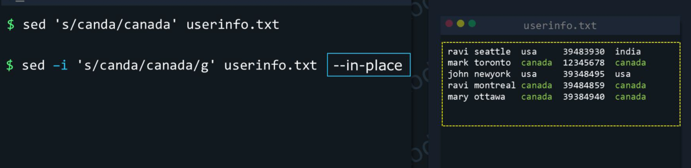

# File Content Commands

        - cat, tac
        - more, less


## Viewing & Paging:

### cat/tac:
- to view small files we can use cat/tac
- __cat:__ concatenate files and print on the standard output
- __tac:__  concatenate and print files in reverse

```shell
cat file_name; # prints the file content on stdout
cat -n file_name; #prints the file content on stdout with line numbers
cat file_name1, file_name2; # concatenates and prints the content
tac file_name; # prints the file content on stdout
tac -n file_name; #prints the file content on stdout with line numbers
```


### head/tail:
- For large files to view first or last few lines then use head/tail commands

#### head
- For Example when you want to view last few lines of the log file then you can use tail
tail /var/log/apt/term.log

#### head (notes)
- `head` prints the first part of files (default 10 lines).
- Common options:
        - `-n <NUM>` : show the first NUM lines (e.g. `head -n 20 file`).
        - `-c <NUM>` : show the first NUM bytes (e.g. `head -c 200 file`).
        - `-q` : quiet, do not print headers when multiple files.
        - `-v` : always print headers with file names.

Examples:
```shell
head file.txt                 # first 10 lines
head -n 5 file.txt            # first 5 lines
head -n 0 file.txt            # print nothing (useful in scripts)
head -c 100 file.txt          # first 100 bytes
head -n 20 file1 file2        # first 20 lines of each file (with headers)
```

#### tail (notes)
- `tail` prints the last part of files (default 10 lines).
- Common options:
        - `-n <NUM>` : show the last NUM lines (e.g. `tail -n 50 file`).
        - `-c <NUM>` : show the last NUM bytes (e.g. `tail -c 512 file`).
        - `-f` : follow file as it grows (useful for logs).
        - `-F` : like `-f` but if the file is rotated or replaced it will retry following the filename.
        - `--pid=<PID>` : (GNU tail) terminate when process PID dies (useful in scripts).

Examples:
```shell
tail file.txt                 # last 10 lines
tail -n 50 file.txt           # last 50 lines
tail -c 200 file.txt          # last 200 bytes
tail -f /var/log/syslog       # follow appended lines in real time
tail -F /var/log/nginx/access.log  # follow across rotations
#Example: test.log -> test.log.1 and new logs will be added to new test.log file -f will stop after rotation -F will follows rotation and it will display new test.log file content
```

<details>
<summary>Practices</summary>

### Small exercises — practice head & tail

1) Create a sample file and use `head` and `tail` to inspect it

Task:
- Create a file named `lines.txt` that contains 100 lines, each line containing its line number (1..100).

Commands / hints:
```shell
seq 1 100 > lines.txt
head lines.txt            # should show 1..10
head -n 3 lines.txt       # should show 1..3
tail lines.txt            # should show 91..100
tail -n 5 lines.txt       # should show 96..100
```

2) Use byte-based options

Task:
- Create a short text file and show the first 50 bytes and the last 50 bytes.

Commands / hints:
```shell
printf "Hello World\nThis is a test file with multiple bytes." > sample.txt
head -c 50 sample.txt
tail -c 50 sample.txt
```

3) Follow a growing file (simulate a log)

Task:
- Start a background writer that appends a timestamp every second, and in another terminal follow it with `tail -f`.

Commands / hints:
```shell
# Terminal 1: write timestamps
while sleep 1; do date >> /tmp/tail_demo.log; done &
# create and follow
seq 1 20 > /tmp/rotate_demo.log
tail -f /tmp/rotate_demo.log &

mv /tmp/rotate_demo.log /tmp/rotate_demo.log.1
seq 21 40 > /tmp/rotate_demo.log
# repeat above steps for -F as well it will follow after repeat
tail -F /tmp/rotate_demo.log
```


<details>

---


## sed - stream editor for filtering and transforming text

- sed works as: `sed [OPTIONS] 'ADDRESS COMMAND' file(s)` — it reads each input line into the pattern space, applies commands, then prints (unless `-n` used). Addresses choose which lines the command applies to; commands transform the pattern space or control flow.




## cut command:

Sure! Here is a **clean, merged, and improved version** of both responses — a complete **Learning Notes for the `cut` command in Linux** with explanations, examples, and exercises.
Perfect for adding to your **Markdown interview-prep notes**.

---

# 📝 Linux `cut` Command — Complete Learning Notes

## 1. Overview

The **`cut`** command in Linux extracts specific sections from each line of text input—whether from a file or a pipeline (stdin).
It is lightweight, fast, and commonly used in log processing, CSV parsing, shell scripting, and ETL pipelines.

---

## 2. Syntax

```
cut [OPTIONS] [FILE...]
```

If no file is provided, `cut` reads from **stdin**, making it pipeline-friendly.

---

## 3. Selection Methods

`cut` extracts data in **three ways**:

### **3.1 By Bytes – `-b`**

```
cut -b LIST file
```

* Extracts based on **byte positions**.
* Be careful with multi-byte UTF-8 characters.

### **3.2 By Characters – `-c`**

```
cut -c LIST file
```

* Extracts **character positions**.
* More reliable for text than `-b`.

### **3.3 By Fields – `-f` (Most used)**

```
cut -d DELIMITER -f LIST file
```

* Extracts **fields/columns** separated by a delimiter (`,` `:` space, etc.).
* Default delimiter: **TAB**

---

## 4. What is LIST?

`LIST` supports these formats:

| Format  | Meaning         |
| ------- | --------------- |
| `N`     | Nth item        |
| `N-M`   | from N to M     |
| `N-`    | from N to end   |
| `-M`    | from start to M |
| `N,M,K` | multiple fields |

---

## 5. Useful Options

| Option                   | Description                        |
| ------------------------ | ---------------------------------- |
| `-b LIST`                | Select bytes                       |
| `-c LIST`                | Select characters                  |
| `-f LIST`                | Select fields                      |
| `-d CHAR`                | Set delimiter                      |
| `-s`                     | Skip lines without delimiter       |
| `--complement`           | Invert selection                   |
| `--output-delimiter=STR` | Print fields with custom delimiter |

---

# 6. Examples

---

## **6.1 Character / Byte Extraction Examples**

### Extract characters 1 to 3:

```
cut -c 1-3 names.txt
```

### Extract only positions 2, 5, and 7:

```
cut -c 2,5,7 file.txt
```

### Extract first 4 bytes:

```
cut -b -4 file.txt
```

---

## **6.2 Extract Fields (Most Practical Use)**

### Extract first column of a CSV:

```
cut -d',' -f1 students.csv
```

### Extract 2nd and 3rd fields:

```
cut -d',' -f2,3 students.csv
```

### Extract fields from 3rd to last:

```
cut -d':' -f3- /etc/passwd
```

### Extract from a space-separated file:

```
cut -d' ' -f1,3 file.txt
```

---

## **6.3 Skip lines without delimiter**

(Useful for mixed text)

```
cut -d',' -f1 -s data.txt
```

---

## **6.4 Complement Output (everything except fields X,Y)**

```
cut -d',' -f2,4 --complement file.csv
```

---

## **6.5 Custom Output Delimiter**

```
cut -d',' -f1,3 --output-delimiter=' | ' file.csv
```

---

## **6.6 Using Cut in Pipelines**

### Extract the last field (email) of active users:

```
grep active users.csv | cut -d',' -f3
```

### Extract process names from `ps`:

```
ps aux | cut -c 65-
```

---

# 7. Real-World Use Cases

### ✔ Parsing log files

```
cat /var/log/syslog | cut -d' ' -f5-
```

### ✔ Extract usernames from `/etc/passwd`

```
cut -d':' -f1 /etc/passwd
```

### ✔ Extract file sizes from `ls -l`

```
ls -l | cut -d' ' -f5
```

### ✔ Clean inconsistent spacing using `tr` + `cut`

```
cat mixed_spaces.txt | tr -s ' ' | cut -d' ' -f1,2
```

---

# 8. Limitations of `cut`

### ❌ Cannot handle multi-character delimiters

Example: `"::"` is not supported.

### ❌ Fails when spacing is irregular

Use `awk` or `tr -s` before pipelining.

### ❌ Multi-byte UTF-8 characters may break with `-b`

Prefer `-c`.

---

# 9. Exercises (Highly Recommended)

## ▶ **Exercise 1: Students Data**

Create `students.txt`:

```
Alice,90,Math
Bob,78,Physics
Carol,85,Chemistry
Dave,92,Math
```

1. Extract all names
   `cut -d',' -f1 students.txt`
2. Extract scores + subjects
   `cut -d',' -f2,3 students.txt`
3. Extract from 2nd field to last
   `cut -d',' -f2- students.txt`

---

## ▶ **Exercise 2: Password File**

```
getent passwd > passwd_sample.txt
```

1. Extract only usernames
   `cut -d':' -f1 passwd_sample.txt`
2. Extract home directories
   `cut -d':' -f6 passwd_sample.txt`
3. Users with bash shell

   ```
   grep '/bin/bash' passwd_sample.txt | cut -d':' -f1
   ```

---

## ▶ **Exercise 3: Irregular Spacing**

File:

```
    67 lol
   143 hi
    21 test
      1 ciao
```

1. Try `cut -d' ' -f1,2` → observe incorrect output
2. Try:

   ```
   tr -s ' ' < mixed_spaces.txt | cut -d' ' -f1,2
   ```

---

## ▶ **Exercise 4: Tab-separated file**

```
ID	Name	Dept	Salary
1001	John	HR	50000
1002	Jane	Finance	60000
```

1. Extract the “Dept” column
   `cut -f3 data.txt`
2. Print Name|Salary
   `cut -f2,4 data.txt --output-delimiter='|'`

---

## ▶ **Exercise 5: UTF-8 Characters**

```
crème
façade
naïve
```

1. `cut -b 2-4 special.txt` → Observe corruption
2. `cut -c 2-4 special.txt` → Correct output
3. Reflect why (`UTF-8 multibyte handling`)

---

# 10. Summary / Key take-aways

Use cut when you need to extract parts of each line: bytes, characters or fields.

For delimited data (CSV, tab-separated, colon-separated), -f + -d is very handy.

Remember the default delimiter is tab (if -d not given).

Use ranges and lists in the “LIST” argument (e.g., 1,3-5,8-).

Combine cut with pipes for flexible processing.

Be aware of limitations: irregular spacing, multibyte characters, multiple delimiters = might need awk/sed instead.

---