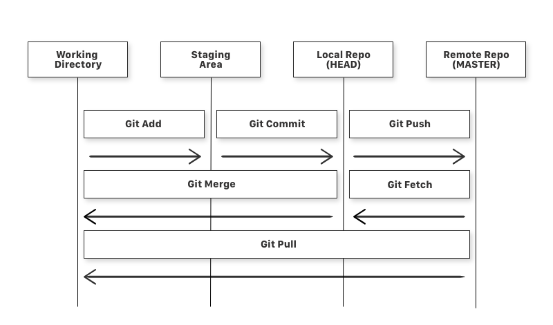

# Git Operations:


## Git Workflow:





---

## 1. What is Git (in simple terms)?

Git is a **version control system**:

- Keeps track of file changes over time.
- Lets you **go back** to older versions if something breaks.
- Helps multiple developers work together without overwriting each other’s work.

You mainly work in a **repository (repo)** = a project folder tracked by Git.

---

## 2. Important Concepts (before commands)

### 2.1 Repository types

* **Local repo** – on your machine.
* **Remote repo** – on server (GitHub, GitLab, Bitbucket).

You usually:

1. Work in **local repo**.
2. Sync changes with **remote repo** using `push`/`pull`.

---

### 2.2 Git file lifecycle (very important!)

A file in Git can be in these states:

1. **Untracked** – Git doesn’t know about it yet.
2. **Tracked**

   * **Unmodified** – no changes since last commit.
   * **Modified** – changed, but not staged.
   * **Staged** – ready to be committed.

Flow:
**Modified → Staged → Committed**

Commands:

* `git add` → moves to **Staged**
* `git commit` → moves to **Committed**

---

## 3. Starting a Project

### 3.1 Create a new (local) repository

```bash
mkdir my-project
cd my-project
git init
```

* `git init` creates a hidden `.git` folder – that’s the actual repo metadata.
* Now this folder is a Git repository.

---

### 3.2 Clone an existing repository (from GitHub etc.)

```bash
git clone https://github.com/user/repo.git
```

* Creates a new folder `repo/` and downloads complete history.
* You usually do this for existing projects.

---

## 4. Basic Workflow: status → add → commit

Let’s say you created a project:

```bash
echo "Hello Git" > hello.txt
```

### 4.1 Check status

```bash
git status
```

You’ll see something like:

* `Untracked files: hello.txt`

That means: Git sees a new file but is not tracking it yet.

---

### 4.2 Stage files

To stage a single file:

```bash
git add hello.txt
```

To stage all modified/untracked files:

```bash
git add .
# or
git add -A
```

Now `git status` will show:

* `Changes to be committed: hello.txt`

That means: this file will be included in the next **commit**.

---

### 4.3 Commit changes

```bash
git commit -m "Add hello.txt"
```

* `-m` = commit message.
* Message should **describe what you did**, like:

  * `"Fix login bug"`
  * `"Add user profile page"`

After commit, `git status` usually shows:

* `nothing to commit, working tree clean`

This means your working directory is in sync with the last commit.

---

## 5. Viewing history and changes

### 5.1 View commit history

```bash
git log
```

You’ll see:

* Commit hash (long ID)
* Author
* Date
* Message

For a short view:

```bash
git log --oneline
```

Example:

```text
a1b2c3d Add hello.txt
9f8e7d6 Initial commit
```

---

### 5.2 See what changed

Before staging:

```bash
git diff
```

Shows differences between **working directory** and **staged/last commit**.

After staging:

```bash
git diff --staged
```

Shows differences between **staged version** and **last commit**.

---

## 6. Working with branches

Think of a **branch** as a separate line of development.

* `main` or `master` = default branch.
* You create branches for features/bugs and then merge.

### 6.1 See branches

```bash
git branch
```

The `*` marks your current branch.

---

### 6.2 Create a new branch

```bash
git branch feature/login
```

This just creates it, doesn’t switch to it.

---

### 6.3 Switch to a branch

```bash
git checkout feature/login
```

Or create **and** switch in one step (recommended):

```bash
git checkout -b feature/login
```

Now any commits you make are on `feature/login`, not `main`.

---

### 6.4 Merge a branch into main

1. Switch to the branch you want to merge **into** (usually `main`):

   ```bash
   git checkout main
   ```

2. Merge the feature branch:

   ```bash
   git merge feature/login
   ```

* If Git can merge automatically → a merge commit is created.
* If there are conflicts → you must resolve them manually (see below).

---

### 6.5 Merge conflicts (high-level idea)

A **merge conflict** happens when:

* Same part of the same file changed in both branches.

Git will mark conflicts like:

```text
<<<<<<< HEAD
code from current branch
=======
code from other branch
>>>>>>> feature/login
```

You must edit file manually, choose/fix the code, then:

```bash
git add <file>
git commit    # complete the merge
```

---

## 7. Working with remotes (GitHub, GitLab, etc.)

### 7.1 Check remotes

```bash
git remote -v
```

Typical output:

```text
origin  https://github.com/user/repo.git (fetch)
origin  https://github.com/user/repo.git (push)
```

`origin` is the default name for the remote repository.

---

### 7.2 Add a remote (if needed)

```bash
git remote add origin https://github.com/user/repo.git
```

---

### 7.3 Push changes to remote

First push (and set upstream):

```bash
git push -u origin main
```

Later pushes (same branch):

```bash
git push
```

* This uploads your local commits to GitHub/GitLab.

---

### 7.4 Pull latest changes from remote

```bash
git pull
```

Equivalent to:

```bash
git fetch    # download new commits
git merge    # merge into local branch
```

If you want to just **fetch without merging**:

```bash
git fetch
```

---

## 8. Ignoring files: `.gitignore`

Some files should **not** be tracked (logs, build outputs, IDE configs, etc.).

Create a file named `.gitignore` in the project root:

```text
# Ignore log files
*.log

# Ignore build outputs
target/
dist/

# Ignore IDE settings
.idea/
.vscode/
```

Git will now ignore those patterns when you run `git status` and `git add .`.

> Note: If a file is already tracked, adding it to `.gitignore` does **not** automatically un-track it. You must remove it:
>
> ```bash
> git rm --cached filename
> ```

---

## 9. Undoing & fixing things (common safe operations)

### 9.1 Unstage a file

You ran `git add` by mistake? Undo staging:

```bash
git reset HEAD <file>
```

This moves file from **staged** → **modified**, doesn’t change file contents.

---

### 9.2 Discard local changes (dangerous – cannot easily undo)

To revert a file to the last committed version:

```bash
git checkout -- <file>
```

This **throws away** all uncommitted changes in that file.

---

### 9.3 `git revert` vs `git reset` (important difference)

#### `git revert <commit>`

* Creates a **new commit** that “undoes” the changes of previous commit.
* **Safe for shared branches** (e.g., `main` on GitHub).

Example:

```bash
git revert a1b2c3d
```

#### `git reset`

* Moves the branch pointer to a different commit.
* Can change history, especially with `--hard`.

Common usage:

```bash
# Soft reset: keep changes as staged
git reset --soft HEAD~1

# Mixed (default): keep changes as modified
git reset HEAD~1

# Hard reset: discard all changes & commits after target (danger!)
git reset --hard HEAD~1
```

> For **beginners**, avoid `--hard` on shared branches.

---

## 10. Temporary work: `git stash`

You’re in the middle of changes but need to switch branches quickly, and you don’t want to commit half-done work.

### 10.1 Save current changes

```bash
git stash
```

* Working directory becomes clean (like last commit).
* Your changes are stored in a stash stack.

---

### 10.2 List stashes

```bash
git stash list
```

---

### 10.3 Apply stashed changes

```bash
git stash apply      # applies latest stash, keeps it in list
# or
git stash pop        # applies latest stash and removes it from the list
```

---

## 11. A Typical Day-to-Day Workflow Example

Let’s simulate a simple workflow:

1. **Clone project**

   ```bash
   git clone https://github.com/user/my-app.git
   cd my-app
   ```

2. **Create a new branch**

   ```bash
   git checkout -b feature/add-login
   ```

3. **Make changes in code** (edit files)

4. **Check status**

   ```bash
   git status
   ```

5. **Stage files**

   ```bash
   git add src/login.js
   git add src/auth.js
   ```

6. **Review changes**

   ```bash
   git diff --staged
   ```

7. **Commit**

   ```bash
   git commit -m "Add login functionality"
   ```

8. **Push branch to remote**

   ```bash
   git push -u origin feature/add-login
   ```

9. Open GitHub → Create a Pull Request → After review, merge to `main`.

---

## 12. Small Cheat Sheet (quick reference)

```bash
# Setup
git init                          # start new repo
git clone URL                     # clone existing repo

# Status & history
git status                        # see status
git log --oneline                 # compact history
git diff                          # see changes

# Staging & committing
git add <file>                    # stage file
git add .                         # stage all
git commit -m "message"           # commit

# Branching
git branch                        # list branches
git checkout -b new-branch        # create + switch
git checkout branch-name          # switch branch
git merge branch-name             # merge into current branch

# Remotes
git remote -v                     # show remotes
git push -u origin branch         # push first time
git push                          # push later
git pull                          # fetch + merge

# Undo
git reset HEAD <file>             # unstage
git checkout -- <file>            # discard local changes
git revert <commit>               # safely undo commit

# Stash
git stash                         # stash changes
git stash list                    # list stashes
git stash pop                     # apply + remove latest stash
```

---
