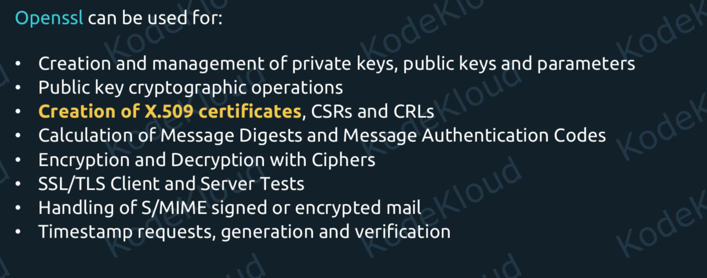

# SSL or TLS certifcates


## What Are SSL Certificates?
- Let's think about what happens when we use a password on a website. Or when we enter credit card details. There are two big problems:
- One, how can we be sure that we are sending this data to the legitimate website, and not some clone created by some malicious hacker?
- And two, how can we be sure that no one can steal these details as they're being sent through the networks?


- Well, certificates solve both of these issues. They authenticate the website, and they encrypt network traffic between user and website.
- Authentication means that the website can cryptographically prove to a browser that it is legitimate. It proves that it's actually KodeKloud.com, and not some clone. 
- And the certificate is also used to make the connection private between the user and KodeKloud.com. All data exchanged with the website is encrypted.

## How can we actually create SSL certificates?

- The utility that is normally used on Linux to create and manage TLS certificates is called "openssl". 



- "Creation of X.509 certificates". These are the certificates that we can use on websites to do the authentication and encryption we mentioned before.


Below is a **beginner-friendly, LFCS-focused explanation** of **SSL/TLS certificate concepts** that appear in the **Linux Foundation Certified System Administrator (LFCS)** exam.
This is designed as clear notes with examples specifically for **RHEL-based (Rocky/Alma/CentOS)** systems.

---

# ⭐ SSL/TLS Certificates – LFCS Essential Notes


SSL/TLS is all about **secure communication** over a network → encryption + authentication + integrity.

Although the LFCS doesn’t require deep PKI theory, you **must understand basic concepts** and **manage certificates on Linux servers**, especially for **HTTPS/Apache/Nginx/OpenSSH, OpenVPN**, and other secure services.

---

# 1. What is SSL/TLS?

* **SSL (Secure Sockets Layer)** → old, insecure.
* **TLS (Transport Layer Security)** → modern, secure version (TLS 1.2 / 1.3).

When you configure HTTPS or secure services, you are actually enabling **TLS**, even though people still say *SSL*.

---

# 2. What is a Certificate?

A TLS certificate is a **digital identity file** used to:

1. **Prove server authenticity** (example: that you’re talking to *google.com*).
2. **Encrypt the communication** (via public/private key pair).

It contains:

* Subject (e.g., CN = [www.example.com](http://www.example.com))
* Issuer (CA identity)
* Public key
* Validity dates
* Signature of CA

---

# 3. Public Key Concepts You MUST Know

## 3.1 Public Key / Private Key

* Private key → stored securely on server (`.key` file)
* Public key → part of the certificate (`.crt` or `.pem`)

Encryption Works Like:

* Client uses server’s **public key** → encrypts data
* Server uses **private key** → decrypts data

## 3.2 Self-signed vs CA-signed

| Type                        | Description                             | LFCS relevance                     |
| --------------------------- | --------------------------------------- | ---------------------------------- |
| **Self-signed certificate** | Created by server itself                | Used for testing, internal systems |
| **CA-signed certificate**   | Signed by trusted Certificate Authority | Used for production HTTPS          |

---

# 4. Certificate Signing Request (CSR)

Before you get a certificate from a CA, you generate:

* A **private key**
* A **CSR** (Certificate Signing Request)

Command:

```bash
openssl req -new -newkey rsa:2048 -nodes -keyout server.key -out server.csr
```

CSR contains your:

* Domain name
* Organization
* Public key

CA uses CSR → creates certificate.

---

# 5. Complete Certificate Chain

A certificate usually has:

1. **Root CA** (trusted by OS/browser)
2. **Intermediate CA**
3. **Server certificate**

For production, servers often require:

```
server.crt
intermediate.crt
```

Combined file for Apache/Nginx:

```
cat server.crt intermediate.crt > chain.crt
```

---

# 6. TLS Handshake (Simplified)


Basic process:

1. Client → Hello (supported TLS versions + ciphers)
2. Server → sends certificate + chooses cipher
3. Client → verifies certificate is trusted
4. Client → generates session key (encrypted with server’s public key)
5. Secure communication starts

---

# 7. Managing Certificates in Linux (LFCS Important!)

### 7.1 System certificate store

RHEL-based systems store trusted CA certs in:

```
/etc/pki/tls/certs/       # trusted certificates
/etc/pki/tls/private/    # private keys (600 permission)
/etc/pki/ca-trust/       # CA trust configuration
```

### 7.2 Add a certificate to the system trust store

Place your certificate in:

```
/etc/pki/ca-trust/source/anchors/myCA.crt
```

Then update trust store:

```bash
sudo update-ca-trust
```

Verify:

```bash
trust list | grep myCA
```

---

# 8. Creating a Self-Signed Certificate (LFCS-tested!)

Create private key + certificate (valid for 1 year):

```bash
openssl req -x509 -nodes -days 365 -newkey rsa:2048 \
-keyout /etc/pki/tls/private/server.key \
-out /etc/pki/tls/certs/server.crt
```

Common fields you will see:

* Country (C)
* State (ST)
* Locality (L)
* Organization (O)
* Organizational Unit (OU)
* Common Name (CN) → **domain name (very important)**

Example:

* CN must match domain: `www.example.com`
* For local testing → use hostname (`server1.lab.local`)

---

# 9. Convert Certificate Formats (PEM, CRT, CER, DER)

| Format                   | Description                     | Linux usage              |
| ------------------------ | ------------------------------- | ------------------------ |
| **PEM (.pem, .crt)**     | Base64-encoded                  | Most common on Linux     |
| **DER (.der)**           | Binary format                   | Sometimes used with Java |
| **PKCS#12 (.pfx, .p12)** | Contains key + cert in one file | Import/export            |

### Convert DER → PEM

```bash
openssl x509 -inform der -in cert.der -out cert.pem
```

### Convert PEM → PKCS12

```bash
openssl pkcs12 -export -out bundle.p12 \
-inkey server.key -in server.crt
```

---

# 10. Verify Certificates (LFCS Commands)

Check certificate information:

```bash
openssl x509 -in server.crt -text -noout
```

Check CSR:

```bash
openssl req -in server.csr -text -noout
```

Check private key matches certificate:

```bash
openssl rsa -in server.key -modulus -noout
openssl x509 -in server.crt -modulus -noout
```

If modulus matches → the key and cert pair is correct.

---

# 11. Enable TLS in Apache (LFCS Objective)

Install SSL/TLS module:

```bash
sudo dnf install mod_ssl
```

Default SSL vhost file:

```
/etc/httpd/conf.d/ssl.conf
```

Important lines:

```
SSLCertificateFile /etc/pki/tls/certs/server.crt
SSLCertificateKeyFile /etc/pki/tls/private/server.key
SSLCertificateChainFile /etc/pki/tls/certs/chain.crt   # optional
```

Restart:

```bash
sudo systemctl restart httpd
```

---

# 12. Enable TLS in Nginx

Edit `/etc/nginx/nginx.conf` or site file:

```
server {
    listen 443 ssl;
    ssl_certificate /etc/pki/tls/certs/server.crt;
    ssl_certificate_key /etc/pki/tls/private/server.key;
}
```

Test and restart:

```bash
sudo nginx -t
sudo systemctl restart nginx
```

---

# 13. Key Permissions (LFCS-critical)

Private keys **must** be:

```
chmod 600 server.key
chown root:root server.key
```

Certificates (`*.crt`) can be world-readable.

---

# 14. Common Exam Tasks You Must Practice

### ✔ Create a self-signed certificate

### ✔ Generate CSR and private key

### ✔ Add certificate to system trust store

### ✔ Configure HTTPS in Apache/Nginx

### ✔ Verify certificate details

### ✔ Understand certificate chain

### ✔ Fix key/cert permission issues

---


---
---

# Practices:

Great! Below are **LFCS-oriented, hands-on SSL/TLS exercises** you can actually perform on a **RHEL/Rocky/Alma Linux** VM.
Each task is realistic and matches what LFCS expects you to do on exam systems.

---

# 🔥 **LFCS Hands-On SSL/TLS Exercises (With Commands + Expected Output)**

---

# 🧪 **Exercise 1 — Create a Self-Signed TLS Certificate**

### 🎯 **Goal:** Generate a private key + self-signed certificate for 1 year.

### Steps:

```bash
sudo openssl req -x509 -newkey rsa:2048 -nodes \
-keyout /etc/pki/tls/private/web.key \
-out /etc/pki/tls/certs/web.crt \
-days 365
```

### Important fields:

* **Common Name (CN)** → must match hostname
  Example: `server1.lab.local`

### Verify:

```bash
openssl x509 -in /etc/pki/tls/certs/web.crt -text -noout
```

✔ Expected: Certificate details, public key, validity dates.

---

# 🧪 **Exercise 2 — Generate a Private Key + CSR (Certificate Signing Request)**

### 🎯 Goal: Create a CSR for a production-ready certificate.

```bash
sudo openssl req -new -newkey rsa:2048 -nodes \
-keyout server.key -out server.csr
```

Verify CSR contents:

```bash
openssl req -text -noout -verify -in server.csr
```

✔ Expected: Shows CSR information without errors.

---

# 🧪 **Exercise 3 — Create a Local CA & Issue Certificates (Internal PKI)**

*(Very useful in LFCS exam!)*

### Step 3.1 — Create CA private key + self-signed root certificate

```bash
openssl genrsa -out myCA.key 4096
openssl req -x509 -new -nodes -key myCA.key \
-sha256 -days 3650 -out myCA.pem
```

### Step 3.2 — Sign a CSR with your CA

Sign server.csr from previous exercise:

```bash
openssl x509 -req -in server.csr \
-CA myCA.pem -CAkey myCA.key -CAcreateserial \
-out server.crt -days 825 -sha256
```

Verify certificate:

```bash
openssl x509 -in server.crt -text -noout
```

✔ Expected: Issuer shows **myCA**.

---

# 🧪 **Exercise 4 — Add Your Own CA to System Trust Store**

### 🎯 Goal: Linux must trust `myCA.pem`

Copy CA to anchors directory:

```bash
sudo cp myCA.pem /etc/pki/ca-trust/source/anchors/
```

Update trust:

```bash
sudo update-ca-trust
```

Verify:

```bash
trust list | grep myCA
```

✔ Expected: It should appear as a trusted CA.

---

# 🧪 **Exercise 5 — Configure HTTPS in Apache (mod_ssl)**

### Step 5.1 — Install SSL support

```bash
sudo dnf install mod_ssl -y
```

This automatically creates:
`/etc/httpd/conf.d/ssl.conf`

### Step 5.2 — Edit SSL config

Open:

```bash
sudo nano /etc/httpd/conf.d/ssl.conf
```

Modify:

```
SSLCertificateFile /etc/pki/tls/certs/web.crt
SSLCertificateKeyFile /etc/pki/tls/private/web.key
```

### Step 5.3 — Restart Apache

```bash
sudo systemctl restart httpd
sudo systemctl status httpd
```

### Step 5.4 — Test from browser or curl

```bash
curl -k https://localhost
```

✔ Expected: HTML output (ignore certificate warnings).

---

# 🧪 **Exercise 6 — Configure HTTPS in Nginx**

Install:

```bash
sudo dnf install nginx -y
```

Edit `/etc/nginx/nginx.conf` or create a server block:

```
server {
    listen 443 ssl;
    server_name server1.lab.local;

    ssl_certificate /etc/pki/tls/certs/web.crt;
    ssl_certificate_key /etc/pki/tls/private/web.key;

    root /usr/share/nginx/html;
}
```

Test config:

```bash
sudo nginx -t
```

Restart:

```bash
sudo systemctl restart nginx
```

✔ Expected: No errors + HTTPS works.

---

# 🧪 **Exercise 7 — Verify Certificates and Keys (LFCS Tested!)**

### 7.1 Compare key + certificate modulus (must match)

```bash
openssl rsa -in web.key -modulus -noout
openssl x509 -in web.crt -modulus -noout
```

✔ Expected: Both modulus values should be identical.

### 7.2 Check certificate expiration

```bash
openssl x509 -enddate -noout -in web.crt
```

### 7.3 Check certificate subject

```bash
openssl x509 -subject -noout -in web.crt
```

✔ CN must match domain/hostname.

---

# 🧪 **Exercise 8 — Build a Certificate Chain File**

If you received:

* `server.crt`
* `intermediate.crt`

Combine:

```bash
cat server.crt intermediate.crt > chain.crt
```

Use in Apache/Nginx:

```
SSLCertificateFile chain.crt
SSLCertificateKeyFile server.key
```

✔ LFCS sometimes tests this.

---

# 🧪 **Exercise 9 — Convert Certificate Formats**

### 9.1 PEM → DER

```bash
openssl x509 -in server.crt -outform der -out server.der
```

### 9.2 DER → PEM

```bash
openssl x509 -inform der -in server.der -out server.pem
```

### 9.3 PEM → PKCS#12 (single file: cert + key)

```bash
openssl pkcs12 -export -out bundle.p12 \
-in server.crt -inkey server.key
```

✔ Useful for Tomcat/Java-based applications.

---

# 🧪 **Exercise 10 — Restrict Key Permissions (Exam Important!)**

Private key must have strict permissions:

```bash
sudo chmod 600 /etc/pki/tls/private/web.key
sudo chown root:root /etc/pki/tls/private/web.key
```

Check:

```bash
ls -l /etc/pki/tls/private/
```

✔ Expected: `-rw------- root root web.key`

---

# 🔥 Bonus: LFCS Practice Scenario

**Task:**
You are asked to secure a web server with HTTPS using a self-signed certificate.

### Steps you should perform:

1. Generate private key + certificate.
2. Install mod_ssl.
3. Update SSL config in Apache.
4. Set correct permissions.
5. Restart HTTPD.
6. Validate with `curl -k https://localhost`.

If you want, I can create a **full mock LFCS exam question** for this.

---


---
---

Below is a **full LFCS-style mock exam question** (realistic, hands-on, task-oriented).
After the question, you’ll also get **expected steps + validation checks** so you can practice like the actual exam.

---

# 📝 **LFCS Mock Exam Question — Secure a Web Server with HTTPS Using a Self-Signed Certificate**

## **Scenario**

Your organization has deployed a web server running on **Rocky Linux/RHEL**.
Your task is to **secure the web service using HTTPS** with a **self-signed SSL/TLS certificate**.

You have full root access.
Assume Apache HTTP Server (**httpd**) is installed and running.

---

# ❗ **Your Tasks**

Perform the following actions:

---

### **Task 1 — Create a Self-Signed Certificate**

Create:

* A **private key** named `web.key`
* A **self-signed certificate** named `web.crt`
* Valid for **365 days**
* Using **RSA 2048-bit encryption**

Store them in the appropriate system locations:

* `/etc/pki/tls/private/` → private key (secure)
* `/etc/pki/tls/certs/` → certificate

The certificate’s **Common Name (CN)** must match the system’s hostname.

---

### **Task 2 — Configure Apache to Use HTTPS (SSL/TLS)**

Perform the following:

1. Install SSL module if not installed.
2. Enable HTTPS support in Apache.
3. Configure Apache to use the self-signed certificate and key you generated.
4. Ensure Apache listens on port **443**.

The Apache SSL config file is:

```
/etc/httpd/conf.d/ssl.conf
```

---

### **Task 3 — Apply Correct File Permissions**

Ensure:

* The private key is only readable by root.
* Certificate file is world-readable.

---

### **Task 4 — Restart and Enable Services**

Restart Apache service to apply changes and ensure the service starts automatically on boot.

---

### **Task 5 — Verify Secure Web Access**

Use `curl` to test HTTPS access locally and verify:

1. Apache responds over HTTPS.
2. The certificate is presented (even though it is untrusted).

---

# ⏳ **Deliverable (What You Would Enter in LFCS Exam)**

Provide:

* Commands executed
* Required configuration changes
* Verification commands

---

---

# ✅ **Answer Key (What The Evaluators Expect)**

Use this to practice and check your work.

---

# **✔ Solution Steps**

## **Task 1 — Create Self-Signed Certificate**

Generate private key + cert:

```bash
sudo openssl req -x509 -newkey rsa:2048 -nodes \
-keyout /etc/pki/tls/private/web.key \
-out /etc/pki/tls/certs/web.crt \
-days 365
```

👉 When prompted, set **CN = $(hostname)**.

Verify:

```bash
openssl x509 -in /etc/pki/tls/certs/web.crt -text -noout
```

---

## **Task 2 — Configure Apache for HTTPS**

### Install SSL module:

```bash
sudo dnf install mod_ssl -y
```

This creates `/etc/httpd/conf.d/ssl.conf`.

### Edit SSL config:

```bash
sudo nano /etc/httpd/conf.d/ssl.conf
```

Ensure these lines point to your certificate and key:

```
SSLCertificateFile /etc/pki/tls/certs/web.crt
SSLCertificateKeyFile /etc/pki/tls/private/web.key
```

Also ensure:

```
Listen 443 https
```

---

## **Task 3 — Apply Correct Permissions**

Private key:

```bash
sudo chmod 600 /etc/pki/tls/private/web.key
sudo chown root:root /etc/pki/tls/private/web.key
```

Certificate:

```bash
sudo chmod 644 /etc/pki/tls/certs/web.crt
```

---

## **Task 4 — Restart and Enable Apache**

```bash
sudo systemctl restart httpd
sudo systemctl enable httpd
sudo systemctl status httpd
```

✔ Expected: service active (running).

---

## **Task 5 — Verify HTTPS Works**

Test HTTPS using curl (ignore cert validation):

```bash
curl -k https://localhost
```

✔ Expected output: HTML content of default Apache page.

Check certificate details:

```bash
openssl s_client -connect localhost:443 -servername localhost
```

Look for:

* Certificate chain
* Issuer = self-signed CN
* Protocol = TLSv1.2 or TLSv1.3

---

# 🎉 **You Have Completed the Mock LFCS Question!**

If you want, I can also generate:

✅ Another LFCS-style question (SSH security, firewall, networking, user management)
✅ A **graded exam-style solution**
✅ A **step-by-step lab environment setup for practice**
✅ A full **LFCS mock exam (20 questions)**

Tell me what you want next!
