# Operations Deployment

## 1. Boot, Reboot and Shutdown/Poweroff:

#### systemctl:

- __command:__ system control => ``systemctl``

````bash
systemctl reboot
systemctl reboot --force
#to shutdown use poweroff keyword
systemctl poweroff
systemctl poweroff --force 
# similar to turning off the power button
systemctl poweroff --force --force
# To get previlized access use sudo before all the commands
sudo systemctl reboot
sudo systemctl poweroff
````

#### shutdown:

- The shutdown command is better suited for **scheduled reboots or shutdowns.**
- The time is in 24-hour format, so you can use anything between 00:00 and 23:59.
- If you want to shutdown x minutes later, use +x instead.
````bash
# To shutdown at 2AM
sudo shutdown 02:00
# To shutdown after 15 minutes
sudo shutdown +15
# to reboot at 2AM
sudo shutdown -r 02:00
sudo shutdown -r +15
````

__wall message:__
- The "wall" message is the broadcast notification sent to all logged-in users and terminals when the system is being shut down, rebooted
- The shutdown utility publishes this message (internally using wall or equivalent) so users get a visible warning like: when shutdown will happen, who scheduled it, and any freeform text you provide.

````bash
sudo shutdown -r +10 'The system is going down for reboot in 10 minutes!'
sudo shutdown -r +5 "Rebooting for kernel update; save your work"
#halt immediately (poweroff depending on system).
sudo shutdown -h now "System maintenance: shutting down now"
#Cancel a scheduled shutdown Command:
sudo shutdown -c
# send warnings only
sudo shutdown -k +10 "Maintenance starts in 10 minutes (test only)"
# using wall command. warning only
echo "Heads up: quick maintenance in 15 minutes" | sudo wall
````
---

### boot system into different operation modes

````bash
systemctl get-default
#graphical.target

#change default target
sudo systemctl set-default multi-user.target
# you can change it to emergency.target or rescue.target
# requires reboot to effect
# to change without reboot 
sudo systemctl isolate graphical.target

````

 systemd targets: 

| Target                | Description                                                                     | Use Case                                                           |
| --------------------- | ------------------------------------------------------------------------------- | ------------------------------------------------------------------ |
| ``graphical.target``  | Boots into a full graphical desktop environment.                                | Standard desktop usage.                                            |
| ``multi-user.target`` | Boots into a text-based environment with network services, but no GUI.          | Servers or other systems that don't require a graphical interface. |
| ``rescue.target``     | Loads a minimal set of services with a root shell.                              | For administrative tasks and maintenance in a minimal environment. |
| ``emergency.target``  | Boots with only the most basic system services and a read-only root filesystem. | Critical troubleshooting when standard and rescue modes fail.      |


## 2.Scripting to Automate the Tasks
- When we log into a Linux operating system, we're automatically dropped at a command line.
- After successful log in, a program called Bash opens up. 
- All the commands we type are interpreted by ``Bash``, which figures out what needs to happen to execute them. That's why Bash is also called a command interpreter (or shell). 
- Bash can be used in two ways:
  
__1. Interactively:__ We write something, we press Enter, it gets executed and we get a result. 

__2. Scripts:__ Scripts are simply files where we can add multiple instructions for our command interpreter. The interpreter can then read this file and execute instructions in order. First, it will execute the instruction on the first line, then the one on the second line, and so on.

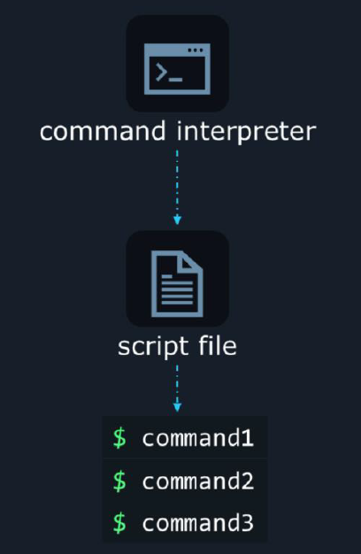

- Creating a new script file:

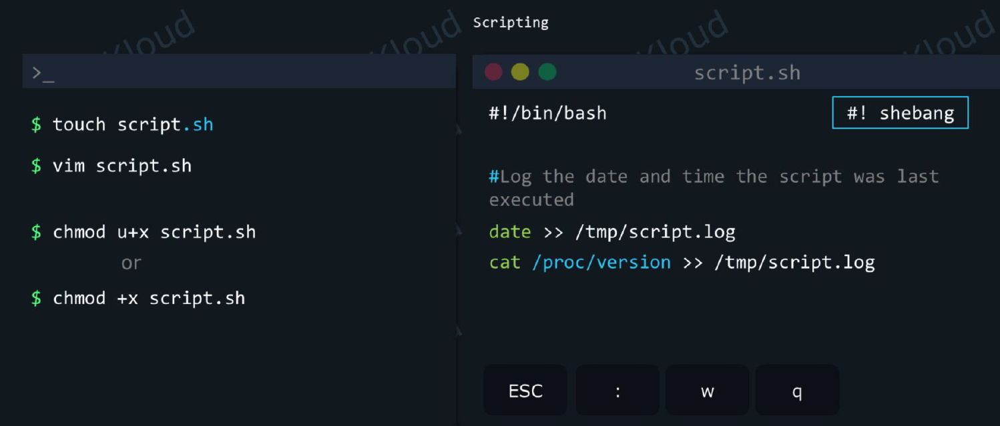

- __.sh extension:__ It's standard practice to add the ``.sh`` extension to this file. It's not mandatory, but it makes it easier when you type "ls" in a directory to spot which files are scripts.
- __touch:__ creates the file
- __vim:__ edit the file
- __#!/bin/bash__ 
- To make our script work, this has to be on the first line, not the second or third. Also, make sure there is no space before ``#``.
- ``#!`` is called a **shebang**. What follows ``#!`` is the full path to the command interpreter that we want to run this script. In this case we choose ``/bin/bash``.

- `#!/usr/bin/python3`: scripts will be exceuted by python3 interpreter.
- The date command prints out a date and time. We also use redirection to save the output of the date command to the ``/tmp/script.log`` file.


- Run/Execute the script file

````bash
# using relative path
./script.sh
# absolute path
/home/aaron/sript.sh
cat /tmp/script.log

````
- to write advanced scripts with conditions, loops and so on we use Bash built-ins

### Bash built-ins :
- These are the built-in commands are defined internally to write shell scripts
- use `help` command to display all the built-in commands
- Type `help name` to find out more about the function name'.

````bash
# list all bash built-ins
help
# see help for if built-in usage
help if
# see help for kill built-in usage
help kill

help test
````

- Now lets create a log file if it doesn't exit oterwise take a backup and crete a new log file
- create ``test-if.sh`` file
````bash
#!/bin/bash

if test -f /tmp/practices/script.log; then
    mv /tmp/practices/script.log /tmp/practices/script.log.backup
    touch /tmp/practices/script.log
else
    touch /tmp/practices/script.log
fi

````

- It's important to note that almost any command can be used in an if block. That's because most commands return a so-called __"exit status code"__. 
- They return ``0`` if the command executed successfully, otherwise ``larger than 0`` if the command didn't find what it was looking for, or if it encountered an error.
- When "if" sees that the command returned 0, it considers that this returned TRUE. When the command returns a non-zero value, "if" considers that the command returned FALSE.
- For example, consider the grep command. If it finds the text you were looking for, it returns 0. If it doesn't, it returns 1.

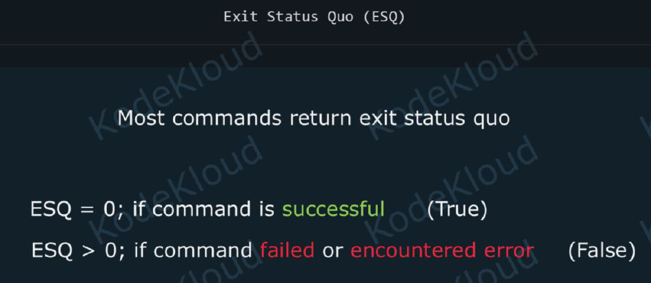

- For more understanding look for existing scripts
- For further learning: https://learn.kodekloud.com/user/courses/shell-scripts-for-beginners

---

## 3.systemd: Manage Startup processes and Services

- When we boot up Linux, certain important applications start up automatically. Some of them even start up in a very specific order. For example, if App2 depends on App1, then App1 will load before App2.

- All ofthis magic happens behind the scenes, and in a rather intelligent way. Furthermore, if important applications crash, they will be restarted automatically. This way, the system can continue to run smoothly even if there's a small hiccup like this. But how does all of this happen? With the help of what is called the init system, short for initialization system.

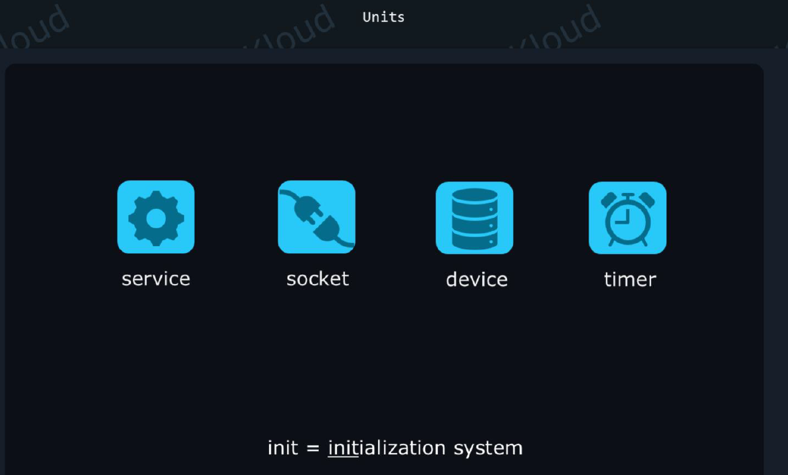


#### systemd:
- __Definition:__ systemd is an init system and system manager for Linux — the first process started by the kernel (PID 1) that initializes the user space and manages services, devices and the overall boot/shutdown lifecycle.
- __Purpose:__ start and supervise services, manage dependencies and targets, handle logging, control device/system state and provide a consistent API for service management.


__Key Components__

- __PID 1 (systemd):__ the init process that adopts or spawns all other processes and is responsible for orderly shutdown/reboot.
  
- __Units:__ configuration objects that represent services, mounts, sockets, timers, devices, targets, etc. Unit files live under ``/etc/systemd/system/`` and ``/lib/systemd/system/``.
  
- __systemctl:__ the CLI to control units (start/stop/enable/disable/status/list).
  

- __journal / journalctl:__ centralized logging system (binary logs) used by systemd.
  
- __Targets:__ named groups of units (like SysV runlevels) such as ``multi-user.target`` or graphical.target``.

- __Socket & D-Bus activation:__ start services on-demand when connections arrive (improves boot parallelism and resource usage).

- __Timers:__ replace many cron usages for scheduling service jobs.

- __cgroups integration:__ process grouping and resource control via control groups for improved supervision.


- So how does this init system know how to start up applications, what to do when a program crashes, and so on? It needs specific instructions to know how to do its job. And sure enough, it has all the instructions it needs in what are called ``systemd`` units. These are simply text files that describe the necessary logic.
- And ``systemd`` is the name of a collection of tools, components, and applications that help start, operate, and manage most of the Linux-based operating systems. 
- ``systemd`` is also the name of the program that starts up as the init system, which can be a bit confusing. Long story short, systemd is the name of a large collection of tools and components, but also the name of the application responsible for system initalization and monitoring the system as a whole to ensure smooth operation.

- Units can be of various types such as:
    - service, 
    - socket,
    - device,
    - timer, 
    - and others. 
- For example, ``timer`` units let us tell the init system that it should launch a specific
application once per week, maybe to clean up some files, or verify a database.

#### Service Units:
- Service units have clear instructions about things such as:
    - What command to issue to start up a program
    - What to do if the program crashes
    - What command to issue when a program is restarted
    - And many more things
- In a nutshell, a service unit tells the init system all it needs to know about how it should manage the entire lifecycle of a certain application.

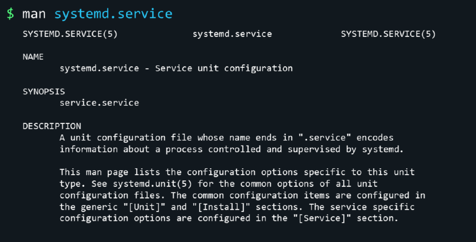

#### SSH Service Example

- Servers need to run the **SSH daemon** to let users connect to them from remote locations. And there is a service unit that instructs the initsystem about how to start this daemon and how to keep it running. 
- We can look at this service file with:

````bash
systemctl cat ssh.service
````

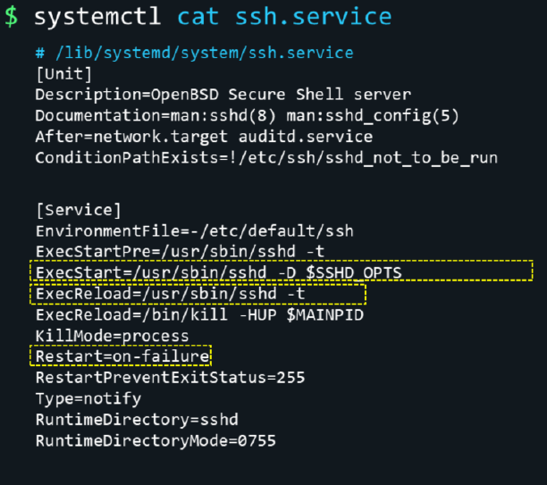

- **ExecStart** tells the init system what command it should run when it wants to start the SSH daemon. 
- **ExecReload** tells it what command it should run to reload the configuration for the SSH daemon. 
- **Restart** line tells systemd to automatically restart this process only when something fails. For example, if the SSH daemon crashes, it's a good idea to have systemd restart it, so we can still connect to our server.

- Check the status:

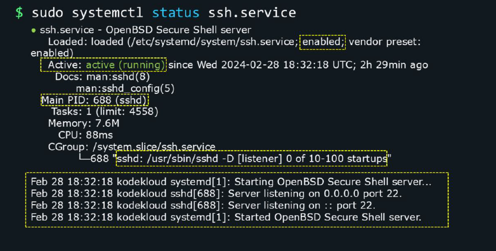


- Sothis systemdservice is responsible for the lifecycle of the SSH daemon. To start up the SSH server application, restart it when needed, andso on. 
- To see the status of this service, we can run:

```bash
systemctl status ssh.service
```

- We can see if this service is enabled. If it's enabled, it means that systemd will automatically start up the SSH daemon when the system boots. Disabled means it won't automatically start up, but it can still be manually started by the administrator.
- we can see if the program managed by this service is running. If it's currently launched, loaded into memory, and running, we'll see a status of active (running).
- We could potentially encounter situations where the service is active, but the program managed by the service is not running. Because it was launched, did its job successfully, then exited. In such a case we'd see a status of active, but exited between parentheses.

- If the SSH daemon is currently running, we'll also see its PID (Process IDentifier). Every time we launch a program on Linux, a process will start up. 
- The process encapsulates the computer code and resources loaded into memory and using the CPU when it needs to execute instructions. And every process has this unique number identifying it. The PID can be used to interact with this process

- We can also see the exact command that has been used to start up this process.
- And, finally, systemctl status also shows us a few log lines: status and error messages generated by this application. These can be useful to see what happened after the program started up, if it encountered any errors, what settings are active for it, and so on. We can press q to exit from this status display.

- Examples:

````bash

sudo systemctl start ssh.service
sudo systemctl stop/status/restart/reload ssh.service
# reloads the configuration without stopping it
sudo systemctl reload ssh.service
# first it reloads config if it needs restart
sudo systemctl reload-or-restart ssh.service
# enable to start the app at bootup time
sudo systemctl enable ssh.service
sudo systemctl status/is-enabled ssh.service
#disable to start at bootup
sudo systemctl disable ssh.service
# to enable and start the service
sudo systemctl enable --now ssh.service
# get a list of all service units available on the system, no matter if they're currently enabled, disabled, started or stopped

systemctl list-units --type service –all
````

### Create Systemd services

- Create a sample application
- `sudo vim /usr/local/bin/myapp.sh`

````bash
#!/bin/bash
echo "MyApp started....." | systemd-cat -t MyApp -p info
sleep 5
echo "MyApp crashed....." | systemd-cat -t MyApp -p err
````
- `sudo chmod +x   /usr/local/bin/myapp.sh`
- __systemd-cat__ adds the log into log file which is tagged to MyApp with -p priority
- ``man systemd.service`` configuration manual to check what all the options available for config
- To create a new systed service config we can use an existing service config as a template. to find all the service configs at `ls /lib/systemd/system` and copy some service config

- ``/lib/systemd/system`` (or ``/usr/lib/systemd/system`` on many distros) contains package-supplied unit files.
- ``/etc/systemd/system`` contains administrator-supplied unit files and overrides — they take precedence.
- In practice: don't edit package files in ``/lib`` or ``/usr/lib``; create overrides or local units under ``/etc``.
````bash
cp /lib/systemd/system/ssh.service /etc/systemd/system/myapp.service
sudo vim /etc/systemd/system/myapp.service

[Unit]
Description=My Application
After=network.target

[Service]
ExecStartPre=echo "systemd is preparing to launch MyApp"
ExecStart=/usr/local/bin/myapp.sh
KillMode=process
Restart=always
RestartSec=1
Type=simple

[Install]
WantedBy=multi-user.target
````
- save the service file config and run below commands

````bash
#reload the systemd daemon
sudo systemctl daemon-reload
# start the service
sudo systemctl start myapp.service
sudo systemctl status myapp.service
# see logs -f follows
sudo journalctl -f 

````

### precedence order for service files

- /lib/systemd/system (or /usr/lib/systemd/system on many distros) contains package-supplied unit files.
  - Debian/Ubuntu: /lib/systemd/system
  - Fedora/RHEL: /usr/lib/systemd/system
- /etc/systemd/system contains administrator-supplied unit files and overrides — they take precedence.Admin/local units and overrides belong in /etc/systemd/system so they survive package upgrades and express local intent.
- In practice: don't edit package files in /lib or /usr/lib; create overrides or local units under /etc.
- There is also a runtime location (/run/systemd/system) used for transient or dynamically generated units (higher than vendor but lower than /etc for persistence intent).

#### Load / precedence order (higher → lower)

1. /etc/systemd/system
2. /run/systemd/system
3. /usr/lib/systemd/system or /lib/systemd/system (vendor-supplied)
   

#### How systemd chooses which unit to load

- If a unit exists in multiple places, the file from the highest-precedence directory is used.
- Drop-in snippets (e.g., /etc/systemd/system/foo.service.d/*.conf) are merged with the main unit file.
- Masking (systemctl mask) creates a symlink to /dev/null so the unit can’t be started at all.

#### Examples illustrating precedence

- If package provides /lib/systemd/system/foo.service and you create /etc/systemd/system/foo.service.d/override.conf, systemd will load the vendor file and then apply your override(s).
- If you copy /lib/systemd/system/foo.service → /etc/systemd/system/foo.service and edit it, the /etc file completely overrides the vendor file.
  
#### Quick checklist before editing units

- Prefer systemctl edit (drop-in) for changes.
- Run sudo systemctl daemon-reload after adding/removing/editing unit files under /etc.
- Restart the unit (sudo systemctl restart name) to apply runtime changes.
- Verify with systemctl status name and systemctl cat name and journalctl -u name.

````bash
man systemd.unit
man systemctl
man systemd.unit  # shows unit file search paths and precedence
systemctl show -p FragmentPath <unit>
systemctl cat <unit>
systemd-delta <unit>
````
---
---


## 4. Processes (ps): Diagnose and Manage Processes


Understanding processes is essential for diagnosing performance issues and managing system behavior.

### What is a process?
- A process is a running instance of a program. Each process has a PID (process identifier), owner, resource usage, and state.
- Processes can spawn child processes (forming a tree). The kernel schedules and manages processes.

### Common process states (STAT column)
- `R` — Running or runnable (on run queue)
- `S` — Sleeping (interruptible)
- `D` — Uninterruptible sleep (usually I/O)
- `T` — Stopped (traced or stopped)
- `Z` — Zombie (terminated but parent not waited on)
- `X` — Dead

### `ps` — view process snapshots
`ps` prints a snapshot of processes. Two popular styles:

- BSD style (short):
    ```bash
    ps aux
    ```
    Fields: `USER`, `PID`, `%CPU`, `%MEM`, `VSZ`, `RSS`, `TTY`, `STAT`, `START`, `TIME`, `COMMAND`.

- UNIX (sysV) style (script-friendly):
    ```bash
    ps -ef
    ```
    Fields: `UID`, `PID`, `PPID`, `C`, `STIME`, `TTY`, `TIME`, `CMD`.

### Custom columns and formatting
Use `-o` to select columns and `--sort` to order output:
```bash
# show top CPU consumers
ps -eo pid,ppid,cmd,%cpu,%mem,etimes --sort=-%cpu | head -n 15

# show top memory consumers
ps -eo pid,ppid,cmd,%mem,rss --sort=-%mem | head -n 15

# show process tree
ps -ef --forest | less
```

### Finding processes
- `pgrep <name>` — list PIDs matching name (use `-l` to show names).
- `pidof <name>` — find PID(s) of a running program (daemon).
- `ps aux | grep <pattern>` — quick text search (careful with grep match itself).

### Inspecting a single process (useful files in `/proc`)
- `/proc/<PID>/cmdline` — full command line arguments.
- `/proc/<PID>/environ` — environment variables (NUL-separated).
- `/proc/<PID>/fd/` — open file descriptors (symlinks to files/sockets).
- `/proc/<PID>/status` — human-readable status and resource usage.

Example:
```bash
PID=1234
sudo cat /proc/$PID/cmdline
sudo ls -l /proc/$PID/fd
sudo cat /proc/$PID/status | egrep "Uid:|VmRSS|Threads"
```

### Interactive tools for diagnosis
- `top` — real-time process viewer (press `P` to sort by CPU, `M` by memory, `k` to kill a PID, `q` to quit).
- `htop` — improved, interactive `top` with tree view and easier controls (not always installed).
- `pstree` — shows the process tree hierarchically.

### Common diagnostics workflows
- High CPU usage:
    1. `top` or `htop` to find the offending PID.
    2. `ps -p <PID> -o pid,ppid,cmd,%cpu,%mem,etime` for context.
    3. `strace -p <PID>` (if safe) to see system calls — helps find busy loops or blocking I/O.

- High memory usage:
    1. `ps -eo pid,ppid,cmd,%mem,rss --sort=-%mem | head`
    2. Inspect `/proc/<PID>/smaps` or `/proc/<PID>/status` for details.
    3. Consider restarting the process or investigating memory leaks in the application.

- Excessive process count (fork bomb or runaway children):
    1. `pstree -p` to view parent-child relationships. we can also use ``ps f`` or ``ps faux``
    2. Identify the parent (PPID) and stop the parent process if appropriate.

### Managing processes (start/stop/kill)
- `kill <PID>` sends `SIGTERM` (15) by default — requests graceful shutdown.
- `kill -9 <PID>` sends `SIGKILL` (9) — forces immediate termination (cannot be trapped). Use only if `SIGTERM` fails.
- `kill -HUP <PID>` (1) often tells daemons to reload configuration.
- `pkill <pattern>` / `killall <name>` — kill by name or pattern (use carefully).

Examples:
```bash
# politely stop
sudo kill 1234

# force kill
sudo kill -9 1234

# kill processes by name
sudo pkill -f myapp           # matches full command line
sudo killall nginx            # kill all nginx worker processes
```

### Job control (interactive shells)
- `&` — run command in background: `sleep 60 &`.
- `jobs` — list background jobs in current shell.
- `fg %1` / `bg %1` — bring job to foreground or send to background.
- `disown` — detach job from shell so it won't receive SIGHUP on logout.
- `nohup <cmd> &` — run command immune to hangups (output goes to `nohup.out` by default).

### Adjusting priority
- `nice` — start a process with a modified niceness (lower niceness value = higher priority).
    ```bash
    nice -n 10 myscript.sh   # run with lower priority (niceness +10)
    ```
- `renice` — change niceness of running processes by PID or user:
    ```bash
    sudo renice -n 5 -p 1234
    sudo renice -n 10 -u someuser
    ```

### Controlling resources
- `ulimit` (shell builtin) sets per-process limits (open files, core size, stack, etc.). Put persistent limits in `/etc/security/limits.conf` for PAM-enabled logins.
- For system services, prefer `systemd` resource directives in unit files (e.g., `MemoryMax=`, `CPUQuota=`, `TasksMax=`).

### Debugging and advanced inspection
- `strace -p <PID>` — trace system calls (useful to see what a process is waiting on).
- `lsof -p <PID>` — list open files, sockets and network ports used by a process.
- `lsof <filename>` - list what all the processes are using this file
- `gdb` — attach to a process for deep debugging (requires symbols and caution).

### Example scenarios

- Restart a misbehaving service managed by `systemd` (recommended):
    ```bash
    sudo systemctl restart myservice.service
    sudo journalctl -u myservice.service -n 200 --no-pager
    ```

- If a non-service process is leaking memory, restart it safely:
    ```bash
    ps -eo pid,cmd,%mem --sort=-%mem | head -n 10
    sudo systemctl stop some-related-service || true
    sudo kill 1234               # graceful
    sudo kill -9 1234            # force if necessary
    ```

### Quick reference commands
| Task                             | Command                                            |
| -------------------------------- | -------------------------------------------------- |
| Snapshot of all processes (BSD)  | `ps aux`                                           |
| Snapshot of all processes (UNIX) | `ps -ef`                                           |
| Top CPU consumers                | `ps -eo pid,ppid,cmd,%cpu --sort=-%cpu             | head` |
| Top memory consumers             | `ps -eo pid,ppid,cmd,%mem --sort=-%mem             | head` |
| Interactive monitor              | `top` / `htop`                                     |
| Process tree                     | `pstree -p` or `ps -ef --forest`                   |
| Find PIDs by name                | `pgrep -l <name>`                                  |
| Kill by PID                      | `kill <PID>` (SIGTERM) / `kill -9 <PID>` (SIGKILL) |
| Kill by name                     | `pkill -f <pattern>` / `killall <name>`            |
| Trace syscalls                   | `strace -p <PID>`                                  |
| List open files                  | `lsof -p <PID>`                                    |

---


## 5.System Log files

- Linux operating systems are largely server-oriented.

- On a server, you always want to know:
    - what happened, 
    - who did what, 
    - what worked, 
    - what didn't work, 
    - what errors were encountered, 
    - who accessed the system, 
    - and so on. 
- Everything important that happens on a Linux system is saved as a text message somewhere, in what are called logs.

### logging daemons:


- 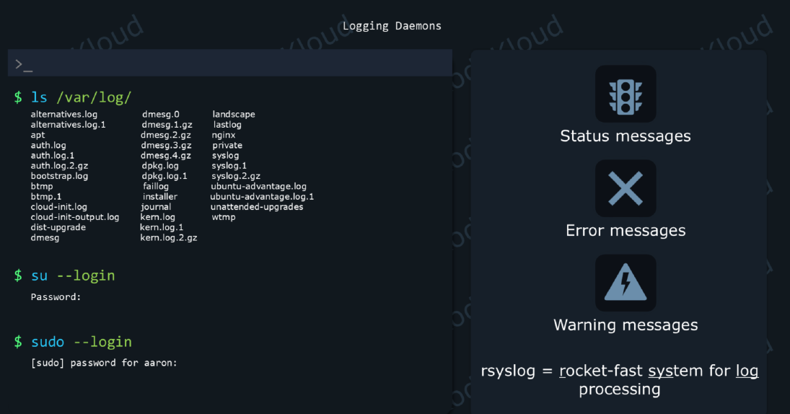

- The Linux kernel and most programs that run on the operating system generate status messages, error messages, warnings, and so on. There can be tens of different programs generating these messages all the time. Sowe need a way to collect all of these and organize them nicely into files. And this is the job of logging daemons. These are simply applications that collect, organize and store logs. The most popular one on Linux is ``rsyslog``. Its name comes from "rocket-fast system for log processing".
- rsyslogstores all logs in the ``/var/log/`` directory.
- Since these are usually regular text files, you can search through them with grep commands or any of the other text-oriented utilities that we learned about.
- One important thing though, most of these files cannot be read by regular users. So before diving into log files, you might want to log in as the root user with a command like

````bash
su -login # password of root
#or
sudo -login #password of your current user.
# grep to find the log file locations
grep -r 'sshd' /var/log/
grep -r 'nginx' /var/log
# -F makes tail enter "follow" mode.
````

---

## Where system logs are generated and how to view them

### Where logs live
- modern Linux operating systems started using an additional way to keeptrack of logs. A program called the **systemd journal daemon** is a bit smarter at how it collects this data.
- systemd-based systems use the binary journal managed by `systemd-journald`. 
- Persistent journal files are stored in `/var/log/journal/` (if enabled) or volatile journal data under `/run/log/journal/`.
- Traditional syslog daemons (e.g., `rsyslog`, `syslog-ng`) write plain-text logs under `/var/log/` such as:
    - `/var/log/syslog` or `/var/log/messages` — general system messages (Debian vs RHEL naming).
    - `/var/log/auth.log` (Debian) or `/var/log/secure` (RHEL) — authentication and sudo messages.
    - `/var/log/kern.log` — kernel messages (if present).
    - Service-specific logs: `/var/log/nginx/`, `/var/log/httpd/`, `/var/log/mysql/`, etc.
- Kernel ring buffer is available via `dmesg` (or `journalctl -k`).
- Rotated and compressed logs are kept as `*.1`, `*.gz` files in `/var/log/` and are managed by `logrotate` (`/etc/logrotate.conf`, `/etc/logrotate.d/`).

### Viewing logs with `journalctl` (systemd systems)
- Show all journal entries (requires root for full access):
    ```bash
    sudo journalctl
    ```
- Show logs from the current boot:
    ```bash
    sudo journalctl -b
    ```
- Tail live logs:
    ```bash
    sudo journalctl -f
    ```
- let us filter for logs generated by a specific command. 
    ````bash
    #get command path
    which sudo
    # find logs for command sudo
    journalctl /usr/bin/sudo
    ````
- Logs for a specific systemd unit (service):
    ```bash
    sudo journalctl -u nginx.service
    sudo journalctl -u ssh.service -n 200    # last 200 lines
    sudo journalctl -u myapp.service -f      # follow live
    ```
- Kernel messages:
    ```bash
    sudo journalctl -k
    ```
- Time-limited query and priority filtering:
    ```bash
    # This uses the 24 hour format so 02:00 shows us logs that were generated since 2 AM.
    sudo journalctl -S 02:00
    sudo journalctl -S 02:00 -U 03:00 # since 2AM Until 3AM
    # specific date & time logs
    sudo journalctl --since "2025-11-30 09:00" --until "2025-11-30 10:00"
    sudo journalctl -p warning -b
    # view logs by priority
    sudo journalctl -p debug/info/warning/err/crit
    ```
- Journal disk usage and vacuuming:
    ```bash
    sudo journalctl --disk-usage
    sudo journalctl --vacuum-size=500M
    ```

### Viewing traditional text logs under `/var/log`
- Tail and follow the main system log files:
    ```bash
    # Debian/Ubuntu
    sudo tail -n 200 -f /var/log/syslog

    # RHEL/CentOS
    sudo tail -n 200 -f /var/log/messages
    ```
- Search logs with `grep` (use `zgrep` for compressed rotated logs):
    ```bash
    sudo grep -i 'error' /var/log/nginx/error.log
    sudo zgrep 'ERROR' /var/log/nginx/error.log.*.gz
    ```
- View rotated/compressed logs:
    ```bash
    zless /var/log/nginx/access.log.1.gz
    ```

### Kernel ring buffer
- Quick kernel messages:
    ```bash
    dmesg | less
    sudo dmesg -T    # human timestamps (may require root)
    # or via journal
    sudo journalctl -k -b
    ```

### Logs for services (best practice)
- Prefer `journalctl -u <service>` on systemd systems. Many services also write to `/var/log/<service>/`.
- After changing a unit file, restart and inspect logs:
    ```bash
    sudo systemctl restart myservice
    sudo journalctl -u myservice -n 200 --no-pager
    ```

### Configuration, rotation and maintenance
- Syslog configuration files:
    - `rsyslog`: `/etc/rsyslog.conf` and `/etc/rsyslog.d/`
    - `syslog-ng`: `/etc/syslog-ng/`
- Log rotation: `/etc/logrotate.conf` and `/etc/logrotate.d/`.
    ```bash
    sudo logrotate --debug /etc/logrotate.conf
    ```

### Permissions and troubleshooting
- Reading many system logs requires root privileges; use `sudo`.
- If logs are missing, check `systemctl status systemd-journald` and the syslog daemon (`rsyslog`/`syslog-ng`). Use `sudo journalctl -xe` for urgent systemd errors.
- For long-term storage or central collection, forward logs to a remote aggregator (rsyslog/syslog-ng -> ELK, Graylog, or remote syslog server).

---


## 6. Schedule Tasks: cron, anacron, at 

- If cron, anacron not installed use below commands to install it

````bash
 # find cron functionlity packages
 sudo dnf search cron*
 # for RHEL based OS package is cronie
 sudo dnf install cronie
 sudo systemctl start crond
 sudo systemctl enable crond
````
- On servers, we'll sometimes need to set up some tasks to run automatically. For example, we could create a job that automatically backs up the database, next, or every Sunday at 3 AM.
- There are 3 utility tools to do this:
    1. cron
    2. anacron
    3. at

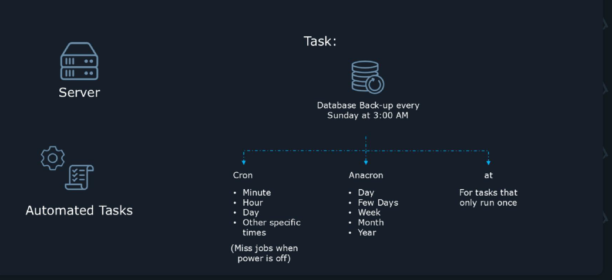

- The **cron** utility is well-suited for repetitive jobs that execute once every few minutes, or hours, or on specific days, and specific times.

- **anacron** is also used to create repetitive jobs. But with a few differences. One is that it cannot repeat those jobs every few minutes or hours. The smallest unit it can work with is a day. 
- So it can run a job every day, or every 3 days, or every week, even every month, or year. But it cannot run a job multiple times per day, just once per day.
- This utility has been created because cron can miss jobs if the computer is not powered on all the time. For example, if a job is set to run daily at 12:00 and the computer is powered on at 12:01, that job won't run for that day. anacron, on the other hand, will check if the job for today ever got a chance to run. If it didn't, it will
execute it, no matter when the system is powered on.

- Now for the **at** utility. We saw that cron and anacron are focused on repetitive automated tasks. In contrast, **at** is focused on tasks that should only run once.

### cron:

````bash
* * * * * /path/to/your/command_or_script
````
### Explanation of the fields:
- First asterisk (*): Represents the minute field (0-59). An asterisk here means "every minute."
- Second asterisk (*): Represents the hour field (0-23). An asterisk here means "every hour."
- Third asterisk (*): Represents the day of the month field (1-31). An asterisk here means "every day of the month."
- Fourth asterisk (*): Represents the month field (1-12). An asterisk here means "every month."
- Fifth asterisk (*): Represents the day of the week field (0-7, where 0 and 7 are Sunday). An asterisk here means "every day of the week." 
- ``/path/to/your/command_or_script``: This is the full path to the command or script you want to execute.

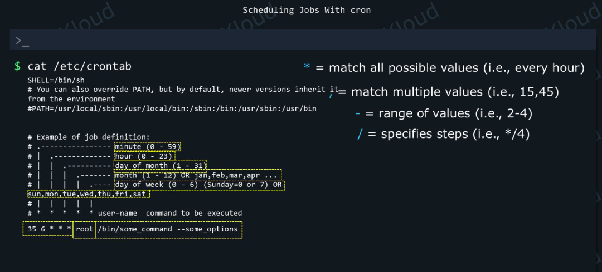

- `cat /etc/crontab` This is the default, system-wide crontable. And the commented lines tell you about the syntax you should use. If you ever need to add a cronjob here, add a new line to the end of the file.
- The first five values tell cron when this should run. The sixth value is an username. And this is followed by the command that should run. cron will execute this as if the user specified in the username field launched that task.

- The thing about adding jobs to this default system-wide table is that in certain cases, the package manager might overwrite this file. And we might lose the changes we've added. For example, this could happen when the package manager upgrades cron

- We have two cron tables 1. system-wide table and 2. user's personal(one table per user) cron table.

- **In cronjobs, we can execute either commands, or shell scripts.**
- edit the user's cron table instead of the system-wide cron table at ``/etc/crontab``. To edit a user's cron table we can use the ``-e``, edit option in the crontab command:
````bash
crontab –e
````

- This will edit the table of your current user; whoever you're currently logged in as.
- To run the touch command, and create a file called "test_passed", every day, at 6:35 AM, we could add this line:
````bash
35 6 * * * /usr/bin/touch test_passed
````
- You might notice that there's no field specifying an username now (as we had in the system-wide cron table). This is not necessary here because this time cron sees
- who the table belongs to and knows to run commands as that user.
- Now we can save our file(ctrl+d) and exit the text editor and that's all there is to adding a cron job.

````bash
# current user
crontab -l
# to see root user crontable as sudo
sudo crontab -l
# to edit root user's crontable
sudo crontab -e
# edit the cron table of the user "jane":
#Only root can edit the cron tables of other users, that's why you also have to add sudo before this command.
sudo crontab -e -u jane
# to remove crontab entirely
crontab -r
# To remove the cron table of a different user:
sudo crontab -r -u jane

````

#### Using Scripts to run cron:

- An alternative way to set up cron jobs is through these special directories:
    - /etc/cron.daily
    - /etc/cron.hourly
    - /etc/cron.monthly
    - /etc/cron.weekly
- Whatever cron finds in here, it will run daily, hourly, monthly or weekly.

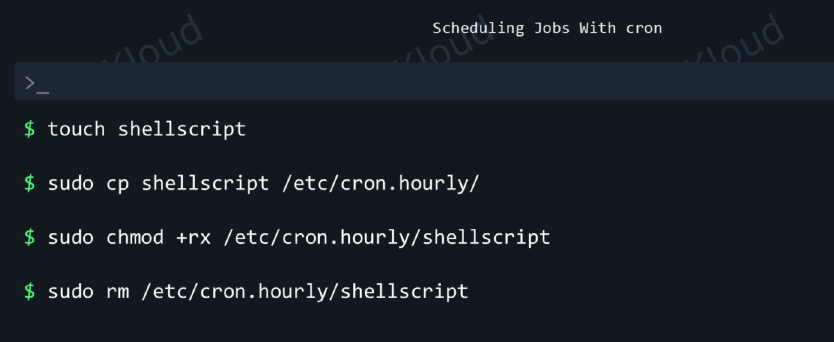


- The shell script file should have **no extension**, if we want to use it as a cron job. For example, don't use a name such as ``shellscript.sh`` if you intend to use this with cron.
- To make this run hourly, we would follow this procedure. First, copy the script to ``/etc/cron.hourly/``. We need root privileges since only the root user can write to this directory.

````bash
sudo cp shellscript /etc/cron.hourly/
# Next, make sure the script is readable and executable, so cron can run it:
sudo chmod +rx /etc/cron.hourly/shellscript

#If later on you need to remove this job, simply remove the file.
sudo rm /etc/cron.hourly/shellscript
````

### anacron:


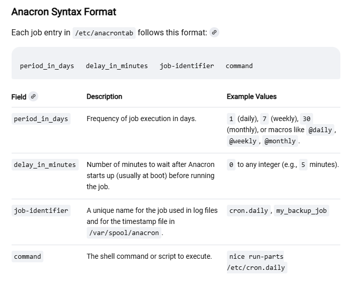

- "anacron" might not be installed by default
- When using anacron, we don't really care at what time the job will run. We just want it to run daily, monthly, or once every few days, no matter the time of the day.
- To schedule a job with anacron, we edit the /etc/anacrontab file:
sudo vim /etc/anacrontab
There are a few helpful hints in this file. First is that we can consult the anacrontab manual in section 5 to see more details about the syntax here. So we can get some
help with a command like:
man 5 anacrontab
Second, we already have three anacron entries at the end of this file, showing us some live examples.
The syntax is quite simple. We have 4 fields in an anacrontab line:
#period in days delay in minutes job-identifier command
First, we have a number that decides how often this should run. The period in the first field is specified in days. Typing 3 here would mean the job will run once every 3
days. There's also an alternate format where we can specify this in natural language. For example, instead of 30, or 31, we can just type @monthly.
When anacron checks to see what needs to run, maybe 10 different jobs have been missed because the machine was powered off during that day. It wouldn't be healthy
to start all 10 jobs at the same time. So in the second field, we can pick a different delay for each one, and make anacron run each job after waiting a specific number of
minutes. This way jobs would be spaced out, starting at different times, not all at once.
The third field, the job identifier, is useful for logging. You could name your job any way you want. If you'd name it test_job, you'd see a line like this in your logs:
anacron[1947]: Job `test_job` started. So you could identify each scheduled task more easily.
Finally, the fourth field is where we specify the command we want to run. Just like with cron, we should specify the full path to the command here, or the full path to the
script we want to run.
So, to add a job that uses the touch command to create a file at the path /root/anacron_created_this, we can add this line at the end of anacrontab:

3 10 test_job /usr/bin/touch /root/anacron_created_this
Such a line makes the job run once every three days, with a delay of 10 minutes and the job identifier for it, or its name, would be set to "test_job".
The command in this job will run as the root user.
If we'd want it to run every week, we could write:
7 10 test_job /usr/bin/touch /root/anacron_created_this
And if we'd want it to run every month:
@monthly 10 test_job /usr/bin/touch /root/anacron_created_this
After we save our file, we should verify if we used the correct syntax. We can do that by passing the -T, test option to the anacron command:
To verify if the syntax of our anacron job is correct, we can use the -T, test option:
anacron -T
We get a message if there are errors. But if it's correct, we get no message.

### at:

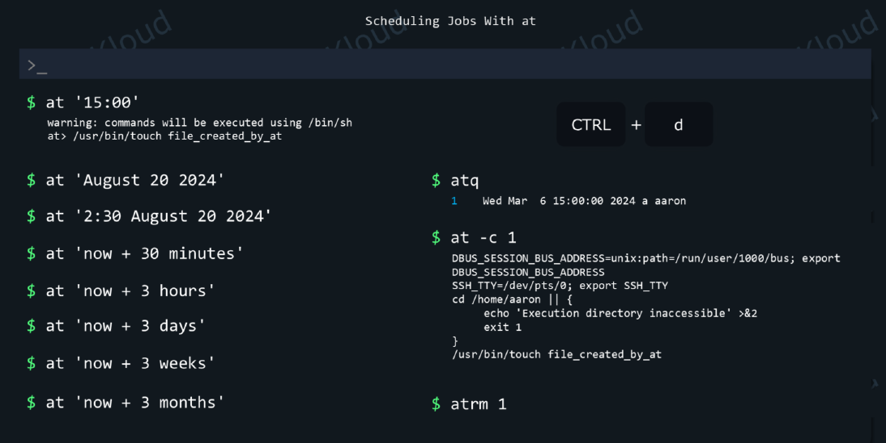

- As mentioned in the intro, cronand anacronare meant to run jobs that repeat periodically. But the utility called "at" is used to schedule jobs that only need to run once.


## 7. Package Manager:


---

## RHEL Package Management: RPM, Repositories, YUM & DNF

This section explains core concepts of package management on RHEL-like systems: RPM packages, repositories, and the high-level tools `yum` and `dnf` used to install, update and manage packages.

### Key concepts
- **RPM (Red Hat Package Manager)**: the low-level package format and tool (`rpm`) used to query, install, upgrade and remove .rpm packages. An RPM contains metadata, the packaged files, and optional scripts (pre/post install or remove).
- **Repository (repo)**: a collection of packages plus metadata which package managers (yum/dnf) use to resolve dependencies and install/upgrade software. Repo definitions live under `/etc/yum.repos.d/*.repo` and include base URL, enabled/disabled flags, GPG key info, etc.
- **YUM / DNF**: high-level package managers that handle dependency resolution, transaction history, and repository metadata. `dnf` is the modern replacement for `yum` (RHEL 8+ uses `dnf` under the hood).
- **Subscription / Content access**: RHEL systems often use `subscription-manager` to register systems and enable Red Hat repositories (or use Red Hat Satellite for offline/content management).
- **Modules & Streams (AppStream / Module streams)**: starting RHEL 8, packages may be grouped into modules with different streams (versions) — managed with `dnf module` commands.

### How repo downloads the latest package?

- A repository (repo) is a collection of packages plus metadata (package lists, versions, file lists, checksums) exposed by a URL or mirror; package managers (yum/dnf) use that metadata to find and download packages and resolve dependencies.
- A package (RPM on RHEL systems) is a single distributable unit (files + metadata + scripts + signature).
- When you ask the package manager to install or update, it consults repo metadata (repomd.xml / primary.xml), picks the highest-version RPM that satisfies dependency rules (RPM epoch:version-release comparison), downloads the .rpm files and any dependencies, verifies signatures, then performs the transaction.

### RPM vs package manager
- `rpm` operates on single `.rpm` files and cannot resolve dependencies automatically. Use it for querying and low-level operations:
    - `rpm -qa` (list installed packages)
    - `rpm -qi <pkg>` (package info)
    - `rpm -ql <pkg>` (list package files)
    - `rpm -qf <file>` (which package owns a file)
    - `rpm -e <pkg>` (erase/remove)
    - `rpm -Uvh package.rpm` (install or upgrade local rpm)
    - `rpm --checksig package.rpm` (verify GPG signature)

- Prefer `yum`/`dnf` for installing packages from repos (they resolve dependencies and record transactions).

### Common YUM/DNF commands (examples)
- List configured repositories:
    ```bash
    dnf repolist all
    yum repolist all
    ```
- Search and list packages:
    ```bash
    dnf search nginx
    dnf list available nginx
    yum search nginx
    ```
- Install / update / remove:
    ```bash
    sudo dnf install nginx
    sudo dnf remove nginx
    sudo dnf update   # update all installed packages
    sudo dnf upgrade  # alias to update on many systems
    ```
- Group and module operations:
    ```bash
    # module list (RHEL8+)
    dnf module list
    dnf module enable nodejs:14
    dnf module install nodejs:14

    # package groups
    dnf group list
    sudo dnf groupinstall "Development Tools"
    ```
- Repo management and caching:
    ```bash
    sudo dnf makecache    # refresh metadata cache
    sudo yum clean all    # clean yum cache
    sudo yum-config-manager --enable epel
    ```

### Repository configuration
- Repo files: `/etc/yum.repos.d/*.repo` contain sections with `name=`, `baseurl=`, `enabled=`, `gpgcheck=` and `gpgkey=`. Example:
    ```ini
    [example-repo]
    name=Example Repo
    baseurl=https://repos.example.com/rhel/$releasever/$basearch/
    enabled=1
    gpgcheck=1
    gpgkey=file:///etc/pki/rpm-gpg/RPM-GPG-KEY-example
    ```
- Enable/disable repos: `dnf config-manager --set-enabled` or `yum-config-manager` (requires `yum-utils`).

### GPG signing and verification
- Packages in official repos are GPG-signed. `gpgcheck=1` verifies signatures using keys listed in `gpgkey=`. Import vendor keys with:
    ```bash
    sudo rpm --import /etc/pki/rpm-gpg/RPM-GPG-KEY-redhat-release
    ```
- `rpm --checksig package.rpm` checks signature on a local file.

### Transaction history & rollback
- `yum`/`dnf` record transaction history. Useful commands:
    ```bash
    sudo dnf history list
    sudo dnf history info <id>
    sudo dnf history undo <id>   # attempt to undo a transaction
    ```
- Note: rollback support depends on available packages and metadata; test carefully before relying on undo for production rollbacks.

### Creating & using local repositories
- Create a local repo from a directory of RPMs using `createrepo`/`createrepo_c` and serve via HTTP, NFS, or file://.
    ```bash
    sudo dnf install createrepo_c
    createrepo_c /srv/repos/myrepo
    # create repo file pointing to file:///srv/repos/myrepo or http://localhost/repos/myrepo
    ```
- Useful for air-gapped environments or internal package hosting.

### Useful RPM/DNF diagnostics
- Check why a package was installed and by which package:
    ```bash
    rpm -q --whatprovides <name>
    rpm -q --whatrequires <pkg>
    rpm -qa | grep <name>
    ```
- Verify installed package files (integrity):
    ```bash
    rpm -V <pkg>
    ```
- Check for obsolete or available updates from repos:
    ```bash
    dnf check-update
    yum check-update
    ```

### Security updates & advisories
- RHEL provides security advisories; on `dnf` you can filter by security
    ```bash
    sudo dnf update --security    # apply only security updates (metadata dependent)
    ```
- Use `yum-plugin-security` or repository metadata to detect CVEs; Red Hat customers use `subscription-manager` and tools like `yum updateinfo`.

### Packaging and building (brief)
- RPMs are built from a `.spec` file using `rpmbuild`. Source RPMs (SRPMs) contain sources and spec.
- Common build layout: `~/rpmbuild/SOURCES`, `SPECS`, `BUILD`, `RPMS`, `SRPMS`.
- `rpmbuild -ba package.spec` builds binary and source RPMs.

### Best practices
- Use `dnf`/`yum` for routine installs and updates (dependency resolution, transaction history).
- Do not manually edit `/usr/lib` packaged unit files — use repos and `/etc/yum.repos.d/` for repo config.
- Prefer `dnf` modules to pick a stream (version) of software on RHEL 8+.
- Keep GPG checking enabled to ensure package integrity.
- In production, test updates in a staging environment and use Red Hat Satellite or a local mirror for controlled rollouts.

---

## 8. Availability of Resources:

### Server disk utilization
- As time goes by, a server will usually use more and more resources. Storage space is a good example.
- how do we know when we are runningout of storage space? 
- We can use the df(disk free) utility.


- Reading df output:
- We can ignore the filesystems that contain the word tmpfs.Those are virtual filesystems that only exist in the computers' memory, not on the storage devices.
- In our case, we see we have two real filesystems. The one Mounted on ``/`` is the root filesystem, where our Linux operating system is installed. The one mounted on`` /boot`` is a small filesystem where boot files are installed.

- To see how much disk space a specific directory is using, we can use the ``du`` (disk usage) utility:
````bash
du -sh /usr/
du -sh /home/prasad/
````

### RAM utilization:

### free cmd:

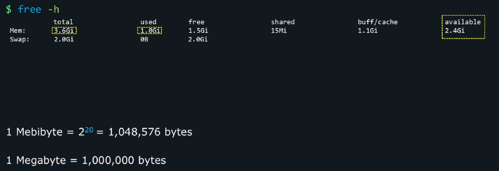

### Processor Utilization:

#### uptime:
- With the uptime command we can see how the CPU cores were used by programs running on our server.
-  uptime  gives a one line display of the following information.  The current time, how long the system has been running, how many users are currently logged on, and the system load averages for the past 1, 5, and 15 minutes.
-  Now let's say we have 8 CPU cores on this system. And we see this load average:
``6.00 0.31 0.18``
- This would mean that 6 CPU cores were used intensely in the last minute. But in the last 5 and 15 minutes, the CPU cores were barely used. So, it's just something that happened recently. Some programs worked hard to do something, for a very brief time. But, overall, the system is not pushing the CPU too much, so we shouldn't be too concerned.
- If we need to see some details about the CPU used on this system, we can run: `lscpu`
- And if we need to see some details about other hardware on this system, we can type: `lspci`

### File System:


- Now let's jump to the integrity of filesystems. To check a filesystem for errors, we first must unmount it, in case it is mounted. We'll learn more about filesystems, partitions, mounting and unmounting in the Storage section of this course.
- To verify an XFS filesystem, we would use a command like this:
````bash
sudo xfs_repair -v /dev/vdb1
````
- /dev/vdb1 points to the partition where this filesystem is stored on. In this case, it points to the first partition on the second virtual storage device

---
---


## Change Runtime Kernel Parameters:


---
---

## SELinux:


---
---

## Create and Manage Containers:

### Example of why containers are so popular?

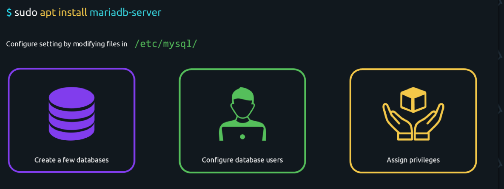

- We install it with a ``sudo apt install mariadb-server`` command. Then we configure its settings by modifying files in the ``/etc/mysql/`` directory. We create a few databases, we configure database users, assign privileges, and so on.


- Let's say we're happy with our setup and we want to move it to a more powerful computer, somewhere in the cloud. The problem is that all of its components are scattered all over the place. The settings for MariaDB are in one directory. The databases are in some other directory, logs in another one. Gathering and migrating all of these things can be a hassle.

- But what if our MariaDB setup would have been created in a Docker container instead? Now everything would exist inside this container: the daemon, the configuration files, the logs, the databases. All we would need to do is copy this container to some other computer and everything will work exactly the same as it did before.

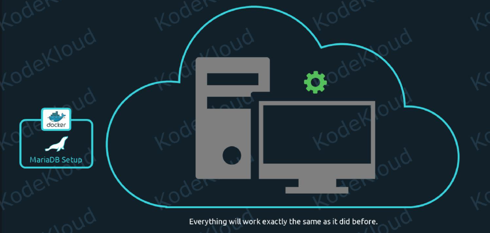

- Containers encapsulate applications. It makes them portable, easy to move around. As easy as copy/pasting a file from one location to another. Furthermore, we can clone this container 100 times, and move it to 100 different locations if we want to.
- Once we're happy with a containerized application, we can deploy it to tens of different servers, at scale. The same thing that Kubernetes does, and part of the reason why it's so popular.

### Example: nginx in docker


---
---