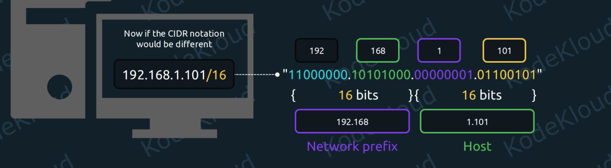
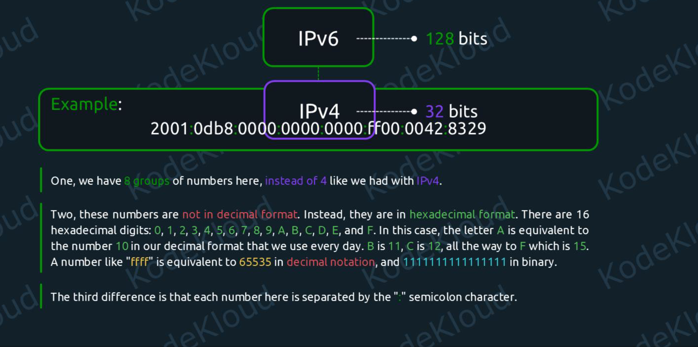
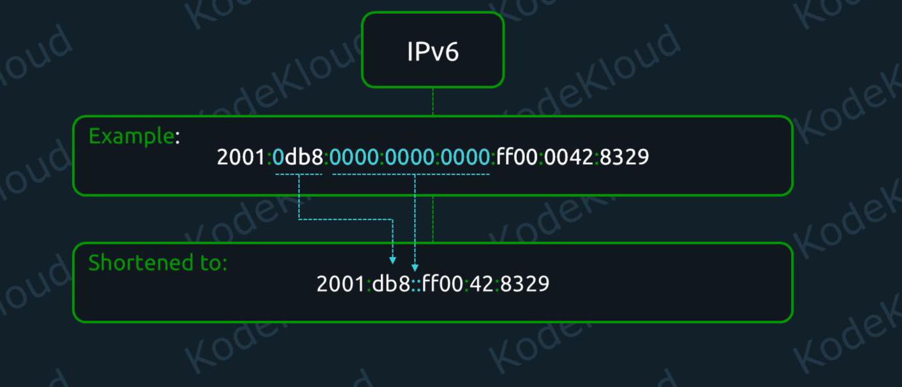
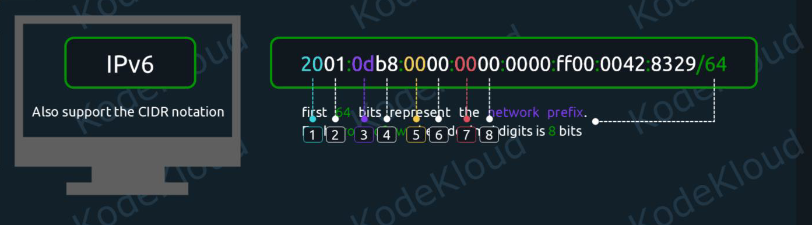

# Network Summary Notes:


## 01. Configure IPv4 and IPv6 Networking and Hostname Resolution:

- To be able to communicate across networks, a device needs an IP address.
- IP stands for Internet Protocol. And there are two kinds of IPs: IPv4 and IPv6. The "v" here stands for "version".
- In version 4 of the Internet Protocol, addresses look like this: `10.0.0.1`


- `192.168.0.5` in this IP we will have 4 numbers `192`, `168`, `0`,`5` each number is an 8-bit integer
- 8 bits can represent a number from 0 to 255, so each number can have at most value is 255 which is  `11111111`


- So an IP like "192.168.1.101" in decimal is actually "11000000.10101000.00000001.01100101" in binary.

### CIDR(Classless Inter-Domain Routing) Notation:

- Sometimes, we will see IPs displayed in this format: `192.168.1.101/24` This is called CIDR notation. 


- We can see an extra /24 at the end, next to the IP address. This tells us that the first 24 bits of this address are the prefix of this network.

- If we take another look at the binary notation, this will become easier to understand.


- If a device knows that the CIDR notation of a network IP is: `192.168.1.101/24` then it understands that `192.168.1` refers to the generic network prefix, and `.101` to a specific host on this network.


#### Example-2:



- As per above CIDR notation any IP in this network must begin with a fixed `192.168.` while the last two numbers can be anything between `0` and `255`. So we can have IPs from: `192.168.0.0` all the way to `192.168.255.255`


### IPv6:




- These addresses have 128 bits, instead of 32 bits, as is the case for IPv4. Here is an example of an IPv6 address: `2001:0db8:0000:0000:0000:ff00:0042:8329` We can notice that this is a bit different in three key areas:

    - we have 8 groups of numbers here, instead of 4 like we had with IPv4
    - these numbers are not in decimal format. Instead, they are in hexadecimal format. There are 16 hexadecimal digits: 0, 1, 2, 3, 4, 5, 6, 7, 8, 9, A, B, C, D, E, and F.
    - each number here is separated by the `:` semicolon character.


- Since these IPv6 addresses are quite long, we'll often see them shortened.



- This is done by removing all leading zeroes first. For example, we can see that "0db8" became "db8". And the consecutive group of "0000:0000:0000" was abbreviated to two consecutive semicolon characters "::".

#### CIDR Notation:
- We have 8 groups of numbers, each group is 16 bits means two hexadecimal digits is 8 bits



- IPv6 addresses also support the CIDR notation. So an address like: `2001:0db8:0000:0000:0000:ff00:0042:8329/64` signals that the first 64 bits represent the network prefix. And each group of two hexadecimal digits is 8 bits.


### Add IPv4 and IPv6 address:

- The address is a protocol (IPv4 or IPv6) address attached to a network device. Each device must have at least one address to use the corresponding protocol. It is possible to have several different addresses attached to one device.

- List Network Interfaces/Devices

```bash
# -c for coloring output
ip -c addr
# or
ip a
#or
ip link
```

- Add/Change/Delete IP addresses to a Network device
- Adding an IP address to a network interface in Linux can be done in two ways:

    1. Temporarily (lost after reboot) → using `ip` command
    2. Permanently (survives reboot) → using NetworkManager (`nmcli`) or `config files`

#### 1. using ip command:

- Useful for testing
- Not persistent after reboot
```bash
man ip address
sudo ip addr add <IP>/<NETMASK> dev <INTERFACE>

ip address add 10.00.00.1/24 dev eth1
# verify
ip address show eth1    
# delete
ip address del 10.00.00.1/24 dev eth1
ip address show eth1  
```

#### 2. Using nmcli:


#### 3. Using config files:


