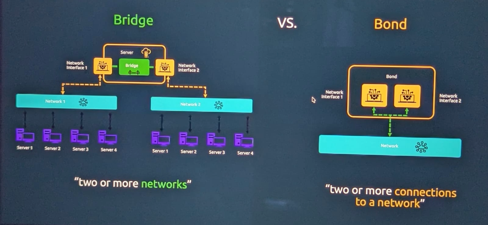
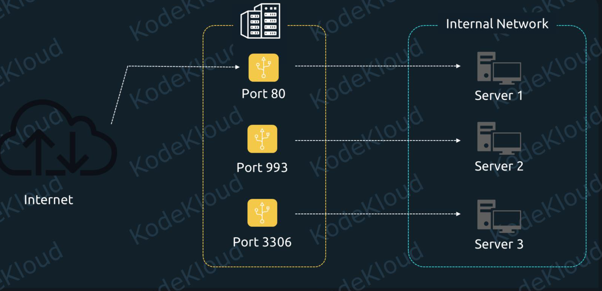
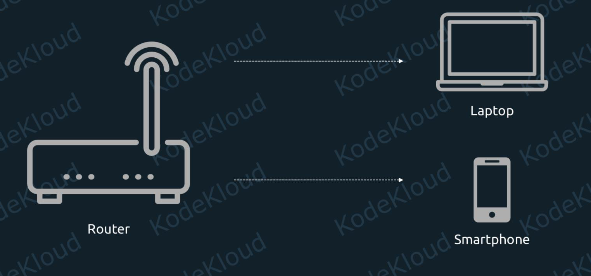
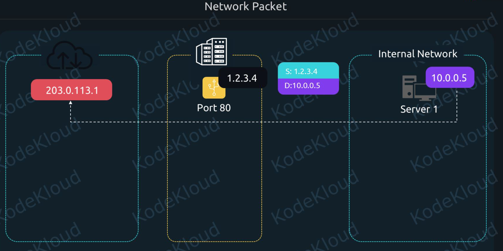

# Network Summary Notes:


##### Network Interfaces: [](./Learn/02_Network_interfaces.md)

## 01. Configure IPv4 and IPv6 Networking and Hostname Resolution:

- To be able to communicate across networks, a device needs an IP address.
- IP stands for Internet Protocol. And there are two kinds of IPs: IPv4 and IPv6. The "v" here stands for "version".
- In version 4 of the Internet Protocol, addresses look like this: `10.0.0.1`


- `192.168.0.5` in this IP we will have 4 numbers `192`, `168`, `0`,`5` each number is an 8-bit integer
- 8 bits can represent a number from 0 to 255, so each number can have at most value is 255 which is  `11111111`


- So an IP like "192.168.1.101" in decimal is actually "11000000.10101000.00000001.01100101" in binary.

### CIDR(Classless Inter-Domain Routing) Notation:

- Sometimes, we will see IPs displayed in this format: `192.168.1.101/24` This is called CIDR notation. 


- We can see an extra /24 at the end, next to the IP address. This tells us that the first 24 bits of this address are the prefix of this network.

- If we take another look at the binary notation, this will become easier to understand.


- If a device knows that the CIDR notation of a network IP is: `192.168.1.101/24` then it understands that `192.168.1` refers to the generic network prefix, and `.101` to a specific host on this network.


#### Example-2:


- As per above CIDR notation any IP in this network must begin with a fixed `192.168.` while the last two numbers can be anything between `0` and `255`. So we can have IPs from: `192.168.0.0` all the way to `192.168.255.255`


### IPv6:


- These addresses have 128 bits, instead of 32 bits, as is the case for IPv4. Here is an example of an IPv6 address: `2001:0db8:0000:0000:0000:ff00:0042:8329` We can notice that this is a bit different in three key areas:

    - we have 8 groups of numbers here, instead of 4 like we had with IPv4
    - these numbers are not in decimal format. Instead, they are in hexadecimal format. There are 16 hexadecimal digits: 0, 1, 2, 3, 4, 5, 6, 7, 8, 9, A, B, C, D, E, and F.
    - each number here is separated by the `:` semicolon character.


- Since these IPv6 addresses are quite long, we'll often see them shortened.


- This is done by removing all leading zeroes first. For example, we can see that "0db8" became "db8". And the consecutive group of "0000:0000:0000" was abbreviated to two consecutive semicolon characters "::".

#### CIDR Notation:
- We have 8 groups of numbers, each group is 16 bits means two hexadecimal digits is 8 bits


- IPv6 addresses also support the CIDR notation. So an address like: `2001:0db8:0000:0000:0000:ff00:0042:8329/64` signals that the first 64 bits represent the network prefix. And each group of two hexadecimal digits is 8 bits.


### Add IPv4 and IPv6 address:

- The address is a protocol (IPv4 or IPv6) address attached to a network device. Each device must have at least one address to use the corresponding protocol. It is possible to have several different addresses attached to one device.


## Working with Network Interfaces

- List Network Interfaces/Devices

```bash
# -c for coloring output
ip -c addr
# or
ip a
#or
ip link
ip link show
```

- Add/Change/Delete IP addresses to a Network device
- Adding an IP address to a network interface in Linux can be done in two ways:

    1. Temporarily (lost after reboot) → using `ip` command
    2. Permanently (survives reboot) → using NetworkManager (`nmcli`) or `config files`

#### 1. using ip command:

- Useful for testing
- Not persistent after reboot
```bash
man ip address
sudo ip addr add <IP>/<NETMASK> dev <INTERFACE>

ip address add 10.00.00.1/24 dev eth1
# verify
ip address show eth1    
# delete
ip address del 10.00.00.1/24 dev eth1
ip address show eth1  
```


#### 2. Using Network Manager Tool : nmcli
- for Ubuntu `netplan`, for RHEL it is `nmcli` tool to working with networks

- For overivew look at: [Network_Manager](./Learn/03_Network_Manager_Intro.md)

- Configuration files

    - `/etc/NetworkManager/`
    - `/etc/sysconfig/network-scripts/ifcfg-*` (RHEL 7/8 legacy compatibility)

- Check if Network Manager (NM) is running or not


```bash
systemctl status NetworkManager
#Start/Stop:
sudo systemctl start NetworkManager
sudo systemctl stop NetworkManager
#Enable on boot:
sudo systemctl enable NetworkManager
```

- Network Interfaces in NetworkManager


```bash
#List interfaces:
nmcli device
# To allow NM to manage an interface:
sudo nmcli device set docker0 managed yes
```

## **Device vs Connection**

NM separates **device** and **connection profile**.

### ✔ Device

- Physical or virtual network interface
- Example: `ens33`, `lo`, `wlan0`

### ✔ Connection

- A configuration profile applied to a device
- Example: `ens33`, `Wired connection 1`

- A single device can have **multiple connection profiles** (e.g., DHCP profile, static profile).


```bash
#List available connections:
nmcli connection show
#Show full device details
nmcli device show ens33
#Show active connection configuration
nmcli connection show ens33
```

---

#### Connection Types

Most common:

* `ethernet`
* `wifi`
* `bridge`
* `bond`
* `vlan`
* `team`
* `vpn`

Example:

```bash
nmcli connection show ens33
```

## Managing IP Addresses by nmcli

- Example: Set static IP on `ens33`:
```bash
# Set Static IP
nmcli con mod <connection-name> <setting>
sudo nmcli connection modify ens33 ipv4.addresses 192.168.1.50/24
sudo nmcli connection modify ens33 ipv4.gateway 192.168.1.1
sudo nmcli connection modify ens33 ipv4.dns "8.8.8.8 1.1.1.1"
nmcli con mod ens33 ipv4.ignore-auto-dns yes
sudo nmcli connection modify ens33 ipv4.method manual
# Apply changes
sudo nmcli connection up ens33
# Switch to DHCP
sudo nmcli connection modify ens33 ipv4.method auto
sudo nmcli connection up ens33
# Add Secondary IP Address
sudo nmcli con mod ens33 +ipv4.addresses 192.168.1.60/24
# Set Static DNS Only
sudo nmcli con mod ens33 ipv4.dns "8.8.8.8"

```

## Routing Management:


```bash
# Show routes
nmcli device show ens33 | grep ROUTE
# Add static route
nmcli con mod ens33 +ipv4.routes "10.10.20.0/24 192.168.1.1"
# Apply
nmcli con up ens33
```

## VLAN Configuration:


```bash
# Create VLAN:
sudo nmcli connection add type vlan con-name vlan10 dev ens33 id 10 ip4 192.168.10.10/24
# Bring it up:
nmcli con up vlan10
```

## Bonding (NIC Teaming)

```bash
# Create bonding interface:
sudo nmcli con add type bond ifname bond0 mode active-backup
# Add slave interfaces:
sudo nmcli con add type bond-slave ifname ens33 master bond0
sudo nmcli con add type bond-slave ifname ens34 master bond0
# Assign IP
sudo nmcli con mod bond0 ipv4.addresses 192.168.1.100/24 ipv4.method manual
# Activate:
nmcli con up bond0
```


##  Bridge Interface (Used in KVM)

```bash
# Create bridge:
sudo nmcli con add type bridge con-name br0 ifname br0
# Add physical NIC to bridge:
sudo nmcli con add type bridge-slave ifname ens33 master br0
#Assign IP to bridge:
sudo nmcli con mod br0 ipv4.addresses 192.168.1.30/24 ipv4.method manual
```

## Wi-Fi Management (RHEL Laptop/Server with WiFi)


```bash
# Scan Networks:
nmcli dev wifi list
#Connect:
nmcli dev wifi connect "MyWiFi" password "12345678"
```

## Debugging & Logs

```bash
# Restart NM:
sudo systemctl restart NetworkManager
# View logs:
journalctl -u NetworkManager -xe
# Check device status:
nmcli -f GENERAL device show ens33
# NetworkManager Configuration Files Location:

ls /etc/NetworkManager/
# Connection profiles stored here:
/etc/NetworkManager/system-connections/*.nmconnection
#View a connection file:
sudo cat /etc/NetworkManager/system-connections/ens33.nmconnection
# Apply config file changes:
sudo nmcli connection reload
```

## Cheat Sheet:

| Task              | Command                              |
| ----------------- | ------------------------------------ |
| List devices      | `nmcli device`                       |
| List connections  | `nmcli con show`                     |
| Show a connection | `nmcli con show ens33`               |
| Activate          | `nmcli con up ens33`                 |
| Deactivate        | `nmcli con down ens33`               |
| Modify static IP  | `nmcli con mod ens33 ipv4.addresses` |
| Add route         | `nmcli con mod ens33 +ipv4.routes`   |
| Delete connection | `nmcli con delete ens33`             |
| Create VLAN       | `nmcli con add type vlan ...`        |
| Create bond       | `nmcli con add type bond ...`        |


## 3. Using config files:

- IP address changes made using `nmcli` are permanent.
- `nmcli` modifies the **connection profile**, not just the live interface state.

- A connection profile is a persistent configuration stored under:

```
/etc/NetworkManager/system-connections/
/etc/NetworkManager/system-connections/<connection-name>.nmconnection
```

- Each profile is a file ending with:`.nmconnection
`
- Example:

```
cat /etc/NetworkManager/system-connections/ens33.nmconnection
```
- When NetworkManager restarts or the system reboots, it re-applies values from this file.

- Changes are **not permanent** only when you modify the live device instead of the connection.

- Example (NOT persistent):

```bash
nmcli device modify ens33 ipv4.addresses 192.168.1.50/24
```

- This affects the live interface but does **not** update the `.nmconnection` file.

- Correct way (persistent):

```bash
nmcli connection modify ens33 ipv4.addresses 192.168.1.50/24
```


### How to create a new connection profile?

- You can create a profile *without* applying it immediately, or you can create and activate it in one step.
- Create profile for interface `ens33` with static IP:

```bash
sudo nmcli connection add type ethernet \
       con-name static-ens33 \
       ifname ens33 \
       ipv4.addresses 192.168.1.50/24 \
       ipv4.gateway 192.168.1.1 \
       ipv4.dns "8.8.8.8" \
       ipv4.method manual \
       autoconnect yes
```
### Breakdown:

* `type ethernet` → it's a wired connection
* `con-name static-ens33` → profile name
* `ifname ens33` → apply to device
* `ipv4.method manual` → static IP
* `autoconnect yes` → activate on boot

- This creates a persistent profile file:

```bash
/etc/NetworkManager/system-connections/static-ens33.nmconnection
# Activate the Profile (Apply it to the Device)
sudo nmcli connection up static-ens33
# Check:
nmcli device status
```

### Create a DHCP Connection Profile**

```bash
sudo nmcli connection add type ethernet \
       con-name dhcp-ens33 \
       ifname ens33 \
       ipv4.method auto \
       autoconnect yes
# Activate it:
nmcli connection up dhcp-ens33

```

- Now `ens33` will get an IP via DHCP.

- How to Assign an Existing Profile to a Device?


Sometimes you create a profile *without* binding it to a device, or you want to switch profiles.

### Example profile with no device:

```bash
# Example profile with no device
con-name office-net
# Attach it to a device:
sudo nmcli connection modify office-net ifname ens33
# Activate it:
sudo nmcli connection up office-net
```

- Switch Between Profiles on the Same Device
xample: two profiles:

```
static-ens33
dhcp-ens33
```

- Switch to static:

```bash
nmcli connection up static-ens33
```

### Switch to DHCP:

```bash
nmcli connection up dhcp-ens33
```

- NetworkManager will automatically deactivate the previous one.

- Check which profile is active on a device:

```bash
nmcli -f DEVICE,STATE,CONNECTION device status
```

- To network services use `ss` (new) or `netstat` (old) tools

- `ss -tunlp` or `netstat -tunlp`

---


# Bridging and Bonding Network Devices



## 1. Network Bridge (br0)

- A **network bridge** works like a **virtual network switch**.
- It connects multiple interfaces at **Layer-2 (Ethernet level)** so they behave as if they are on the same physical network.

- Why Bridges Are Used?
- Virtualization (KVM, QEMU), Virtual machines need access to the LAN network.Bridging allows VMs to share the host NIC.

- Containers (Docker, Podman) Creates bridges like `docker0`.

- Connecting multiple interfaces into one LAN segment.

### 🟨 **Simple Diagram of a Bridge**

```
                     +---------------------+
Physical NIC ens33 → |       br0          | → VM1 eth0
                     |  (Acts like switch) | → VM2 eth0
                     +---------------------+
```

- `br0` controls the IP, not `ens33`.

- How Bridge Works**

- `ens33` (slave) **forwards packets** to `br0`.
- `br0` becomes the interface with the IP address. Other interfaces or VMs connect to `br0` internally.

### Example: Configure a Bridge with `nmcli`

- Step 1: 

```bash
# Create bridge `br0`
nmcli connection add type bridge con-name br0 ifname br0
# Add physical NIC as a slave
nmcli connection add type bridge-slave con-name br0-port1 ifname ens33 master br0
# Assign static IP to the bridge
nmcli connection modify br0 ipv4.addresses 192.168.1.50/24  ipv4.gateway 192.168.1.1 ipv4.method manual
# Bring up the connection
nmcli connection up br0
```
-  IP assigned to the **bridge**, not the physical NIC. Physical NIC(s) become **bridge ports/slaves**


---

## 2. 2. Network Bonding (bond0)

- Network Bonding (aka NIC teaming) combines **two or more physical NICs** into **one logical interface**.

- Purpose:
    -  High Availability (Failover)
    -  If one NIC fails, traffic moves to the other.
    - Load Balancing (Performance), Distribute traffic across multiple NICs.

### 📌 **Bonding Modes (Most Important)**

| Mode  | Name           | Purpose                           |
| ----- | -------------- | --------------------------------- |
| **0** | balance-rr     | Load balancing (round-robin)      |
| **1** | active-backup  | Failover (HA)                     |
| **2** | balance-xor    | Load balance XOR hashing          |
| **4** | 802.3ad (LACP) | Requires switch support           |
| **5** | balance-tlb    | Adaptive load balance             |
| **6** | balance-alb    | Adaptive load + receive balancing |

- Most used:
- **mode 1 (active-backup)** — for servers, no switch config required
- **mode 4 (LACP)** — enterprise switches, high throughput

### 🟩 Bonding Diagram (active-backup mode)

```
          +------------------+
NIC1 →    |                  |
          |      bond0       | → OS sees only *one* interface
NIC2 →    | (active-backup)  |
          +------------------+
              | Active NIC chosen
```

If NIC1 dies → NIC2 takes over instantly.

---

### 🛠 Example: Create a Bond with `nmcli`


```bash
#  Create bond interface
nmcli connection add type bond ifname bond0 con-name bond0 mode active-backup
# Add slave NICs to bond
nmcli connection add type bond-slave ifname ens33 master bond0
nmcli connection add type bond-slave ifname ens34 master bond0
# Assign IP to bond0
nmcli connection modify bond0 ipv4.addresses 192.168.1.100/24 ipv4.gateway 192.168.1.1 ipv4.method manual
# Activate
nmcli connection up bond0
# Verify Bond Status
cat /proc/net/bonding/bond0
```

# 🔹 When to Use Bonding?

| Use Case                        | Recommended Mode                |
| ------------------------------- | ------------------------------- |
| Failover / High availability    | mode **1** (active-backup)      |
| High throughput / LACP switches | mode **4** (802.3ad)            |
| Simple load balancing           | mode **0**, **2**, **5**, **6** |


- For demo setup follow: [demo_setup](./FAQs.md) Question: `How to create dummy network bridging and bonding ?`
---
---


# Packet Filtering: firewalld
- **Packet filtering** means inspecting network packets (source, destination, ports, protocol) and deciding whether to:
    - **Allow (ACCEPT)**
    - **Block (DROP)**
    - **Reject (REJECT)** (send an error response)

- Linux firewalls apply rules to control incoming/outgoing packets based on:
    - IP address
    - Port
    - Protocol (TCP/UDP/ICMP)
    - Network Interface
    - Connection state

- Linux firewalls are implemented through:
- **firewalld** (modern RHEL/CentOS/Rocky Linux/Fedora)
- **nftables** (new backend)
- **iptables** (legacy backend)

## 1. Packet Filtering Using firewalld:

- `firewalld` uses **zones** + **services** + **ports**.


```bash
# Check status:
sudo firewall-cmd --state
# List all open ports + services
sudo firewall-cmd --list-all
```

### Example 1: Allow a Service (HTTP on port 80)

```bash
sudo firewall-cmd --add-service=http --permanent
sudo firewall-cmd --reload
# OR open port manually:
sudo firewall-cmd --add-port=80/tcp --permanent
sudo firewall-cmd --reload
# This creates a packet-filter rule: > Allow TCP packets destined for port 80.
# Test:
ss -tuln | grep 80
```


### Example 2: Block a Port (Disable SSH temporarily)

```bash
sudo firewall-cmd --remove-service=ssh --permanent
sudo firewall-cmd --reload
# This blocks: All incoming packets on port **22/tcp**
```

---

### Example 3: Allow Traffic from a Specific Source (IP-based Filtering)

```bash
sudo firewall-cmd --add-rich-rule='rule family="ipv4" \
 source address="192.168.1.50" port port="22" protocol="tcp" accept' \
 --permanent
sudo firewall-cmd --reload
```
- Meaning: Only **192.168.1.50** can SSH into this machine. All other IPs are blocked.

---

### Example 4: Block a Host Completely

```bash
sudo firewall-cmd --add-rich-rule='rule family="ipv4" \
 source address="192.168.1.100" drop' --permanent
sudo firewall-cmd --reload
```
- This **drops all packets** from the host silently.

---

### Example 5: Reject Packets with Error Response

```bash
sudo firewall-cmd --add-rich-rule='rule family="ipv4" source address="203.0.113.10" reject' --permanent
```

Difference:

| DROP            | REJECT                               |
| --------------- | ------------------------------------ |
| Silent discard  | Sends ICMP “destination unreachable” |
| Harder to debug | Easier for clients to detect deny    |

---

### Example 6: Limit Traffic (Rate Limiting)

- Prevent brute-force attacks:

```bash
sudo firewall-cmd --add-rich-rule='
rule service name="ssh" log prefix="ssh-limit" limit value="5/m" accept' --permanent
```
- This allows only **5 SSH connection attempts per minute**.

---
---

# Port Redirection and Network Address Transalation(NAT):


## Port Redirection

- The public server is connected to both networks: The internal network at the right, and the Internet on the left. So the private servers on our internal network can now be accessed from the Internet if incoming connections go through this publicly accessible server in the middle.



- We can create rules that tell our public server where to redirect incoming connections to port 80, 993, and 3306. In this case, anything incoming on port 80 will be redirected, or forwarded, to Server 1. Port 993 connections would be forwarded to Server 2, and port 3306 connections to Server 3.

## Network Address Translation: NAT

- When data is sent through networks, it's first encapsulated in what are called network packets.


- For example, when we watch a video on YouTube this data is sent to us in very small network packets, each containing a portion of that video.

- Besides the data itself, each network packet also includes the source IP address and destination IP address. This identifies who sent the packet, and who should receive it.





- As far as our private server is concerned, it will have no idea who the original sender was. But through NAT done in both directions, our public server will remember who sent what and where network packets need to go. The same thing that our routers at home do. When data is coming in on a router, it just knows what it should send to our smartphone, and what should be sent to our laptop. This is also done through __Network Address Translation, and masquerading__.




```
Incoming Packet
   |
   v
PREROUTING   → DNAT / Port Forwarding
   |
Routing Decision
   |
   v
POSTROUTING  → SNAT / MASQUERADE
   |
Outgoing Packet
```

### DNAT (Destination NAT)

- Changes the **destination IP address** of incoming packets.

```
Internet → 203.0.113.10 → DNAT → 192.168.1.100
```

- When DNAT is needed

    * Expose internal service to Internet
    * Port forwarding
    * Load balancers, reverse proxies
- Syntax (iptables)

```bash
iptables -t nat -A PREROUTING \
  -d 203.0.113.10 \
  -p tcp --dport 80 \
  -j DNAT --to-destination 192.168.1.100:80
```

| Option             | Meaning             |
| ------------------ | ------------------- |
| `-t`               | NAT Table
| `PREROUTING`       | Packet just arrived |
| `-d`               | Destination IP      |
| `--dport`          | Destination port    |
| `DNAT`             | Destination NAT     |
| `--to-destination` | New IP:Port         |


### SNAT: 

- Changes the **source IP address** of outgoing packets.

```
Before:
192.168.1.10(internal IP) → Google

After SNAT:
203.0.113.10(public IP) → Google
```

- When SNAT is needed

    * Private network accessing Internet
    * Multiple hosts behind one public IP
    * Public IP is **static**

- Syntax (iptables)

```bash
iptables -t nat -A POSTROUTING \
  -s 192.168.1.0/24 \
  -o ens33 \
  -j SNAT --to-source 203.0.113.10
```

### 🔍 Syntax explained

| Option              | Meaning                      |
| ------------------- | ---------------------------- |
| `-t nat`            | Use NAT table                |
| `-A POSTROUTING`    | Apply after routing decision |
| `-s 192.168.1.0/24` | Match source network         |
| `-o ens33`          | Outgoing interface           |
| `-j SNAT`           | Target = Source NAT          |
| `--to-source`       | New source IP                |

### MASQUERADE (Dynamic SNAT)

- Same as SNAT, but **auto-detects public IP**.
- When MASQUERADE is needed

    * DHCP-based public IP
    * Laptop, home broadband, cloud VMs
    * You don’t know the public IP in advance

- Syntax

```bash
iptables -t nat -A POSTROUTING -o ens33 -j MASQUERADE
```
-  Syntax explained

| Part          | Meaning                        |
| ------------- | ------------------------------ |
| `POSTROUTING` | Change packet before it leaves |
| `-o ens33`    | Outgoing interface             |
| `MASQUERADE`  | Auto SNAT                      |

### how we can set up port redirections on Linux?

- The first thing we'll need to do is enable IP forwarding on our machine. Since port redirection needs our machine to be able to forward network packets. And this ability is usually disabled by default.

- Enable kernel IP forwarding by editing one of two files -- either "/etc/sysctl.conf" or "/etc/sysctl.d/99-sysctl.conf".

```bash
# 1. Edit the sysctl configuration file
sudo vim /etc/sysctl.conf

# 2. Uncomment or add this line
net.ipv4.ip_forward=1

# 3. Apply the changes
sudo sysctl -p
sudo sysctl –system
#The --system parameter tells the "sysctl" command to look for configuration values in all the system default files and directories.

# verify
sudo sysctl -a | grep forward
# And in the output we should check if both of these values are set to "1":
#net.ipv4.ip_forward = 1
#net.ipv6.conf.all.forwarding = 1
```
- This allows the kernel to route packets between interfaces, a prerequisite for forwarding. 

- every firewall rule, every redirect, every Network Address Translation is handled by the kernel as well. Or at least, by part of it, called the Netfilter framework. And we have various commands to inform this framework about how we want it to process network packets.

- The modern command to interact with the Netfilter framework is "nft".
- we'll use another command called "iptables". This is the predecessor of "nft", but it still works on modern distributions.


- if you made any mistakes, you can empty this table with:
```bash

sudo iptables --flush --table nat
```
- And then you can start over.

#### Port Redirection (REDIRECT):
- Redirects traffic to **another port on the same machine**.

- When REDIRECT is needed

    * Redirect 8080 → 80
    * Transparent proxy
    * Local testing

- Syntax

```bash
iptables -t nat -A PREROUTING \
  -p tcp --dport 8080 \
  -j REDIRECT --to-port 80
```


### Summary:
#### Decision Table — Which NAT Should I Use?

| Scenario                    | NAT Type     |
| --------------------------- | ------------ |
| Private LAN → Internet      | MASQUERADE   |
| Static public IP            | SNAT         |
| Expose internal web server  | DNAT         |
| Redirect local port         | REDIRECT     |
| Multiple services on one IP | DNAT + ports |

#### Mental Model (Exam Gold)

> **If packet is going OUT → SNAT/MASQUERADE**
> **If packet is coming IN → DNAT/REDIRECT**


#### One-Minute NAT Revision**

* NAT modifies IP/ports
* Happens in **nat table**
* PREROUTING → DNAT
* POSTROUTING → SNAT
* MASQUERADE = dynamic SNAT
* Port forwarding = DNAT
* Always enable IP forwarding
* Allow FORWARD chain


---


