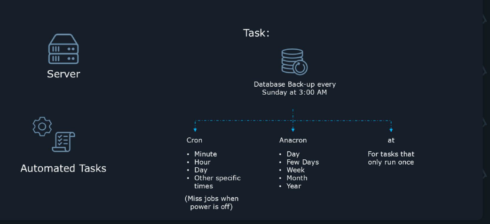
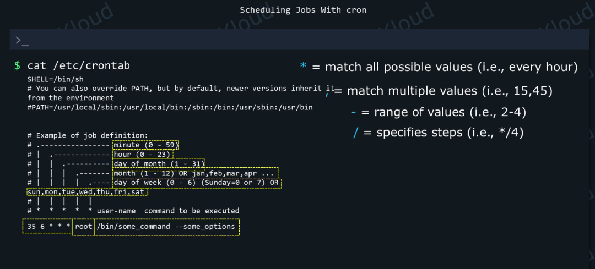

# Operations Deployment Summary Notes


        
        
        1. Diagnose, identify, manage, and troubleshoot processes and services
        2. Manage or schedule jobs for executing commands
        3. Search for, install, validate, and maintain software packages or repositories
        4. Recover from hardware, operating system, or filesystem failures
        5. Configure kernel parameters, persistent and non-persistent
        6. Manage Virtual Machines (libvirt)
        7. Configure container engines, create and manage containers
        8. Create and enforce MAC using SELinux

---

# 1. Diagnose, identify, manage, and troubleshoot processes and services

## 1.1. Boot, Reboot and Shutdown/Poweroff:

```bash
systemctl reboot
systemctl reboot --force
#to shutdown use poweroff keyword
systemctl poweroff
systemctl poweroff --force 
```

### Using cmd: shutdown

- The shutdown command is better suited for **scheduled reboots or shutdowns.**
- syntax: `shutdown [OPTIONS] [TIME] [MESSAGE]`
- Common Time Formats
    - The `[TIME]` argument is mandatory on many systems (like Ubuntu). 
    - `now`: Shutdown immediately.
    - `+m`: Shutdown in m minutes (e.g., +10).
    - `hh:mm`: Shutdown at a specific 24-hour time (anything between 00:00 and 23:59). 
- If you want to shutdown `x` minutes later, use `+x` instead.

````bash
# syntax
# shutdown [OPTIONS] [TIME] [MESSAGE]
# To shutdown at 2AM
sudo shutdown 02:00
# To shutdown after 15 minutes
sudo shutdown +15
# to reboot at 2AM
sudo shutdown -r 02:00
sudo shutdown -r +15
````

__wall message:__
- The "wall" message is the broadcast notification sent to all logged-in users and terminals when the system is being shut down, rebooted
- The shutdown utility publishes this message (internally using wall or equivalent) so users get a visible warning like: when shutdown will happen, who scheduled it, and any freeform text you provide.

````bash
sudo shutdown -r +10 'The system is going down for reboot in 10 minutes!'
sudo shutdown -r +5 "Rebooting for kernel update; save your work"
#halt immediately (poweroff depending on system).
sudo shutdown -h now "System maintenance: shutting down now"
#Cancel a scheduled shutdown Command:
sudo shutdown -c
# send warnings only
sudo shutdown -k +10 "Maintenance starts in 10 minutes (test only)"
# using wall command. warning only
echo "Heads up: quick maintenance in 15 minutes" | sudo wall
````
---

##  1.2. boot system into different operation modes

````bash
systemctl get-default
#graphical.target

#change default target
sudo systemctl set-default multi-user.target
# you can change it to emergency.target or rescue.target
# requires reboot to effect
# to change without reboot 
sudo systemctl isolate graphical.target

````

 systemd targets: 

| Target                | Description                                                                     | Use Case                                                           |
| --------------------- | ------------------------------------------------------------------------------- | ------------------------------------------------------------------ |
| ``graphical.target``  | Boots into a full graphical desktop environment.                                | Standard desktop usage.                                            |
| ``multi-user.target`` | Boots into a text-based environment with network services, but no GUI.          | Servers or other systems that don't require a graphical interface. |
| ``rescue.target``     | Loads a minimal set of services with a root shell.                              | For administrative tasks and maintenance in a minimal environment. |
| ``emergency.target``  | Boots with only the most basic system services and a read-only root filesystem. | Critical troubleshooting when standard and rescue modes fail.      |


---


## 1.3. Scripting to Automate the Tasks

- __Scripts:__ Scripts are simply files where we can add multiple instructions for our command interpreter. The interpreter can then read this file and execute instructions in order. First, it will execute the instruction on the first line, then the one on the second line, and so on.

- __#!/bin/bash__ 
- To make our script work, this has to be on the first line, not the second or third. Also, make sure there is no space before ``#``.
- ``#!`` is called a **shebang**. What follows ``#!`` is the full path to the command interpreter that we want to run this script. In this case we choose ``/bin/bash``.

- `#!/usr/bin/python3`: scripts will be exceuted by python3 interpreter.

- create `test.sh`

```bash
#!/bin/bash
export TEST_NAME=Prasad
echo "Welcome to Shell Scripting.....$TEST_NAME"
```
- execute: `chmod u+x test.sh` and ` ./test.sh`

### Bash Built-ins:

- To write advanced scripts with conditions, loops and so on we use Bash built-ins

- These are the built-in commands are defined internally to write shell scripts
- use `help` command to display all the built-in commands
- Type `help name` to find out more about the function name'.

````bash
# list all bash built-ins
help
# see help for if built-in usage
help if
# see help for kill built-in usage
help kill

help test
````

- Now lets create a log file if it doesn't exit oterwise take a backup and crete a new log file
- create ``test-if.sh`` file
````bash
#!/bin/bash

if test -f /tmp/practices/script.log; then
    mv /tmp/practices/script.log /tmp/practices/script.log.backup
    touch /tmp/practices/script.log
else
    touch /tmp/practices/script.log
fi

````

- It's important to note that almost any command can be used in an if block. That's because most commands return a so-called __"exit status code"__. 
- They return ``0`` if the command executed successfully, otherwise ``larger than 0`` if the command didn't find what it was looking for, or if it encountered an error.
- When "if" sees that the command returned `0`, it considers that this returned `TRUE`. When the command returns a non-zero value, "if" considers that the command returned `FALSE`.
- For example, consider the grep command. If it finds the text you were looking for, it returns 0. If it doesn't, it returns 1.

---

## 1.4. Manage Startup Processes and Services:


### systemd

- __Definition:__ systemd is an init system and system manager for Linux — the first process started by the kernel (PID 1) that initializes the user space and manages services, devices and the overall boot/shutdown lifecycle.

- systemd is the name of a large collection of tools and components, but also the name of the application responsible for system initalization and monitoring the system as a whole to ensure smooth operation.

- A Unit is any resource that systemd knows how to manage.
- Unit files live under ``/etc/systemd/system/`` and ``/lib/systemd/system/``.

- Systemd categorizes these by their file extensions. 
- Common types include:
    - `.service`: A program (like a web server).
    - `.mount`: A hard drive or partition.
    - `.timer`: A scheduled task (like a digital alarm clock).
    - `.target`: A group of units 

- A __Service__ is the most common type of unit. It represents a background process (daemon) that provides a specific function to the system.

- Simple Example: The Apache Web Server
- The service file is usually located at `/lib/systemd/system/apache2.service`.
- It contains instructions like:
    - What to run: `ExecStart=/usr/sbin/apache2`
    - When to run: "Only after the network is online."
    - What to do if it crashes: `Restart=always`

- Examples:

````bash

sudo systemctl start ssh.service
sudo systemctl stop/status/restart/reload ssh.service
# reloads the configuration without stopping it
sudo systemctl reload ssh.service
# first it reloads config if it needs restart
sudo systemctl reload-or-restart ssh.service
# enable to start the app at bootup time
sudo systemctl enable ssh.service
sudo systemctl status/is-enabled ssh.service
#disable to start at bootup
sudo systemctl disable ssh.service
# to enable and start the service
sudo systemctl enable --now ssh.service
# get a list of all service units available on the system, no matter if they're currently enabled, disabled, started or stopped

systemctl list-units --type service –all
````
---

### Create systemd services

- A Service is a background process (daemon). In `systemd`, these are defined by Unit files ending in `.service`.
- __System Services:__ Located in `/lib/systemd/system/` (managed by the package manager).
- __Custom/Admin Services:__ Located in `/etc/systemd/system/` (Exam Tip: Always place your custom units here).

#### How to Create a New Service

- __Step 1:__ Create the script and ensure your script is executable. `sudo vim /usr/local/bin/myapp.sh`

```bash
#!/bin/bash
echo "MyApp started....." | systemd-cat -t MyApp -p info
sleep 5
echo "MyApp crashed....." | systemd-cat -t MyApp -p err
```
- `chmod +x /usr/local/bin/myapp.sh`
- __Step 2:__ Create the Unit file
- you can copy sample files from `/lib/systemd/system` and modify it or,
- Create a new file in the correct directory:`sudo vim /etc/systemd/system/myapp.service`

- __Step 3:__ Define the ContentA basic service requires three sections:
```ini
[Unit]
Description=My Custom App Service
After=network.target

[Service]
Type=simple
ExecStart=/usr/local/bin/myapp.sh
Restart=on-failure

[Install]
WantedBy=multi-user.target
```
- To see all options use `man systemd.service`

- __After:__ Ensures the service starts only after the network is up.
- __ExecStart:__ The full path to the command or script.
- __WantedBy:__ Defines which "target" (runlevel) triggers this service. `multi-user.target` is the standard for normal server operations.

- __Step 4:__ save the service file config and run below commands using `systemctl`

````bash
#reload the systemd daemon
sudo systemctl daemon-reload
# start the service
sudo systemctl start myapp.service
sudo systemctl status myapp.service
systemctl cat myapp.service
# see logs -f follows
sudo journalctl -f 
# Enable (Start at boot): 
sudo systemctl enable myapp.service
# Check if Enabled	
systemctl is-enabled myapp.service
````

- __Step-5:__ Essential Troubleshooting for the Exam
If a service fails to start, the LFCS exam expects you to know how to investigate:
- Check Status: `systemctl status <service>` (Provides the most recent error lines).
- View Full Logs: Use `journalctl` to see detailed history.
- `journalctl -u myapp.service` (Logs for a specific unit).
- `journalctl -xe `(Shows the very end of the system log with explanations).
- Edit Existing Service: Use `systemctl edit --full <service>` to modify an existing unit safely. 

#### LFCS Exam Checklist:
- Did you put the file in `/etc/systemd/system/`?
- Did you run `systemctl daemon-reload` after saving?
- Did you enable the service so it persists after a reboot?
- Is the path in `ExecStart` an absolute path? (Relative paths like `./script.sh` will fail).

#### Load / precedence order (higher → lower)

1. /etc/systemd/system (Admin/Local Units)
- __Drop-in snippets:__ (e.g., /etc/systemd/system/foo.service.d/*.conf) are merged with the main unit file.
2. /run/systemd/system (runtime location)
3. /usr/lib/systemd/system or /lib/systemd/system (vendor-supplied)
- In practice: don't edit package files in `/lib` or `/usr/lib`; create overrides or local units under `/etc`.


#### Examples illustrating precedence

- If package provides /lib/systemd/system/foo.service and you create /etc/systemd/system/foo.service.d/override.conf, systemd will load the vendor file and then apply your override(s).
- If you copy /lib/systemd/system/foo.service → /etc/systemd/system/foo.service and edit it, the /etc file completely overrides the vendor file.
---

## 1.5. Processes (ps): Diagnose and Manage Processes

### What is a process?
- A process is a running instance of a program. Each process has a PID (process identifier), owner, resource usage, and state.
- Processes can spawn child processes (forming a tree). The kernel schedules and manages processes.

### Process Status (ps) — Static snapshot of current processes

- Two popular styles:
- `ps aux`: (BSD style) Show all processes from all users.
- `ps -ef`: (Standard style, script-friendly) Show full listing with Parent Process IDs (PPID).
- `ps -u <username>`: View processes for a specific user.
- `pgrep`: Search for a process by name and return its PID.
- Example: `pgrep nginx`

```bash
ps aux
ps -ef
```
- Use `-o` to select columns and `--sort` to order output:
### Quick reference commands
| Task                             | Command                                            |
| -------------------------------- | -------------------------------------------------- |
| Snapshot of all processes (BSD)  | `ps aux`                                           |
| Snapshot of all processes (UNIX) | `ps -ef`                                           |
| Top CPU consumers                | `ps -eo pid,ppid,cmd,%cpu --sort=-%cpu             | head` |
| Top memory consumers             | `ps -eo pid,ppid,cmd,%mem --sort=-%mem             | head` |
| Interactive monitor              | `top` / `htop`                                     |
| Process tree                     | `pstree -p` or `ps -ef --forest`                   |
| Find PIDs by name                | `pgrep -l <name>`                                  |
| Kill by PID                      | `kill <PID>` (SIGTERM) / `kill -9 <PID>` (SIGKILL) |
| Kill by name                     | `pkill -f <pattern>` / `killall <name>`            |
| Trace syscalls                   | `strace -p <PID>`                                  |
| List open files                  | `lsof -p <PID>`                                    |


### Finding processes
- `pgrep <name>` — list PIDs matching name (use `-l` to show names).
- `pidof <name>` — find PID(s) of a running program (daemon).
- `ps aux | grep <pattern>` — quick text search (careful with grep match itself).

### Inspecting a single process (useful files in `/proc`)
- `/proc/<PID>/cmdline` — full command line arguments.
- `/proc/<PID>/environ` — environment variables (NUL-separated).
- `/proc/<PID>/fd/` — open file descriptors (symlinks to files/sockets).
- `/proc/<PID>/status` — human-readable status and resource usage.

### Controlling Processes (Signaling)
- The `kill` command sends signals to processes. You must know the three most common signal numbers:
- __15 (SIGTERM):__ The default. Asks a process to stop gracefully.
- __9 (SIGKILL)__: Forcefully kills a process immediately (cannot be ignored).
- __1 (SIGHUP)__: Used to tell a process to reload its configuration.

| Task	| Command |
|------ | ------- |
| Kill by PID |	`kill -15 1234` |
| Force Kill by PID |	`kill -9 1234` |
| Kill by Name |	`pkill nginx` |
| Kill all of a user's processes |	`pkill -u username` |

### Priority and "Niceness"

- In Linux, the Nice value determines CPU priority. 
- It ranges from `-20` (Highest priority) to `19` (Lowest priority). Default is `0`.
- `nice`: Start a new process with a specific priority.
- Example: `nice -n 10 tar -czf backup.tar.gz /home` (Runs backup with lower priority).
- `renice`: Change the priority of an already running process.
- Example: `sudo renice -n -5 -p 1234` (Increases priority of PID 1234).
- Note: Only the root user (or sudo) can decrease a nice value (increase priority).

---

### Background and Foreground Management

- `&`: Run a command in the background. (e.g., `sleep 100 &`).
- `jobs`: List background jobs in the current terminal.
- `fg %<id>`: Bring a background job to the foreground.
- `bg %<id>`: Resume a suspended job in the background.
- `Ctrl + Z`: Suspend (pause) the current foreground process.


### Persistent Processes (Screen / Tmux)
- The exam may require you to run a process that survives a logout.
- In Linux, a persistent process is one that continues to run even after you log out of your session, close your terminal, or disconnect from an SSH connection.
- By default, when a terminal session ends, the system sends a SIGHUP (Signal Hang Up) to all processes started in that terminal, which kills them. Persistence prevents this.

#### 1. nohup
- `nohup` stands for "No Hang Up." It intercepts the SIGHUP signal so the process ignores it.
- Usage: nohup [command] &
- Example: Running a long database backup script.
- Example: `nohup ./long_script.sh &`
- What happens: Output that usually goes to the screen is automatically redirected to a file named nohup.out. You can now safely close your terminal.

#### 2. Terminal Multiplexers (tmux / screen)
- This is the professional standard for sysadmins. It creates a "virtual terminal" session on the server that stays alive independently of your connection.
- Step 1: Start a session: tmux new -s mysession
- Step 2: Run your command: ./my_long_task.py
- Step 3: Detach: Press Ctrl+B, then D. (You are now back at your normal prompt; the task is running in the background).
- Step 4: Re-attach later: Even from a different computer, log in via SSH and type:
tmux attach -t mysession
- `tmux`: Start a persistent session.
- `tmux new -s mysession` (Create). Ctrl+B, then D (Detach).
- `tmux attach -t mysession` (Re-attach).

#### LFCS Exam Checklist:
- Can you find a process using the most CPU? (Use top or ps aux --sort=-%cpu).
- Can you find the Parent PID of a process? (Use ps -ef).
- Do you know that -9 is a last resort? (Always try -15 first).
- Do you remember that higher nice values mean lower priority?


## 1.6. Locate and Analyse System log files

- Two logging systems: the traditional `Syslog` (text files) and the modern `systemd Journal` (binary logs).

## 1.6.1. Traditional Syslog Files (/var/log/)
- Most text-based logs are stored in /var/log/. You should know these key files:

| Log File | Purpose |
| -------- | ------- |
| /var/log/syslog | General system messages (Ubuntu/Debian). |
| /var/log/messages | General system messages (RHEL/CentOS). |
| /var/log/auth.log | Authentication, sudo, and login attempts. |
| /var/log/kern.log | Kernel messages and hardware errors. |
| /var/log/dmesg | Kernel ring buffer (boot-up hardware info). |

- Example: Finding failed SSH attempts `grep "Failed password" /var/log/auth.log`

## 1.6.2. The systemd Journal (journalctl)

- Modern distros use `journalctl` to query the binary logs managed by `systemd`. This is a major part of the LFCS exam.

### Basic Queries:

- View all logs (newest at bottom): `journalctl`
- Live updates (like tail -f): `journalctl -f`
- Show most recent entries: `journalctl -n 20`

### Filtered Queries:
- By Unit/Service: `journalctl -u nginx.service`
- By Severity (Errors only): `journalctl -p err` (Priorities: 0:emerg, 3:err, 4:warning, 6:info).

- Since Last Boot: `journalctl -b`
- By Time Range: `journalctl --since "2025-12-20 10:00:00" --until "1 hour ago"`
- Show Kernel Logs: `journalctl -k`
- filter for logs generated by a specific command. 
````bash
#get command path
which sudo
# find logs for command sudo
journalctl /usr/bin/sudo
````
### 1.6.3. Log Rotation (logrotate)

- To prevent logs from filling up the disk, Linux uses logrotate.
- Config Location: `/etc/logrotate.conf` and `/etc/logrotate.d/`.
- Key Parameters:
    - `daily/weekly`: How often to rotate.
    - `rotate 4`: Keep 4 old versions.
    - `compress`: Zip old logs to save space.
- Manual Trigger: `sudo logrotate -f /etc/logrotate.conf` (Forces a rotation check).

### 1.6.4. Analyzing Log Patterns
- The exam may ask you to find specific events. Combine logging commands with text processing:
- Count occurrences of an error: `journalctl | grep -c "input/output error"`
- Find which user used sudo most:
`grep "COMMAND" /var/log/auth.log | awk '{print $6}' | sort | uniq -c`

### 1.6.5. Persistent Journaling
- By default, some systems store `journalctl` logs in memory (lost after reboot). To make them persistent (saved to disk):

- Check the config: `cat /etc/systemd/journald.conf`
- Ensure `Storage=persistent` or manually create the folder:
`sudo mkdir -p /var/log/journal && sudo systemctl restart systemd-journald`


### LFCS Exam Checklist:
Can you find why a service failed to start? (journalctl -xeu <service>)
Can you identify a hardware issue reported by the kernel? (dmesg | less or journalctl -k)
Can you find "Permission Denied" errors in a specific log file?
Do you know how to search logs by a specific time window?

---
---

# 2. Manage or schedule jobs for executing commands: cron, anacron, at

- There are three types of job scheduling tools
    - __Fixed-schedule recurring jobs:__ `cron` 
    - __Missed-job catchup:__ `anacron` 
    - __One-time execution:__ `at`





## 2.1. Standard Recurring Jobs with cron

- The `cron` daemon is used for tasks that repeat (e.g., daily backups).
- `cron` is for servers that run 24/7. If the computer is off during a scheduled time, the job is __skipped__.

- If the system is off during a scheduled window, the task will not run.




- The 5-Star Syntax
* * * * * [user] command
    - Minute (0-59)
    - Hour (0-23)
    - Day of Month (1-31)
    - Month (1-12)
    - Day of Week (0-7, 0/7 are Sunday)

- Examples

```bash
# Every 10 minutes: 
*/10 * * * * /usr/bin/check_disk.sh
# Every Sunday at 4 AM: 
0 4 * * 0 /usr/bin/backup.sh
# System-wide (in /etc/crontab): 
0 1 * * * root /usr/sbin/logrotate
```

- use `crontab -e` to add new cron job and it will be added to User specific config location. To view jobs use `crontab -l`

- __User Level:__ `crontab -e` (Files stored in `/var/spool/cron/crontabs/<username>`)

- __System Level:__ `/etc/crontab` and files in `/etc/cron.d/` (These require a username column)

- __Permissions:__ Use `/etc/cron.allow` or `/etc/cron.deny` to control access.
- __Example:__ Backup every Friday at 11:30 PM
`30 23 * * 5 /usr/bin/tar -czf /backup.tar.gz /var/www/html`

#### Essential Commands
- Edit your crontab: `crontab -e`
- List your crontab: `crontab -l`
- Remove your crontab: `crontab -r`
- Edit another user's crontab (Root only): `sudo crontab -u username -e`

---

## 2.2. Anacron: The "Catch-Up" Scheduler

- `anacron` is designed for desktops or servers that are not always on. - - If a job was missed because the system was powered off, anacron runs it shortly after the system boots up.
- It does not handle minutes (minimum interval is 1 day).
- Config File: `/etc/anacrontab`
- Syntax:  `period_in_days delay_in_minutes job-id command`
- `period_in_days`: values can be `1` (daily), `7` (weekly), `30` (monthly) or macros @daily, @weekly, @monthly
- `delay_in_minutes`: Waiting period after boot
- `job-id`: my_backup_job, ..etc
- Example
```bash
# Run once every 1 day. If missed, wait 15 minutes after the system boots, then run.
1 15 daily-backup /usr/local/bin/backup.sh
```

## 2.3. One-Time Jobs with at

- The `at` is used for a single execution at a specific point in the future.
- How to create a job?
- Syntax: `at [time]`
- Create a job: `at 15:30` (Type command, then `Ctrl+D` to save)
-  List pending jobs: `atq`
- Remove a job: `atrm [job_id]`
- View job content: `at -c [job_id]`
- Example Workflow:
```bash
# Type 
at 16:00 # and press Enter.
#  The prompt changes to at>. Type your command: 
at> /usr/bin/tar -czf /tmp/logs.tar.gz /var/log # Press Enter, 
# then press Ctrl+D to save and exit.
```

- Time Formats: `at now + 1 hour`, `at 10:00 PM tomorrow`, `at 08:15 2025-12-24`.

## 2.4. System-Wide Scheduling

- Beyond user crontabs, administrators use system directories for maintenance scripts:

- `/etc/cron.hourly`, `/etc/cron.daily/`, `/etc/cron.weekly/`, `/etc/cron.monthly/`: Just drop an executable script here; no special syntax is needed.

- The shell script file should have **no extension**, if we want to use it as a cron job.

- `/etc/crontab`: The system-wide `crontab` file. Note: This file requires a "user" column between the time fields and the command.
Example: `0 1 * * * root /usr/sbin/skel_clean.sh`


## 2.5 Access Control (Security)
- Administrators must know how to restrict these tools:
- Cron: `/etc/cron.allow` (only listed users) or `/etc/cron.deny` (blocked users).
- At: `/etc/at.allow` or `/etc/at.deny`.
- Rule: If allow exists, deny is ignored. If neither exists, usually only root can use the tool.

### LFCS Exam Strategy & Checklist

- __Always use absolute paths:__ Inside `cron` or `at`, the `$PATH` is very limited. Always use `/usr/bin/tar` instead of `tar`
- __Permissions:__ Ensure scripts are executable (`chmod +x`).

- __Environment__: `cron` does not load your `.bashrc`. If your script needs specific variables, define them at the top of the script.

- __Logging:__ Capture errors by redirecting: `* * * * * /path/to/cmd >> /var/log/myjob.log 2>&1`.

- __Verification:__ During the exam, verify the service status with `systemctl status cron` and `systemctl status atd`

---
---

# 3. Package Manager (Ubuntu 24.x): Search, install, validate, and maintain software packages or repositories

## 3.1 Package Manager Basics (Ubuntu)


| Tool                 | Purpose                 |
| -------------------- | ----------------------- |
| `apt`                | Main package manager    |
| `apt-cache`          | Query package metadata  |
| `dpkg`               | Low-level package tool  |
| `add-apt-repository` | Manage PPAs             |
| `apt-key` *(legacy)* | GPG keys (now replaced) |

---

### Package Repositories (Where Software Comes From)

```text
/etc/apt/sources.list
/etc/apt/sources.list.d/*.list
```

```bash
# Update Repository Index
apt update # refresh package metadata (always first)
# Search for Packages
apt search nginx             # search by name/description
apt-cache search nginx       # metadata search (older tool)
apt show nginx               # show package details
# Install Packages
apt install nginx            # install package
apt install -y curl vim      # install multiple packages (auto yes)
apt install ./file.deb       # install local .deb file
```


- Validate Installed Packages

```bash
apt list --installed         # list installed packages
dpkg -l nginx                # check package status
which nginx                  # verify binary exists
nginx -v                     # verify version
```

- Remove Packages (Clean vs Complete)

```bash
apt remove nginx             # remove package (keep config)
apt purge nginx              # remove package + config files
apt autoremove               # remove unused dependencies
```

- Upgrade & Maintain Packages

```bash
apt list --upgradable        # show upgradable packages
apt upgrade                  # upgrade installed packages
apt full-upgrade             # upgrade + handle dependencies
```

#### Fix Broken Packages (Exam Favorite ⭐)

```bash
apt --fix-broken install     # fix dependency issues
dpkg --configure -a          # finish interrupted installs
```
#### Manage Repositories (Add / Remove)

```bash
add-apt-repository universe  # enable universe repo
apt update
# Add PPA
add-apt-repository ppa:ondrej/php
apt update
# Remove Repository
add-apt-repository --remove ppa:ondrej/php
```

---

### Repository Signing & GPG Keys (Modern Ubuntu)

> **apt-key is deprecated**

#### Docker third party repo example:

- Why Repository Signing Exists?

-When you install software from a repository:

* Ubuntu must **trust** the source
* Trust is established using a **GPG public key**
* `apt` verifies:

  * Repository metadata
  * Package signatures

- Without a valid GPG key → **installation is blocked**

- Old vs New Method (IMPORTANT)

- Old (Deprecated – DO NOT USE)

```bash
apt-key add key.gpg
```

- New (LFCS Expected)

* Store key in `/usr/share/keyrings/`
* Bind key to repository using `signed-by=`

---

## 3️⃣ Docker Repository Example (Ubuntu 24.x)

We will:

1. Download Docker’s GPG key
2. Store it securely
3. Add Docker repository
4. Verify repository signing
5. Install Docker

---

#### Step 1: Remove Old Docker Entries (If Any)

```bash
rm -f /etc/apt/sources.list.d/docker.list
rm -f /usr/share/keyrings/docker-archive-keyring.gpg
```

👉 Ensures clean setup (good practice for exam)

---

#### Step 2: Download Docker GPG Key (Modern Way)

```bash
curl -fsSL https://download.docker.com/linux/ubuntu/gpg \
| gpg --dearmor -o /usr/share/keyrings/docker.gpg
```

#### What this does:

* `curl -fsSL` → fetch key quietly
* `gpg --dearmor` → convert ASCII → binary format
* Store key in **trusted system location**

---

#### Step 3: Set Correct Permissions (Security)

```bash
chmod 644 /usr/share/keyrings/docker.gpg
```

📌 **Public key → readable by apt**

---

#### Step 4: Add Docker Repository (Signed-by)

```bash
echo \
"deb [arch=$(dpkg --print-architecture) signed-by=/usr/share/keyrings/docker.gpg] \
https://download.docker.com/linux/ubuntu \
$(lsb_release -cs) stable" \
> /etc/apt/sources.list.d/docker.list

# or 
echo "deb [signed-by=/usr/share/keyrings/docker.gpg] https://download.docker.com/linux/ubuntu noble stable" > /etc/apt/sources.list.d/docker.list

```

### Key LFCS Concepts Here:

| Part                             | Meaning                        |
| -------------------------------- | ------------------------------ |
| `signed-by=`                     | Bind repo to specific GPG key  |
| `/usr/share/keyrings/docker.gpg` | Trusted public key             |
| `$(lsb_release -cs)`             | Ubuntu codename (noble, jammy) |

---

## 8️⃣ Step 5: Update Package Index (Verification Step)

```bash
apt update
```

### If successful:

✔ No GPG errors
✔ Docker repo metadata downloaded

### If key missing:

❌ `NO_PUBKEY` error

---

## 9️⃣ Step 6: Install Docker Package

```bash
apt install -y docker-ce docker-ce-cli containerd.io
```

---

#### How to Verify Repository Signing (EXAM GOLD)

### Check repository file:

```bash
cat /etc/apt/sources.list.d/docker.list
```

✔ Must contain:

```text
signed-by=/usr/share/keyrings/docker.gpg
```

---

### Check key file:

```bash
ls -l /usr/share/keyrings/docker.gpg
```

---

### Check Docker package origin:

```bash
apt-cache policy docker-ce
```

✔ Shows:

```text
download.docker.com
```

---

## 1️⃣1️⃣ Remove Docker Repository (Cleanup Task)

```bash
rm /etc/apt/sources.list.d/docker.list
rm /usr/share/keyrings/docker.gpg
apt update
```

📌 **LFCS may ask repo removal**

---

## 1️⃣2️⃣ Common LFCS Exam Errors (Avoid These)

❌ Using `apt-key`
❌ Forgetting `signed-by=`
❌ Storing key in random location
❌ Not running `apt update`
❌ Ignoring GPG error messages

---

## 1️⃣3️⃣ Typical LFCS Exam Questions (Based on This)

✔ Add a third-party repository securely
✔ Fix `NO_PUBKEY` error
✔ Verify repository signing
✔ Remove untrusted repository
✔ Install software from new repo

---

## 🎯 LFCS Golden Rule (Memorize This)

> **Key → Keyring → signed-by → apt update → install**

---

## 🧪 Mini Practice (5 Minutes)

1️⃣ Add Docker repo using secure GPG method
2️⃣ Verify no GPG errors
3️⃣ Install Docker
4️⃣ Remove repo and key


---

- Package Files & Ownership

```bash
dpkg -L nginx                # list files installed by package
dpkg -S /etc/nginx/nginx.conf # find which package owns file
```

---

- Hold & Unhold Packages

```bash
apt-mark hold nginx          # prevent upgrade
apt-mark unhold nginx        # allow upgrade
```

- Clean Package Cache

```bash
apt clean                    # clear downloaded .deb files
apt autoclean                # remove obsolete packages
```

---

## 🎯 LFCS Exam Scenarios (Very Common)

✔ Install missing package
✔ Enable repository
✔ Verify package installation
✔ Fix broken install
✔ Remove unused packages


---
---


# 4. Recover from hardware, operating system, or filesystem failures

- Disk Utilization: `du`
- RAM Utilization: `free`
- Process Utiliztion: `uptime`

---
---

# 5. Configure kernel parameters, persistent and non-persistent

- you must be able to view, modify, and persist kernel parameters using the `sysctl` command and the `/proc/sys/` filesystem.

## 5.1. Understanding Kernel Parameters
- Kernel parameters control the behavior of the Linux kernel at runtime (e.g., networking settings, security limits, or memory management).

- Path in Filesystem: `/proc/sys/`
- Translation Rule: A parameter named `net.ipv4.ip_forward` maps to the file `/proc/sys/net/ipv4/ip_forward`.


## 5.2. Non-Persistent Changes (Runtime Only)

- These changes take effect immediately but revert to default after a reboot. This is used for testing.

### Method A: Using sysctl (Recommended)
- __Command:__ `sudo sysctl -w parameter=value`
- Example (Enable IP Forwarding):
`sudo sysctl -w net.ipv4.ip_forward=1`

### Method B: Using echo (Direct write to /proc)

- Command: `echo "value" | sudo tee /proc/sys/path/to/parameter`
- Example: `echo "1" | sudo tee /proc/sys/net/ipv4/ip_forward`


## 5.3. Persistent Changes (Survives Reboot)
- To make a change permanent, you must write it to a configuration file.

- __Step 1:__ Edit the Configuration File
- Custom settings should be placed in `/etc/sysctl.d/` rather than editing the main `/etc/sysctl.conf` directly.
- Create file: `sudo vim /etc/sysctl.d/99-custom.conf`
- Add the parameter:

```text
net.ipv4.ip_forward = 1
vm.swappiness = 10
```

- __Step 2:__ Apply the Changes immediately
- After saving the file, you don't need to reboot. Apply the new settings from the file:
- Command: `sudo sysctl -p /etc/sysctl.d/99-custom.conf` If you edited the main file, use: `sudo sysctl -p`

## 5.4. Essential Commands for the Exam

| Task | Command |
| ---- | ------- |
| List ALL parameters |	`sysctl -a` |
| Search for a specific parameter |	`sysctl -a | grep net.ipv6.route` |
| Read a specific value	 | `sysctl net.ipv4.ip_forward` |
| Check values from files only | `sysctl --system` |


## 5.5. Common Exam Examples

- Enable IPv4 Forwarding (Routing): `net.ipv4.ip_forward = 1`
- Disable IPv6: `net.ipv6.conf.all.disable_ipv6 = 1`
- Change Swappiness: `vm.swappiness = 10` (Tells kernel to prefer RAM over swap)
- Increase Max Open Files: `fs.file-max = 100000`

### LFCS Exam Checklist:
- __Dot vs. Slash:__ Remember that sysctl uses dots (`net.ipv4.ip_forward`), while the filesystem uses slashes (`/proc/sys/net/ipv4/ip_forward`).
- __Spaces:__ In the `.conf` file, use spaces around the = sign for better readability.
- __Validation:__ Always verify the change with `sysctl <parameter>` after applying it.
- __Permissions:__ Non-persistent changes to `/proc/sys/` usually require sudo or a root shell.

---
---

# 6. Manage Virtual Machines (libvirt)

- with the `libvirt` ecosystem, which is the standard toolkit for managing `KVM/QEMU` virtual machines on Linux.

- What LFCS Expects (Very Important)
    - Install & enable libvirt
    - Manage VMs using virsh
    - Start / stop / reboot / autostart VMs
    - View VM info
    - Manage VM storage (basic)
    - Networking (default NAT)


## 6.1 Core Components (Know These Names)

| Component      | Purpose                    |
| -------------- | -------------------------- |
| `libvirtd`     | VM management daemon       |
| `virsh`        | CLI tool to manage VMs     |
| `qemu-kvm`     | Hypervisor                 |
| `virt-install` | Create new VMs             |
| `virt-manager` | GUI (not required in exam) |


### Install libvirt (Ubuntu 24.x)

```bash
apt update
# install KVM + libvirt + CLI tools
apt install -y qemu-kvm libvirt-daemon-system libvirt-clients virtinst
# or
apt install virt-manager
# Enable and start service: ensures libvirt starts on boot
systemctl enable --now libvirtd
# Verify:
systemctl status libvirtd

# Verify Virtualization Support
# confirms CPU virtualization support
kvm-ok
# verify KVM kernel modules
lsmod | grep kvm
```


### libvirt Networking (Default Network)

- Default NAT Network

```bash
# list virtual networks
virsh net-list --all
virsh net-start default
virsh net-autostart default
# ensure default network is active
```

## 6.2 VM Lifecycle Management (virsh)

### Create a Test VM using domain xml config

- create a TestVM.xml
```xml
<domain type="qemu">
	<name>TestVM</name>
	<memory unit="GiB">1</memory>
	<vcpu>1</vcpu>
	<os>
		<type arch="x86_64">hvm</type>
	</os>
</domain>
```
- TestVM doesn't contain any running OS, this is useful for Testing
- run below commands practice lifecycle of VM
```bash
virsh help
# define (but don't start) a domain from an XML file
virsh define TestVM.xml
# to list all the domains/vms
virsh list --all
# start the VM
virsh start TestVM
# reboot
virsh reboot TestVM
# graceful shutdown
virsh shutdown TestVM
# Hard PowerOff the VM
virsh destroy TestVM
# delete the VM
virsh help undefine
virsh undefine --remove-all-storage TestVM

# to start VM at boot up
virsh autostart TestVM
virsh autostart --disable TestVM
# to view the resources assigned to VM
virsh dominfo TestVM
# network interfaces
virsh domiflist vm1
# attached disks
virsh domblklist vm1

```

### How to increase `vcpus`?

```bash
# view current info
virsh dominfo TestVM
virsh help setvcpus
virsh setvcpus TestVM 2
# if max-vcpus config is set to 1 then above command fails, so first update config
```
- you must increase the maximum limit, which requires a restart of the virtual machine. 

#### Solution: Offline Method (Persistent Change)
- Follow these steps to permanently increase the CPU count:

```bash
# Shut down the VM gracefully:
virsh shutdown TestVM
# Increase the maximum vCPU limit:
virsh setvcpus TestVM 2 --maximum --config
# Set the current vCPU count to match the new maximum:
virsh setvcpus TestVM 2 --config
# Start the VM again:
virsh start TestVM 
```

#### Alternative: Direct XML Editing
- If the commands above do not work, you can manually edit the virtual machine's XML configuration file:
- Open the configuration: `virsh edit TestVM`
- Locate the `<vcpu>` tag. It will likely look like this:
`<vcpu placement='static'>1</vcpu>`

- Change it to allow a higher maximum or just set a higher static value:
- To set a static 2 vCPUs: `<vcpu placement='static'>2</vcpu>`
- To set a current 1 but allow up to 4: `<vcpu placement='static' current='1'>4</vcpu>`
- Save and exit, then shutdown and start the VM for the changes to apply. 

---

### How to increase the memory?

```bash
virsh dominfo TestVM
virsh shutdown TestVM
virsh setmaxmem TestVM 2048M --config
virsh setmem TestVM 2048M --config
virsh start TestVM
virsh dominfo TestVM
```


## 6.3 Create a Virtual Machine (virt-install)

- To create a VM with OS we have two options

### 1. Existing Disk Image: (pre-built cloud image)
- If you download a pre-built cloud image (often a `.qcow2` file), you can "import" it. This skips the installation process entirely.
- Download cloud image using: `wget https://cloud-images.ubuntu.com/minimal/releases/noble/release/ubuntu-24.04-minimal-cloudimg-amd64.img`
- this image contains pre-configure ubuntu environment to use it in cloud environment. By default it will be in less size, to use it resize it using `qemu-img` command

```bash
# verify current size
qemu-img info  ubuntu-24.04-minimal-cloudimg-amd64.img
# resize it to 10GB
qemu-img resize  ubuntu-24.04-minimal-cloudimg-amd64.img 10G
qemu-img info  ubuntu-24.04-minimal-cloudimg-amd64.img
```

- copy this `.img` file to `/var/lib/libvirt/images`
```bash
cp ubuntu-24.04-minimal-cloudimg-amd64.img /var/lib/libvirt/images/
```
- Now let's create a VM using this img file

```bash
virt-install \
 --osinfo ubuntu24.04 \
 --name myvm1 \
 --memory 3072 \
 --vcpus 1 \
 --import --disk /var/lib/libvirt/images/ubuntu-24.04-minimal-cloudimg-amd64.img \
 --network network=default \
 --graphics none

 ```
 - After running it will display how to connect to this VM
 - `virsh --connect qemu:///system console myvm1`
- Disconnect: Escape character is ^] (`Ctrl + ]`)

 - First we need to set the password for the root in Ubuntu 24.X onwards, for that install new package:`sudo apt install -y libguestfs-tools`
 - then run: `sudo virt-customize -a /var/lib/libvirt/images/ubuntu-24.04-minimal-cloudimg-amd64.img --root-password password:password123`

- after this we can connect to the VM console using: `virsh --connect qemu:///system console myvm1`


---
### 2. Network Location: (--location)

```bash
 virt-install \
--osinfo ubuntu24.04
--name myvm2 \
--memory 2048 \
--vcpus 2 \
--disk size=10 \ 
--location /path/to/iso \
--os-variant ubuntu24.04 \
--network network=default \
--graphics none \
--extra-args 'console=ttyS0'

# or 
# --location https://url/to/iso
```

📌 Exam focus:

* Name
* Memory
* Disk
* Network
* Boot source


## 1️⃣3️⃣ Typical LFCS Exam Scenarios

✔ Start a stopped VM
✔ Enable VM autostart
✔ Verify VM status
✔ Attach storage
✔ Delete unused VM


1. Install libvirt and ensure the service starts automatically.
2. Verify that hardware virtualization is supported on the system.
3. List all virtual machines, including stopped ones.
4. Start the default libvirt network and enable it on boot.
5. Start a virtual machine named `vm1`.
6. Configure `vm1` to start automatically when the host boots.
7. Display CPU and memory information for `vm1`.
8. Find the disk file attached to `vm1`.
9. Gracefully shut down `vm1`.
10. Force stop a non-responsive VM named `vm2`.
11. Create a 5GB qcow2 disk image named `data.qcow2`.
12. Access the console of `vm1`.
13. Remove a VM named `oldvm` but keep its disk intact.
14. Completely delete a VM and its disk.
15. Verify which virtual networks are currently active.

---
---

# 7. Configure container engines, create and manage containers

    * Install and configure a container engine
    * Pull images
    * Run containers
    * Start / stop / restart containers
    * List containers & images
    * Remove containers & images
    * Basic networking & port mapping
    * Volume mounts (bind mounts)
    * Container autostart / restart policy


## 1. Key Concepts

- __Container Engine:__ The software that runs containers (Podman, Docker, or containerd).
- __Image:__ A read-only template (the "blueprint").
- __Container:__ A running instance of an image (the "house").
- __Registry:__ A storage location for images (e.g., Docker Hub or Quay.io). 
---

## Install & Enable Container Engine

```bash
apt update
apt install -y docker.io        # install Docker engine
systemctl enable --now docker  # start Docker & enable on boot
```

```bash
docker version                 # verify Docker installation
docker info                    # daemon & system info
```

---

## 📦 Images – Search, Pull, List

```bash
docker search nginx            # search image on Docker Hub
docker pull nginx              # download image locally
docker images                  # list downloaded images
```

---

## ▶️ Run Containers (Core Skill ⭐)

```bash
docker run nginx               # run container (foreground)
docker run -d nginx            # run container in background
```

```bash
docker run -d --name web nginx # run container with name
```

---

## 📋 List Containers

```bash
docker ps                      # running containers
docker ps -a                   # all containers (incl stopped)
```

---

## ⏹️ Start / Stop / Restart Containers

```bash
docker stop web                # gracefully stop container
docker start web               # start stopped container
docker restart web             # restart container
```

---

## ❌ Remove Containers & Images

```bash
docker rm web                  # remove stopped container
docker rm -f web               # force remove running container
```

```bash
docker rmi nginx               # remove image
docker image prune             # remove unused images
```

---

## 🌐 Port Mapping (Very Common in LFCS)

```bash
docker run -d -p 8080:80 nginx
# map host port 8080 → container port 80
```

Verify:

```bash
ss -tuln | grep 8080
curl http://localhost:8080
```

---

## 📁 Volumes / Bind Mounts (Exam Favorite ⭐)

```bash
docker run -d \
 -v /data:/usr/share/nginx/html \
 -p 8081:80 \
 nginx
# mount host dir into container
```

Verify mount:

```bash
docker inspect web | grep /data
```

---

## 📜 Logs & Inspection

```bash
docker logs web                # view container logs
docker inspect web             # detailed container info (JSON)
```

---

## 🖥️ Execute Commands Inside Container

```bash
docker exec web ls /           # run command inside container
docker exec -it web /bin/bash  # interactive shell
```

Exit:

```text
exit
```

---

## 🔁 Restart Policies (Autostart Containers)

```bash
docker run -d --restart unless-stopped nginx
# container restarts automatically
```

Check:

```bash
docker inspect web | grep RestartPolicy
```

---

## 🌐 Networking Basics

```bash
docker network ls              # list docker networks
docker network inspect bridge  # default bridge network
```

📌 LFCS usually uses **default bridge network**

---

## 🧹 Clean Up (Good Exam Habit)

```bash
docker system prune
# remove stopped containers, unused images, networks
```

---

## 🎯 LFCS EXAM GOLDEN RULES (Containers)

✔ Pull → Run → Verify → Manage → Clean
✔ Always use `-d` unless asked otherwise
✔ Map ports explicitly (`-p`)
✔ Verify with `docker ps`, `ss`, `curl`
✔ Do NOT use docker-compose or Kubernetes

---

### 30-Second Checklist Before Moving On

* [ ] Container running?
* [ ] Correct port mapped?
* [ ] Correct volume mounted?
* [ ] Logs checked?
* [ ] Cleanup done if required?


## Environment Variables

```bash
docker run -d -e APP_ENV=prod nginx
# pass env variable to container
```

Verify:

```bash
docker exec web env
```

---

## Restart Policies (Autostart)

```bash
docker run -d --restart unless-stopped nginx
# container restarts automatically
```

Check:

```bash
docker inspect web | grep RestartPolicy
```

> **Pull → Run → Verify → Manage → Clean**


### LFCS Exam Checklist (2025)
- State Persistence: Know how to use `-v` to ensure data survives a container deletion.
- Port Mapping: Understand that the format is `HostPort:ContainerPort`.
- Environment Variables: Be ready to use `-e` (e.g., `-e MYSQL_ROOT_PASSWORD=pass`).
- Auto-Restart: Use `--restart always` if the exam asks for a container to persist through a host reboot.
- Resource Limits: Know how to limit memory (`-m 512m`) or CPUs (`--cpus=1`). 


---

# 🧪 LFCS Practice Questions – Containers
1. Install Docker and ensure it starts on boot.
2. Pull the `nginx` image and list available images.
3. Run an `nginx` container named `web` in detached mode.
4. Expose the container on host port `8080`.
5. Verify that the web server is reachable locally.
6. Stop and restart the container.
7. View logs of the running container.
8. Execute a shell inside the container.
9. Mount `/data` directory from host into the container.
10. Remove the container and image.


---
---

# 8. Create and enforce MAC using SELinux

