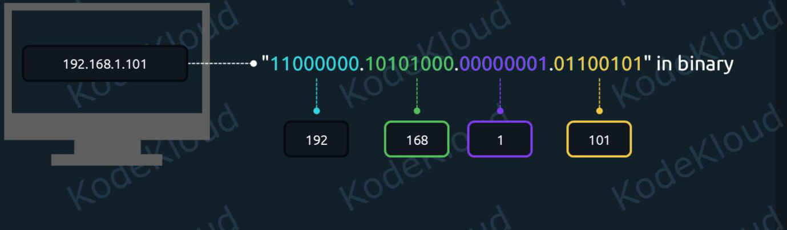
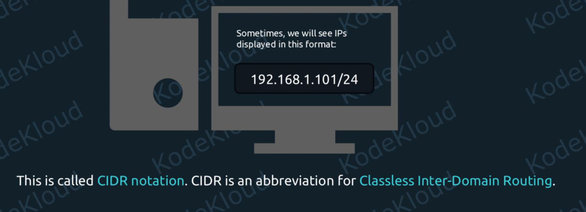
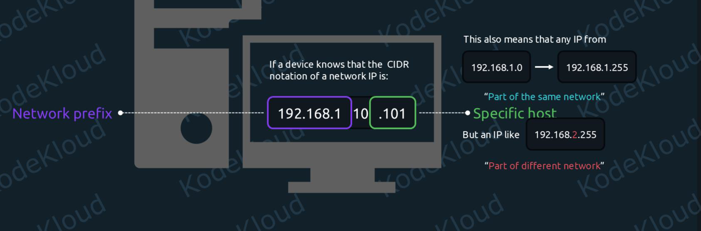
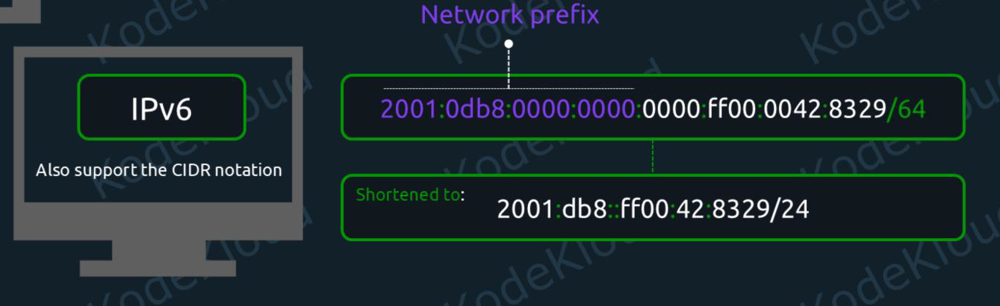

# 04_Networking_Summary_Notes

        1. Configure IPv4 and IPv6 networking and hostname resolution
        2. Set and synchronize system time using time servers
        3. Monitor and troubleshoot networking
        4. Configure the OpenSSH server and client
        5. Configure packet filtering, port redirection, and NAT
        6. Configure static routing
        7. Configure bridge and bonding devices
        8. Implement reverse proxies and load balancers

# 1. Configure IPv4 and IPv6 networking and hostname resolution

## Network Interfaces: [Network Interfaces Introduction](../05_Networking/Learn/02_Network_interfaces.md)

## 01. Configure IPv4 and IPv6 Networking and Hostname Resolution:

- To be able to communicate across networks, a device needs an IP address.
- IP stands for Internet Protocol. And there are two kinds of IPs: IPv4 and IPv6. The "v" here stands for "version".
- In version 4 of the Internet Protocol, addresses look like this: `10.0.0.1`


- `192.168.0.5` in this IP we will have 4 numbers `192`, `168`, `0`,`5` each number is an 8-bit integer
- 8 bits can represent a number from 0 to 255, so each number can have at most value is 255 which is  `11111111`




- So an IP like "192.168.1.101" in decimal is actually "11000000.10101000.00000001.01100101" in binary.

### CIDR(Classless Inter-Domain Routing) Notation:

- Sometimes, we will see IPs displayed in this format: `192.168.1.101/24` This is called CIDR notation. 



- We can see an extra /24 at the end, next to the IP address. This tells us that the first 24 bits of this address are the prefix of this network.

- If we take another look at the binary notation, this will become easier to understand.


- If a device knows that the CIDR notation of a network IP is: `192.168.1.101/24` then it understands that `192.168.1` refers to the generic network prefix, and `.101` to a specific host on this network.



#### Example-2:


- As per above CIDR notation any IP in this network must begin with a fixed `192.168.` while the last two numbers can be anything between `0` and `255`. So we can have IPs from: `192.168.0.0` all the way to `192.168.255.255`


### IPv6:


- These addresses have 128 bits, instead of 32 bits, as is the case for IPv4. Here is an example of an IPv6 address: `2001:0db8:0000:0000:0000:ff00:0042:8329` We can notice that this is a bit different in three key areas:

    - we have 8 groups of numbers here, instead of 4 like we had with IPv4
    - these numbers are not in decimal format. Instead, they are in hexadecimal format. There are 16 hexadecimal digits: 0, 1, 2, 3, 4, 5, 6, 7, 8, 9, A, B, C, D, E, and F.
    - each number here is separated by the `:` semicolon character.


- Since these IPv6 addresses are quite long, we'll often see them shortened.


- This is done by removing all leading zeroes first. For example, we can see that "0db8" became "db8". And the consecutive group of "0000:0000:0000" was abbreviated to two consecutive semicolon characters "::".

#### CIDR Notation:
- We have 8 groups of numbers, each group is 16 bits means two hexadecimal digits is 8 bits


- IPv6 addresses also support the CIDR notation. So an address like: `2001:0db8:0000:0000:0000:ff00:0042:8329/64` signals that the first 64 bits represent the network prefix. And each group of two hexadecimal digits is 8 bits.



### Add IPv4 and IPv6 address:

- The address is a protocol (IPv4 or IPv6) address attached to a network device. Each device must have at least one address to use the corresponding protocol. It is possible to have several different addresses attached to one device.


## Working with Network Interfaces

- Before making changes, you must identify your interfaces and current status. 
- Show IP Addresses: `ip addr show`
- Show Routing Table: `ip route show` (IPv4) or `ip -6 route show` (IPv6).
Check Link Status: `ip link show`
Identify Netplan Configs: `ls /etc/netplan/`


## Add/Change/Delete IP addresses to a Network device

- Adding an IP address to a network interface in Linux can be done in two ways:

    1. Temporarily (lost after reboot) → using `ip` command
    2. Permanently (survives reboot) → using NetworkManager (`nmcli`) or `config files`

### 1. using ip command:

- Useful for testing
- Not persistent after reboot
```bash
man ip address
# to make network device UP/DOWN use ip link
ip link set dev <dev_id> up/down
# add/delete ip address
sudo ip addr/address add/delete <IP>/<NETMASK> dev <dev_id>

ip addr add 10.00.00.1/24 dev eth1
# verify
ip address show eth1    
# delete
ip addr del 10.00.00.1/24 dev eth1
ip addr show eth1  
```


### 2. Using Network Manager Tool : netplan

-  Identifying Network State

```bash
# Show IP Addresses: 
ip addr show
# Show Routing Table: (IPv4)
ip route show 
# (IPv6) 
ip -6 route show
# Check Link Status: 
ip link show
# Identify Netplan Configs: 
ls /etc/netplan/ 
# get current config
netplan get
```

- To update netplan configuration create a drop-in file under `/etc/netplan/`
- to see the sample config files use `/usr/share/doc`. it contains the user docs for the most of the software packages
- look at `ls /usr/share/doc/netplan/examples/` for sample files
- create an yaml file
```yaml
network:
  version: 2
  ethernets:
    eth0:
      dhcp4: true
    eth1:
      addresses:
      - "10.0.0.40/12"
      - "fe80::921b:eff:fe3d:abcd/64"
      servernames: #DNS servers
        addresses:
          - 8.8.4.4
          - 8.8.8.8
      routes: # router config
        - to: 192.168.0.0/24 via: 10.0.0.100
        - to: default via: 10.0.0.1
      dhcp4: false
      dhcp6: false
```

- After saving the file, verify with below cmds
```bash
# you try these settings for 60 sec then it will revert.
netplan try --timeout 60 
# to aplly changes
netplan apply

# check DNS servers 
resolvectl status
ip route show
```

#### DNS Server update

- in the above yaml config we have add DNS: `servernames` only for `eth1` network interface. To apply globally for all the network interfaces we have to edit `/etc/systemd/resolved.conf`

```bash
vi /etc/systemd/resolved.conf
# uncomment DNS= and update DNS
DNS=8.8.8.8 8.8.4.4
```

- After saving it verify: `resolvectl status` or `resolvectl dns`

#### How to update hostname?
- For example you have a DB Server which is running at `127.0.123.123` instead of mentioning IP everytime you want to use hostname as `dbserver`. To update this we have to edit `/etc/hosts`

```bash
vi /etc/hosts
# add below line
127.0.123.123 dbserver
```

- Verify: `ping dbserver`

---
---

# 2. Monitor and troubleshoot networking: ss
- Command: `ss`
- Get all available Network services which are ready to listen use  `ss -tunlp`
- In the output of our `ss -tunlp` command, we can first take a look at the Local Address:Portcolumn
Local Address: Port 
    - `127.0.0.1:3306` only accepts internal conncetions
    - `0.0.0.0:22` -> will accept connections from any external IP address.
    - `[::]:22` means the same thing as `0.0.0.0:22`. It just indicates that this is listening for incoming IPv6 connections,instead of IPv4.

- old command: `netstat`

# 3. Configure bridge and bonding devices


## 3.1. Network Bridge (br0) 

- A **network bridge** works like a **virtual network switch**.
- It connects multiple interfaces at **Layer-2 (Ethernet level)** so they behave as if they are on the same physical network.

- Why Bridges Are Used?
- Virtualization (KVM, QEMU), Virtual machines need access to the LAN network.Bridging allows VMs to share the host NIC.

- Containers (Docker, Podman) Creates bridges like `docker0`.

- Connecting multiple interfaces into one LAN segment.

### 🟨 **Simple Diagram of a Bridge**

```
                     +---------------------+
Physical NIC ens33 → |       br0          | → VM1 eth0
                     |  (Acts like switch) | → VM2 eth0
                     +---------------------+
```

- `br0` controls the IP, not `ens33`.

- How Bridge Works**

- `ens33` (slave) **forwards packets** to `br0`.
- `br0` becomes the interface with the IP address. Other interfaces or VMs connect to `br0` internally.

### Example: Configure a Bridge with netplan

- Assume that we have two network interfaces `enp0s8` and `enp0s9` we want to create a bridge b/w those.
- __Step-1:__ copy sample bridge config from `cp /usr/share/doc/netplan/examples/bridge.yaml /etc/netplan/99-pr-bridge.yaml`
- __Step-2:__ change execution permissions: `chmod 600 /etc/netplan/99-pr-bridge.yaml`
- Edit the config file:

```bash
vi /etc/netplan/99-pr-bridge.yaml
network:
  version: 2
  renderer: networkd
  ethernets:
    enp0s8:
      dhcp4: no
    enp0s9:
      dhcp4: no
  bridges:
    br0:
      dhcp4: yes
      interfaces:
        - enp0s8
        - enp0s9
```
- Now try with netplan and apply
```bash
netplan try
netplan apply
```

- Verify with `ip -c link` and `ip -c addr`
- Now you'll see `master br0` under `enp0s8` and `enp0s9` and new bridge interface `br0`

- Only `br0` will have the IP address, all the communication happens only from `br0` to `enpos8` and `enp0s9`

- To remove the bridge delete the netplan file `rm -rf /etc/netplan/99-pr-bridge.yaml` and delete the bridge interface to freeup slave devices `ip link delete br0` and reboot your system.


## 3.2 Bond

- Network Bonding (aka NIC teaming) combines **two or more physical NICs** into **one logical interface**.

- Purpose:
    -  High Availability (Failover)
    -  If one NIC fails, traffic moves to the other.
    - Load Balancing (Performance), Distribute traffic across multiple NICs.

### 📌 **Bonding Modes (Most Important)**

| Mode  | Name           | Purpose                           |
| ----- | -------------- | --------------------------------- |
| **0** | balance-rr     | Load balancing (round-robin)      |
| **1** | active-backup  | Failover (HA)                     |
| **2** | balance-xor    | Load balance XOR hashing          |
| **4** | 802.3ad (LACP) | Requires switch support           |
| **5** | balance-tlb    | Adaptive load balance             |
| **6** | balance-alb    | Adaptive load + receive balancing |

- Most used:
- **mode 1 (active-backup)** — for servers, no switch config required
- **mode 4 (LACP)** — enterprise switches, high throughput

### 🟩 Bonding Diagram (active-backup mode)

```
          +------------------+
NIC1 →    |                  |
          |      bond0       | → OS sees only *one* interface
NIC2 →    | (active-backup)  |
          +------------------+
              | Active NIC chosen
```

If NIC1 dies → NIC2 takes over instantly.

---

### Create a Bond with netplan
- it is almost similar to bridge
- Assume that we have two network interfaces `enp0s8` and `enp0s9` we want to create a bond b/w those.
- __Step-1:__ copy sample bond config from `cp /usr/share/doc/netplan/examples/bond.yaml /etc/netplan/99-pr-bond.yaml`
- __Step-2:__ change execution permissions: `chmod 600 /etc/netplan/99-pr-bond.yaml`
- Edit the config file:

```bash
vi /etc/netplan/99-pr-bridge.yaml
network:
  version: 2
  renderer: networkd
  ethernets:
    enp0s8:
      dhcp4: no
    enp0s9:
      dhcp4: no
  bonds:
    bond0:
      dhcp4: yes
      interfaces:
        - enp0s8
        - enp0s9
      parameters:
        mode: active-backup
        primary: enp0s8
        mii-monitor-interval: 100
```
- Now apply bond config
```bash
netplan apply
```

- Verify with `ip -c link` and `ip -c addr`
- Now you'll see `master bond0` under `enp0s8` and `enp0s9` and new bridge interface `bond0`

- Only `bond0` will have the IP address, all the communication happens only from `bond0` to `enpos8` and `enp0s9`
- To see complete bond config: `/proc/net/bonding/bond0`
- To remove the bridge delete the netplan file `rm -rf /etc/netplan/99-pr-bond0.yaml` and delete the bridge interface to freeup slave devices `ip link delete bond0` and reboot your system.


---
---

# 4. Configure packet filtering (firewall), port redirection, and NAT

## Packet Filtering: firewalld
- **Packet filtering** means inspecting network packets (source, destination, ports, protocol) and deciding whether to:
    - **Allow (ACCEPT)**
    - **Block (DROP)**
    - **Reject (REJECT)** (send an error response)

- Linux firewalls apply rules to control incoming/outgoing packets based on:
    - IP address
    - Port
    - Protocol (TCP/UDP/ICMP)
    - Network Interface
    - Connection state

- Linux firewalls are implemented through:
- **ufw** (Ubuntu)
- **firewalld** (modern RHEL/CentOS/Rocky Linux/Fedora)
- **nftables** (new backend)
- **iptables** (legacy backend)


- Ubuntu uses __UFW (Uncomplicated Firewall)__ as the default frontend for iptables/nftables.
- By default ufw is disabled, check status `ufw status`
- __NOTE: don't enable `ufw` directly without allowing SSH traffic rule, otherwise you cannot connect to the system using SSH__
- ⚠️ Enabling UFW may disconnect SSH if not allowed first.

```bash
ufw status
ufw allow 22
# or
ufw allow ssh
# enable firewall
ufw enable
ufw status verbose
# disable firewall
ufw disable 
```

### Default Policies (Very Important)

```bash
ufw default deny incoming
ufw default allow outgoing
```

This is the **recommended secure baseline**.

---

### Allow Services

- Allow service by name

```bash
ufw allow ssh
ufw allow http
ufw allow https
```

-  Allow specific port

```bash
ufw allow 22
ufw allow 80/tcp
ufw allow 53/udp
```
- Allow from Specific IP

```bash
# Allow Network Subnet
ufw allow from 192.168.1.0/24
# given IP is able to connect to all the ports of the server
ufw allow from 192.168.1.10
# restricted to connect only 22 port, but it can use any network interface
ufw allow from 192.168.1.10 to any port 22
# only tcp/22
sudo ufw allow proto tcp from 192.168.1.10 to any port 22
# target IP should be 10.0.0.5
ufw allow from 192.168.1.10 to 10.0.0.5 port 22
```
---

- `to any`: This means the rule applies regardless of which network card the traffic arrives on. Whether the user connects via your public IP or your internal private IP, they are allowed access to port 22. 


### Deny Traffic

```bash
# Closes Port 23 (standard port for Telnet) to everyone on the internet/network.
ufw deny 23
# Blocks all traffic from a specific IP address,
ufw deny from 192.168.1.100
# deny outgoing traffic from a netwok device
ufw deny out on enpos8 to 8.8.8.8 
```


- The device at `192.168.1.100`is completely "blacklisted." It cannot ping you, access your website (80/443), or try to SSH (22) into your machine.

#### Pro-Tip for deny rules:

- Rules in UFW are processed in the order they appear. If you have a rule that allows all SSH traffic (`allow 22`) and then you run `deny from 192.168.1.100`, the attacker might still be able to get in if the "allow" rule is listed first.

- To ensure a block works immediately, always check the order with:
`sudo ufw status numbered`
- If you need to insert a deny rule at the very top to block a specific attacker, use:
`sudo ufw insert 1 deny from 192.168.1.100`

- Recommended to use deny rules first then allow rules

### Delete Firewall Rules

- List rules with numbers:

```bash
ufw status numbered
# Delete rule:
ufw delete 2
```

### Other commands


```bash
# List available profiles:
ufw app list
# View logs:
journalctl -u ufw
# Check Which Ports Are Open
ss -tuln
```

---

### Common LFCS Scenarios

- Allow SSH before enabling firewall
- Allow HTTP & HTTPS

```bash
ufw allow 80/tcp
ufw allow 443/tcp
```
- Block a Specific IP
```bash
ufw deny from 10.10.10.5
```
- Allow only from a subnet

```bash
ufw allow from 192.168.10.0/24 to any port 22
```
- Troubleshooting Tips

```bash
ufw status verbose
journalctl -xe | grep ufw
```
-  Common LFCS Mistakes

❌ Forgetting to allow SSH before enabling firewall
❌ Using wrong protocol (tcp vs udp)
❌ Forgetting to reload / enable
❌ Blocking yourself out


## Port Redirection and NAT:

### 1. Prerequisites: Enable IP Forwarding
- NAT and redirection will not work unless the Linux kernel is allowed to "pass" packets between interfaces.

- Temporary: `sudo sysctl -w net.ipv4.ip_forward=1`
- Persistent: Edit `/etc/sysctl.conf` or `/etc/sysctl.d/99-custom.conf` and add: `net.ipv4.ip_forward = 1`

- Apply: `sudo sysctl -p`


### 2. NAT (Network Address Translation)

- NAT (Network Address Translation) is the process of modifying IP address information in packet headers while in transit.
- NAT allows multiple devices on a private network to access the internet using the single public IP. This is called __Masquerading__.


### SNAT (Source Network Address Translation): Static IP

- SNAT changes the source IP address of a packet. It is typically used when an internal (private) host needs to initiate a connection to an external (public) network.
- __Direction:__ Outgoing (Internal → External).
- __Primary Use:__ To allow multiple devices with private IPs to share a single public IP to access the internet.
- __Masquerading:__ A specific type of SNAT used when the public IP is dynamic (like a home router).

- __Where it happens:__ In the POSTROUTING chain (just before the packet leaves the server).

- Example Command:
- Use SNAT : When your server has a __Static (fixed) IP__ address. It is faster and more efficient because the kernel doesn't have to check the interface IP for every packet.

`iptables -t nat -A POSTROUTING -o eth0 -j SNAT --to-source <static_public_ip>`

- __Breakdown:__
- This command tells the Linux kernel to rewrite the Source IP of all outgoing packets to a specific public IP address. 


| Component | Description |
| --------- | ----------- |
| `iptables` | The administration tool for IPv4 packet filtering and NAT.|
| `-t nat` | Specifies the NAT table. This table is used exclusively for translating addresses (changing IPs/ports).|
| `-A POSTROUTING` | Appends the rule to the POSTROUTING chain. This chain processes packets after the routing decision is made, just before they leave the network interface. |
| `-o eth0` | Specifies the Output Interface. The rule only applies to traffic exiting via eth0 (typically the public/WAN interface). |
| `-j SNAT` | The jump target; tells iptables to perform Source NAT. |
| `--to-source 203.0.113.10` | Specifies the __static public IP__ to use as the new source address for outgoing packets |


### SNAT (Source Network Address Translation): Dynamic IP (DHCP)

- Use the `-j MASQUERADE` target when your public IP is dynamic (assigned via DHCP or PPP). It automatically detects the IP currently assigned to the outgoing interface.
- Scenario: You want devices on `eth1` (private) to access the internet via `eth0` (public).
- Command:
```bash
sudo iptables -t nat -A POSTROUTING -o eth0 -j MASQUERADE
```
- __Breakdown:__
- `-t nat`: Targets the NAT table.
- `-A POSTROUTING`: Appends to the chain that handles packets just before they leave the interface.
- `-o eth0`: Specifies the __outbound__ (public) interface.
- `-j MASQUERADE`: A specialized form of SNAT. It does not require a `--to-source IP` because it dynamically pulls the address from the specified interface.

### SNAT: Additional Options (Refining the Rule)
- You can make this rule more specific to avoid affecting all traffic:

- Filter by Source Network: Only translate traffic coming from your private LAN. `-s 192.168.1.0/24`
- Filter by Protocol: Only translate web traffic.`-p tcp --dport 80`
- Specify a Range of IPs: If you have multiple public IPs, you can load-balance. `--to-source 203.0.113.10-203.0.113.20`

#### Verification & Persistence
- Check the rule: `sudo iptables -t nat -L -n -v`
- Persistence (Ubuntu 24.x/25.x): Remember that iptables commands are lost on reboot. 
- To make this permanent for the LFCS exam, you must save it:

```bash
sudo apt update
sudo apt install iptables-persistent
# During installation, it will ask to save current IPv4 and IPv6 rules. Select Yes.
```

- __Save new changes later:__ If you add new rules after installation, use the following to overwrite the saved files:

```bash
sudo sh -c 'iptables-save > /etc/iptables/rules.v4'
sudo sh -c 'ip6tables-save > /etc/iptables/rules.v6'
# Alternatively, use the helper command: 
sudo netfilter-persistent save
sudo netfilter-persistent reload 

```

- Here, `sh -c "command"` fixes the redirection problem, you can use `tee` also, 
`sudo iptables-save | sudo tee /etc/iptables/rules.v4 > /dev/null`

- If you cannot install helper packages, you can manually export and import rules. 
- Export current rules: `sudo iptables-save > /etc/iptables.conf`

---

### 3. Port Redirection (Port Forwarding)

- Port redirection sends incoming traffic to a different port or a different machine.

#### Local Port Redirection (Same Machine)

- __Scenario:__ Redirect traffic coming into port 80 to an internal service on port 8080.
- Command:

```bash
sudo iptables -t nat -A PREROUTING -i eth0 -p tcp --dport 80 -j REDIRECT --to-port 8080
```
- __Breakdown:__
- `-A PREROUTING`: Handles packets as they arrive at the interface.
- `-i eth0`: The __inbound__ interface.
- `--dport 80`: The destination port the user is trying to reach.
- `-j REDIRECT --to-port 8080`: Re-routes it internally.

#### DNAT (To a Different Machine/VM)

- DNAT changes the destination IP address of a packet. It is typically used when an external host initiates a connection to a service hidden behind a firewall or router.
- __Direction:__ Incoming (External → Internal).
- __Primary Use:__ Port Forwarding. Publishing a web server or database located on a private IP/Virtual Machine to the public internet.

- __Where it happens:__ In the __PREROUTING__ chain (as soon as the packet hits the server).

- __Scenario:__ Traffic arriving on the host (port 80) should go to a Virtual Machine at 192.168.122.10.

- Command:
```bash
sudo iptables -t nat -A PREROUTING -i eth0 -p tcp --dport 80 -j DNAT --to-destination 192.168.122.10:80 
``` 

### Key Differences Summary
| Feature | SNAT | DNAT |
| ------- | ---- | ---- |
| What is changed? | The Source IP (the "From" address). | The Destination IP (the "To" address). |
| Who initiates? | The Internal Host (Client). | The External Host (Internet User). |
| Iptables Chain | POSTROUTING | PREROUTING |
| Common Name | IP Masquerading / Internet Sharing. | Port Forwarding / Server Publishing. |
| Why use it? | To hide private IPs from the internet. | To make an internal service reachable. |

### Real-World Analogy
- Imagine a large company with a mailroom:
- SNAT: An employee (Internal IP) sends a letter. The mailroom replaces the employee's name with the Company Name (Public IP) so the recipient knows where to reply.
- DNAT: A customer sends a letter to the Company Address (Public IP) specifically marked "Attn: Accounting." The mailroom sees the label and delivers it to the Accounting Desk (Internal IP).

### Persistence (Surviving Reboot)
- Unlike `ufw`, `iptables` commands are lost on reboot. 
- the standard way to save them on Ubuntu is the `iptables-persistent` package.

```bash
# Install:
sudo apt install iptables-persistent
# Save Rules
sudo iptables-save | sudo tee /etc/iptables/rules.v4
# Reload Rules
sudo netfilter-persistent reload
```

### Troubleshooting & Verification

| Goal | Command |
| ---- | ------- |
| List NAT Rules | `sudo iptables -t nat -L -n -v`|
| Check Forwarding Stats | `sudo iptables -L FORWARD -v` |
| Flush All NAT Rules | `sudo iptables -t nat -F` |
| Monitor Traffic |	`sudo tcpdump -i eth0 port 80` |


### LFCS Exam Strategy Summary
 - __PREROUTING__ is for Redirection (changing where a packet goes as it enters).
- __POSTROUTING__ is for NAT/Masquerade (changing the source address as it leaves).
- Always specify the protocol (`-p tcp` or `-p udp`) when redirecting ports.
- If traffic is blocked, check the default FORWARD policy: `sudo iptables -P FORWARD ACCEPT`.

- If a question asks you to "allow a private network to access the web," think __SNAT/Masquerade in POSTROUTING__. 
- If it asks you to "make a local web server available to the public," think __DNAT in PREROUTING__.


---
---

# 5. Configure static routing

## Fundamental Routing Concepts
- __Routing Table:__ A database stored in the kernel that defines where to send packets based on their destination IP.
- __Default Gateway:__ The "route of last resort." Packets with no specific match in the routing table are sent here.

- __Static vs. Dynamic:__ Static routing is manually configured by an administrator; dynamic routing uses protocols (like OSPF or BGP) to adapt to network changes. 

## Runtime Routing (Non-Persistent):

- Use this for immediate testing. These changes are lost after a reboot.
- The modern standard for managing routes on Linux is the ip route command from the iproute2 package. 


Add Static Route	sudo ip route add <network/mask> via <gateway_ip> dev <interface>
Delete a Route	sudo ip route del <network/mask>
Trace Packet Path	ip route get <destination_ip> (shows which route the kernel will pick)

| Task | Command |
| ---- | ------- |
| View Routing Table | `ip route show` or simply `ip route` |
| Add Default Gateway | `sudo ip route add default via <gateway_ip>` | 
| Add a Static Route | `sudo ip route add <network/mask> via <gateway_ip> dev <interface>` |
| Add a Host Route | `sudo ip route add <single_IP> via <gateway_IP>` |
| Delete a Route | `sudo ip route del <network/mask>` |
| Trace Packet Path | `ip route get <destination_ip>` (shows which route the kernel will pick) |

- `<network/mask>`:  (The Destination)
- Purpose: Defines the target network you want to reach.
- Example: 192.168.50.0/24
- Explanation: This uses CIDR notation.
  - `192.168.50.0`is the network address.
  - `/24` (Subnet Mask 255.255.255.0) defines the size of the network.
  - If you want to route to a single IP only, use `/32` (e.g., 10.10.10.5/32).

- `via <gateway_ip>` (The Next Hop):

- Purpose: The address of the router or "next hop" that knows how to get to the destination.
- Example: via 192.168.1.1
- Requirement: The <gateway_ip> must be reachable on one of your existing, directly connected networks. You cannot "hop" over an IP that your system doesn't already know how to talk to.

- `dev <interface>`(The Exit Door)
- Purpose: Explicitly tells the kernel which physical or virtual network card to use to send the packet.
- Example: dev eth0 or dev ens33
- Explanation: While the kernel can often figure this out based on the via IP, explicitly defining the device ensures the packet leaves through the correct interface, which is critical on systems with multiple network cards (multi-homed).

- __Example:__
- If your office network is 10.0.0.0/8 and your local gateway is 192.168.1.254 on your eth0 card, the command would be:
- `sudo ip route add 10.0.0.0/8 via 192.168.1.254 dev eth0`

## Persistent Routing (Netplan)
- To make a route permanent, you must edit the YAML configuration file in `/etc/netplan/` (e.g., 01-netcfg.yaml).
- Example Configuration:
```yaml
network:
  version: 2
  renderer: networkd
  ethernets:
    eth0:
      addresses:
        - 192.168.1.50/24
      routes:
        - to: 10.20.0.0/24
          via: 192.168.1.1
        - to: 172.16.0.0/16
          via: 192.168.1.254
          metric: 100
        - to: default
         via: 192.168.1.1
```
- `to:` The destination network in CIDR notation.
- `via:` The gateway IP.
- `metric:` (Optional) Priority of the route (lower number = higher priority).
- default: IPv4 either use `to: default` or `to: 0.0.0.0/0` 
- IPv6: `to:default` or `to: ::/0`
- Apply the changes:
- Test: `sudo netplan try` (allows rollback if you lose connection).
- Apply: `sudo netplan apply`

##  Verification and Troubleshooting
- Check the route is active: `ip route get <destination_ip>`
- Result: Shows exactly which interface and gateway the system will use to reach that specific IP.

- Trace the path: `traceroute 10.20.0.5`
- Check connectivity: `ping -c 3 10.20.0.5`
- Check logs: If Netplan fails, check `journalctl -u systemd-networkd`

## LFCS Exam Checklist (2025)
- Gateway Accessibility: You cannot add a route to a gateway that your system cannot already "see" (it must be on your local subnet).
- Netplan Syntax: Ensure correct indentation (2 spaces) and no tabs.
- Default Route: Most systems only have one default gateway. If you add a second one, use metric to prioritize them.
- Persistence: If the exam task says "survive a reboot," you must use Netplan. If it says "configure immediately," use ip route.
        
        
---
---     

# 7. Set and synchronize system time using time servers

- Time synchronization is managed by `systemd-timesyncd` (a lightweight NTP client) and the `timedatectl` utility.

## The timedatectl Utility
- This is the primary tool for managing system time, timezones, and synchronization status.

```bash
# install 
apt install systemd-timesyncd
# View Current Status:
timedatectl 
#or 
timedatectl status
# Look for "System clock synchronized: yes" and "NTP service: active".
# List Available Timezones:
timedatectl list-timezones
# Set Timezone:
sudo timedatectl set-timezone Asia/Kolkata
# Set Time Manually:
sudo timedatectl set-time "2025-12-25 16:30:00"
#(Note: This only works if NTP synchronization is disabled).
```

## Synchronizing with Time Servers (NTP)
- Ubuntu 24.04 uses systemd-timesyncd by default to synchronize with remote NTP servers.

```bash
# Enable NTP Synchronization:
sudo timedatectl set-ntp true
# Verify Synchronization Details:
timedatectl show-timesync --all
# Monitor Synchronization in Real-time:
watch timedatectl status
```

## Configuring Custom Time Servers
- If the exam asks you to use specific NTP servers (e.g., an internal company clock), you must edit the configuration file.
- Edit the configuration file: `sudo vim /etc/systemd/timesyncd.conf`
- Add/Modify the NTP line:
```ini
[Time]
NTP=0.pool.ntp.org 1.pool.ntp.org
FallbackNTP=ntp.ubuntu.com
```
- Restart the service to apply changes: `sudo systemctl restart systemd-timesyncd`

## Advanced: Using chrony
- While `timesyncd` is standard, some advanced environments (or exam tasks requiring a full NTP server) use `chrony`.
```bash
# Install: 
sudo apt install chrony
# Check Status: 
chronyc tracking
# View Sources: 
chronyc sources -v
```
- Config File: /etc/chrony/chrony.conf

## Hardware Clock vs. System Clock
- System Clock: The time kept by the Linux kernel (software).
- Hardware Clock (RTC): The time kept by the battery-powered clock on the motherboard.
- Sync System to Hardware: `sudo hwclock --hctosys`
- Sync Hardware to System: `sudo hwclock --systohc`
- Check RTC: `timedatectl | grep RTC`

## LFCS Exam Checklist (2025)
- NTP Persistence: Always ensure NTP is enabled with `timedatectl set-ntp true` so time remains synced after reboots.
- UTC vs Local: Servers should almost always be set to UTC to avoid issues with logs and timezones. Check with `timedatectl`.
- Firewall: If time won't sync, ensure UDP Port 123 is open for NTP traffic.
- Verification: Use `timedatectl` to confirm "System clock synchronized: yes" before finishing the task.


---
---

# 8. Implement reverse proxies and load balancers

- Nginx is the most common tool for a reverse proxy and load balancer tasks, alternates to Nginx are HAProxy, Apache, Traefik, Squid, and many others

## 1. Reverse Proxy Basics

- A reverse proxy sits in front of a web server and forwards client requests to it. 
- This hides the backend server's identity and provides a single point of entry.
- Benefits:
    - DNS propagation
    - Filtering web traffic
    - Caching pages to return results much faster to users, and so on. 

- Example Task: Redirect traffic from your public IP (Port 80) to a backend application running on localhost:3000.
- Install Nginx: `sudo apt update && sudo apt install nginx -y`
- NOTE: if you get error: `[emerg] socket() [::]:80 failed (97: Address family not supported by protocol)` means IPV6 not supported by your VM disable IPV6 config inside `/etc/nginx/sites-available/default` file. comment the line `#listen [::]:80 default_server;`

- Configure Proxy: create file `/etc/nginx/sites-available/my_proxy.conf`

- As far as Nginx is concerned, these are simply settings for a website it will host. Since technically, it still
functions as a web server at its core. When users connect to it, they can get website content. 
- But the difference is that when a user requests a web page, instead of generating it internally, we tell Nginx to fetch
the content from an external web server. Which is what makes it a reverse proxy.

```nginx
server {
    listen 80;

    location / {
        proxy_pass http://127.0.0.1:3000;
        include proxy_params
    }
}
```

- __Enable & Restart:__

```bash
sudo ln -s /etc/nginx/sites-available/proxy.conf /etc/nginx/sites-enabled/
sudo nginx -t && sudo systemctl restart nginx
```

- __BreakDown:__

- __listen:__ In the server block we tell Nginx to listen for incoming connections on port 80.
- __location /__: This is the filter on uri about when to apply the proxy_pass,for example below all URLs will be proxied
        
        example.com/
        example.com/admin
        example.com/images/dog.jpg
        example.com/images/animals/cat.jpg
- If `location /images` then proxy_pass will be called only for `example.com/images/dog.jpg` and `example.com/images/animals/cat.jpg`

- It maches the requests after our `example.com` domain name.

- `proxy_pass`: We can use an IP address, but also a hostname, or domain name. like `proxy_pass http://my_web_server.com`

- `include proxy_params`, to pass the user request details like IP address, scheme,..and so on. we can view all included params at: `cat /etc/nginx/proxy_params` file

- Remember, we added this config file to the `/etc/nginx/sites-available/` directory. - But, as the name suggests, this just lists what website configurations are available. 
- Nginx has an additional directory called `/etc/nginx/sites-enabled/`. And it only applies definitions for files it can find in that directory.
- The standard practice is to simply soft link files. When we want to enable a website config from the "sites-available" directory, we soft link it to the "sites-enabled" directory.

- `sudo ln -s /etc/nginx/sites-available/proxy.conf /etc/nginx/sites-enabled/proxy.conf`

- Also, we should disable the `default` website configuration that is currently active. 
- To disable it, we simply remove the file from the directory. The file is actually called "default". `sudo rm /etc/nginx/sites-enabled/default`
- This file is also a soft link, so we won't lose any content since the real file can be found in the "/etc/nginx/sites-available/" directory.

- verify : `sudo nginx -t`
- apply our new settings: `sudo systemctl reload nginx.service`
- And that's it. Nginx now works as a reverse proxy, redirecting all requests to the web server at "1.1.1.1".

## 2. Load Balancing Strategies

- A load balancer distributes incoming traffic across multiple backend servers to ensure high availability and performance.

### Steps to Configure a Nginx as Load Balancer:

- __Step_1:__ create a conf file: `sudo vim /etc/nginx/sites-available/lb.conf`

- Then the content we add could look something like this:

```nginx

upstream mywebservers {
    least_conn; # redirected to least used server
    server 1.2.3.4;
    server 5.6.7.8;
}
server {
    listen 80;
    location / {
        proxy_pass http://mywebservers;
    }
}
```
- __Step_2:__ create a soft link: `sudo ln -s /etc/nginx/sites-available/lb.conf /etc/nginx/sites-enabled/lb.conf`

- Verify and Reload: `sudo nginx -t` and `sudo systemctl reload nginx.service`

### Strategies: 

#### Round Robin (Default)

- Traffic is distributed sequentially (Server A, then B, then C).
```nginx
upstream myapp {
    server 192.168.1.10;
    server 192.168.1.11;
}

server {
    listen 80;
    location / {
        proxy_pass http://myapp;
    }
}
```

#### Weighted Load Balancing
Direct more traffic to more powerful servers.
```nginx
upstream myapp {
    server 192.168.1.10 weight=3; # Receives 3x more traffic
    server 192.168.1.11;
}
```

#### IP Hash (Session Persistence)
- Ensures a client is always directed to the same backend server (useful for login sessions).
```nginx
upstream myapp {
    ip_hash;
    server 192.168.1.10:8084; # you can use difference port
    server 192.168.1.11;
}
```


#### Health Checks & Failover
- It is critical to handle backend failures gracefully.
- __max_fails:__ Number of unsuccessful attempts before marking a server as down.
- __fail_timeout:__ How long a server is considered "down" before trying again.

```nginx
upstream myapp {
    server 192.168.1.10 max_fails=3 fail_timeout=30s;
    server 192.168.1.11 backup; # Only used if the first server fails
}
```
### Essential Management Commands

| Task | Command |
| ---- | ------- |
| Check Syntax | `sudo nginx -t` |
| Reload Config | `sudo systemctl reload nginx` |
| View Access Logs | `tail -f /var/log/nginx/access.log` |
| View Error Logs | `tail -f /var/log/nginx/error.log` |

### LFCS Exam Checklist (2025)
- __Firewall:__ Ensure __port 80/443__ is open via `sudo ufw allow 'Nginx Full'`.
- __Upstream Block:__ The upstream block must be outside the server block.
- __SELinux/AppArmor:__ If using a non-standard port for proxying, ensure security modules aren't blocking the connection.
- __Headers:__ Always use proxy_set_header X-Forwarded-For $proxy_add_x_forwarded_for; so the backend knows the actual visitor's IP.


---
---


# 9. Configure the OpenSSH server and client


## 1. Installation and Service Management
- Install Server: `sudo apt install openssh-server -y`
- Enable/Start: `sudo systemctl enable --now ssh`
- Check Status: `systemctl status ssh`

## 2. Hardening the SSH Server (sshd_config) 
- The main configuration file is `/etc/ssh/sshd_config`. 
- __Exam Tip:__ Always back up this file before editing: 
`sudo cp /etc/ssh/sshd_config /etc/ssh/sshd_config.bak. `
- Apply Changes: Always test the configuration and reload:
`sudo sshd -t && sudo systemctl reload ssh `

## 3. Key-Based Authentication (The "No Password" Setup) 

- on the server every user home directory there is a `~/.ssh/` directory and it contains `authorized_keys` file
- This is a frequent exam requirement to improve security and automation. 
```bash 
# Generate Keys (on Client):
ssh-keygen # simply enter for password
# or 
ssh-keygen -t ed25519 #(Recommended) 
#or
ssh-keygen -t rsa -b 4096
# above command creates two files 
# 1. private key: id_ed25519  and 2. public key: id_ed25519.pub  
# Copy Public Key to Server: it copies ~/.ssh/id_ed25519.pub file to the server ~/.ssh/authorized_keys files
ssh-copy-id user@server-ip
# more options
ssh-copy-id -p 22 -i ~/.ssh/id_ed25519.pub user@server-ip`
# you can verify that id_ed25519.pub key content is copied to authorized_keys
# Test Login:
ssh user@server-ip # (Should not ask for a password). 

```

### Manual Option to copy the public key
- Copy the content of the `~/.ssh/id_ed25519.pub` and paste it inside the server's `~/.ssh/authorized_keys` file

- Now whoever has the private key corresponding to that public key can login to the account
- finger prints stored in `~/.ssh/known_hosts`, you can remove it `rm -rf ~/.ssh/known_hosts` it will ask you confirmation first time you do ssh to the server again

## 4. SSH Client Configuration (~/.ssh/config) 
- Instead of typing long commands, configure shortcuts in your local user's config file.
- Edit: `vim ~/.ssh/config`

```text
Host myserver
  HostName 192.168.1.50
  User prasad
  Port 22
  IdentityFile ~/.ssh/id_ed25519
```
- Result: You can now simply type `ssh myserver`. 
## 5. Advanced Client Tools 
- SSH-Agent (Key Caching): If your key has a passphrase, use the agent so you only type it once:
`eval $(ssh-agent)` then `ssh-add ~/.ssh/id_ed25519`.

## 6. Troubleshooting
- Check Server Logs: `journalctl -u ssh -f` (Crucial for seeing why a login failed).
- Verbose Mode: `ssh -vvv user@server` (Shows exactly where the connection drops).
- PermitRootLogin Prohibit-Password: This default setting allows root to login via keys, but not via password. 

## LFCS Exam Checklist (2025)
- Firewall: If you change the port (e.g., to 2222), you must update the firewall: `sudo ufw allow 2222/tcp`.
- Permissions: SSH is very strict. Ensure `~/.ssh` is 700 and `authorized_keys` is 600.
- Banner: If asked to display a warning message, set Banner /etc/issue.net in sshd_config.
- Idle Timeout: Use ClientAliveInterval 300 and ClientAliveCountMax 0 to drop idle connections after 5 minutes.        
   
---
---
       
        
