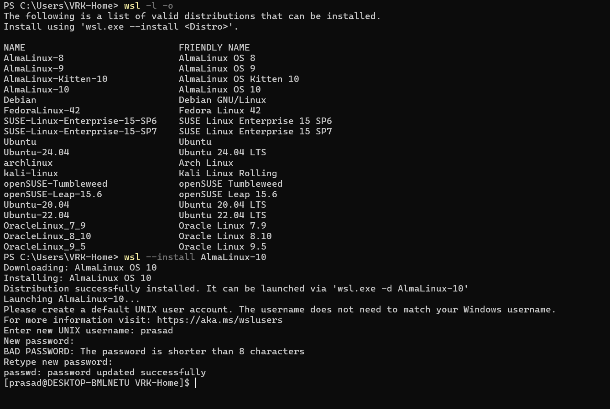

# RHEL Setup

- Both AlmaLinux and Rocky Linux are built to be binary-compatible with RHEL
- AlmaLinux: This is a community-driven project backed by the AlmaLinux OS Foundation and CloudLinux. It's known for consistent updates and a strong corporate backing, which ensures stability and a structured roadmap.

- Rocky Linux: This is a purely community-driven project. It is a 1-to-1 binary-compatible fork of RHEL, prioritizing stability and community independence.
- Both are excellent choices for hands-on practice with RHEL-like systems.
- 
Alma Linux Setup:

username: prasad/prasad

